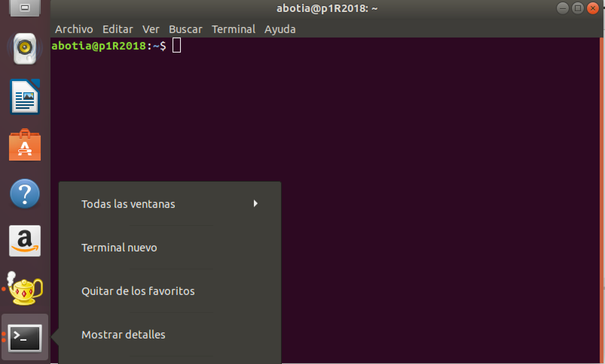
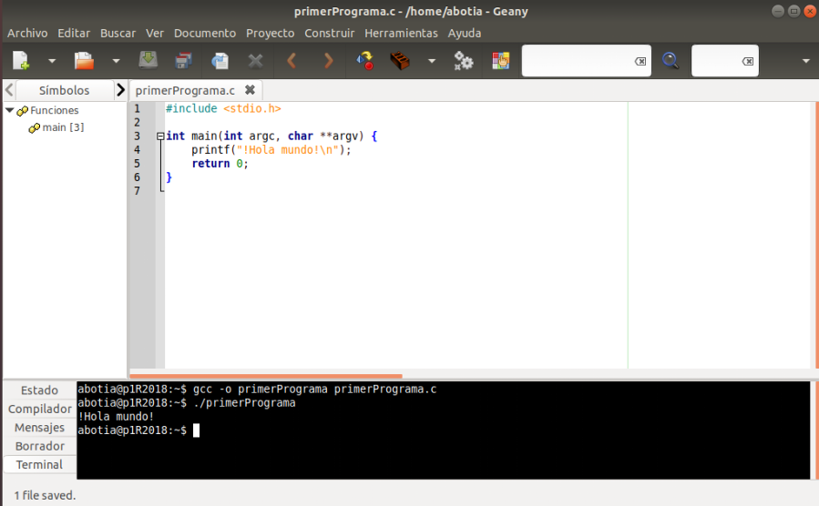

# Práctica 0: Entorno Linux y herramientas

## Objetivos de esta práctica

- Conocer y comprender las herramientas necesarias para la realización de un programa 
- Aprender a manejar las herramientas y el entorno seleccionado para las prácticas
- Sistema Operativo: `Linux`
- Editor de textos: `Geany`
- Compilador: `gcc`
- Compilar y ejecutar un primer programa
- Depurar los fallos encontrados

## Realizar y probar un programa

- Para realizar y probar un programa, debemos implementar el programa usando un editor de textos
- Compilar el programa para obtener un ejecutable, usando un compilador
- Ejecutar el programa (ejecutable) desde el sistema operativo

Existen numerosos IDEs, o entornos integrados de desarrollo, que facilitan la tarea del desarrollador, tales como Eclipse, NetBeans, Visual Studio, IntelIiJ, etc

En las prácticas, usaremos **Geany** como alternativa ligera y de licencia GPL entre el resto de opciones

## Sistema operativo Linux

- Las prácticas se desarrollarán bajo el Sistema Operativo Linux
- Es posible usarlo a través de una "máquina virtual", permite emular un Sistema Operativo. Por ejemplo, para lanzar Windows desde Linux o viceversa

- Es importante conocer los comandos básicos para usar el terminal, así como algunos conceptos base
- Diferencias entre mayúsculas y minúsculas (case sensitive)
- Separador de carpetas en una ruta: / (en lugar de \\)

## Terminal de Linux

- Lanzar la terminal
    - Desde el icono “Terminal”
    - Combinación de teclas “Ctrl+Alt+T”
- Prompt: símbolo $
    - Indica que el terminal esta listo para recibir comandos
- Sistema de ficheros:
    - Raiz: /
    - Carpeta de usuario: /home/username ó ~ 

## Algunos comandos del terminal de Linux

### `ls`

- Muestra el contenido del directorio actual (nombres de ficheros y directorios)
- Se puede usar con modificadores, por ejemplo, `ls -l` muestra más detalles

### `cd`

- Para cambiar de directorio: `cd nombreDirectorio`

- Si no se indica nombre de directorio, nos movemos al `/home` del usuario

`cd ..` subir un nivel en la jerarquía de directorios

### `pwd`

- Muestra el nombre de la ruta actuaL

### `mkdir`

- Para crear directorios nuevos: `mkdir directorio`

### `rm`

- Para borrar ficheros: `rm prueba.c`

### `rmdir`

- Para borrar directorios que estén vacíos: `rmdir directorio`

- Si no están vacíos: `rmdir -r directorio`

### `cp`

- Copia ficheros entre distintos directorios del disco duro: `cp  fichero.c   practica0/.`

### `mv`

- Renombra ficheros: `mv fichero.c nuevoNombre.c`

### `clear`

- Borra la pantalla

### `man`

- Muestra ayuda de un comando de linux: `man comando`
- Para mostrar ayuda de una función del lenguaje C: `man 3 funcionC`

### `find`

- Buscar ficheros o directorios: `find -name <opciones_busqueda>`

### `sudo`

- Lanzar un comando como superusuario: `sudo comando`

## Instalación de programas en Linux

- Existen repositorios de aplicaciones similares a "Google Play"

~~~
apt install <nombre_aplicacion>
~~~

- Es necesario lanzarla como root 

~~~
sudo apt install geany 
sudo apt install gcc
~~~

## Editor de textos Geany

- Gestión de ficheros y edición estándar
    - Nuevo, guardar como, buscar, reemplazar
- Editor de textos “enriquecido”
    - Palabras clave aparecen con un color resaltado 	
- Opciones para programar
    - Construir → Compilar | Construir | Ejecutar
    - Sobre el fichero actual que contiene el programa
- Vista inferior
    - Mensajes de salida, errores, vista de terminal, etc.

- Construir → Compilar
    - Equivalente al comando `gcc -c programa.c`
    - Genera un programa en código objeto programa.o
- Construir → Construir
    - Equivalente al comando `gcc -o programa programa.c`
    - Compilar y enlazar
    - Generará un ejecutable llamado `programa` (sin extensión)
- Construir → Ejecutar
    - Equivalente a la ejecución desde consola `./ejecutable`

## Nuestro primer programa

- Antes de empezar, crea una carpeta en el sistema para alojar todos los ficheros

~~~
mkdir practica0
cd practica0
~~~

- Accede a **Moodle** donde se encuentran los ficheros necesarios para realizar esta práctica
- Descarga el fichero `firstProgram.c` en la carpeta `practica0`
- Abrirlo desde Geany:
    - Compilar y estudiar los ficheros generados 
    - Construir y estudiar los ficheros generados 
    - Ejecutar
    - Eliminar todos los ficheros salvo el `.c` original

## Compilar, enlazar y ejecutar desde  línea de comandos (terminal)

- Abrir de nuevo el terminal y realiza las siguientes acciones:
    - Compilar únicamente:
    
        ~~~     
        gcc -c firstProgram.c
        ~~~
        
    - Compilar y enlazar generando ejecutable:
    
        ~~~
        gcc -o ejecutable firstProgram.c
        ~~~

    - Ejecutar el fichero generado:
    
        ~~~
        ./ejectuable 
        ~~~
        
## Descubriendo errores

- Descarga en la carpeta el fichero `firstProgramErrorA.c` y `firstProgramErrorB.c`
- Para cada fichero:
    - Abre el fichero desde Geany y estudia las diferencias con respecto al programa original
    - Intenta compilar (añadir la opción `-Wall` nos ayuda). Fíjate que el Geany utiliza esta opción al compilar (observa la ventana donde muestra el resultado de la compilación). Después, desde línea de comandos compila con la opción `-Wall` y sin dicha opción, y entiende para qué sirve.  
    - Estudia la salida obtenida por el compilador o el programa si la compilación terminó con éxito
    - Encuentra el error y corrígelo   

## Depuración de programas

- Dos tipos de errores:
    - Sintácticos: los detecta el compilador. Se solucionan fácilmente
    - Lógicos: se producen en el diseño del programa o en la implementación sin que suponga un error de sintaxis. MUY DIFÍCILES DE SOLUCIONAR
- Herramienta para la detección de errores:
    - Depurador o debugger `gdb`
    - Programa externo. Trabaja con el ejecutable
    - Añadimos la opción `-g` al compilar con `gcc` para incluir información de depurado en el ejecutable

----

Programación 1, Grado de Robótica, curso 2020-21  
© Departamento Ciencia de la Computación e Inteligencia Artificial, Universidad de Alicante  
Antonio Botía, Cristina Pomares