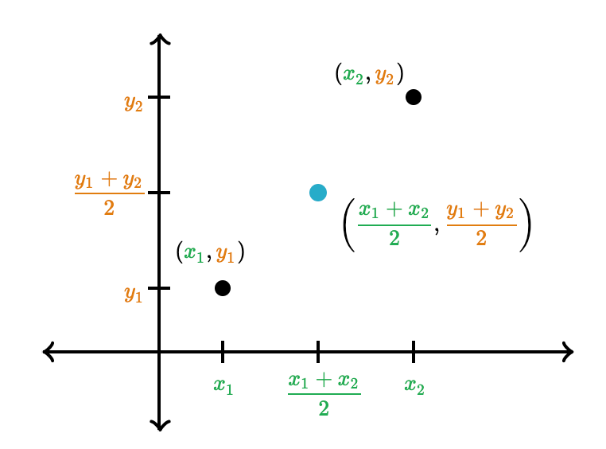

# Práctica 1: Tipos de datos simples

### Ejercicio 1 ###

El siguiente programa debe solicitar por teclado la edad, las iniciales de un nombre y 2 apellidos y la altura de una persona, y mostrará por pantalla sus iniciales en orden inverso y la suma de la edad y la altura.

Completa la implementación de este programa rellenando cada hueco con la sentencia adecuada. Después, compílalo y ejecútalo para comprobar su correcto funcionamiento.

~~~c
_________________

int main() {
    _________________;
    _________________;
    _________________;

    printf("Introduce la edad: ");
    ___________________________;

    printf("Introduce las iniciales del nombre y 2 apellidos: ");
    ___________________________;

    printf("Introduce la altura en metros: ");
    ___________________________;

    printf("\n\nLas iniciales del nombre y apellidos en orden inverso es:
          %c%c%c\n",ini_ap2, ini_ap1, ini_nom);
    printf("La suma de la edad y la altura es: %.2f\n", edad + altura);

    return 0;
}
~~~

Para leer por teclado dos datos seguidos separados por un espacio, puedes utilizar el `scanf` de la siguiente forma:

~~~c
scanf("%d %d", &x, &y);
~~~

### Ejercicio 2 ###

Implementa un programa que solicite al usuario las notas de los 2 exámenes de la convocatoria de Enero y muestre por pantalla la nota final de la asignatura en dicha convocatoria, teniendo en cuenta que las ponderaciones de cada examen parcial es del 50%.

Ejemplo de ejecución:

~~~text
Introduce la nota del primer examen (temas 1 al 5): 4.3
Introduce la nota del segundo examen (temas 1 al 9): 5.8
La nota final en la convocatoria ordinaria de Enero es: 5.05
~~~

Datos de entrada: `notas parciales`

Casos de prueba:

| Datos de entrada | Salida por pantalla |      
|:----------------:|:-------------------:|
| 4.3 y 5.8       | La nota final en la convocatoria ordinaria de Enero es: 5.07              |
| 7.0 y 2.5            | La nota final en la convocatoria ordinaria de Enero es: 4.75              |   
| 9.5 y 8.7            | La nota final en la convocatoria ordinaria de Enero es: 9.10              |    

### Ejercicio 3 ###

Implementa un programa que solicite al usuario un número de años y muestre por pantalla las horas, minutos y segundos que tienen esa cantidad de años. Suponemos que cada 4 años, uno será bisiesto y por tanto tendrás que considerar un día más.

Ejemplo de ejecución:

~~~text
Introduce número de años: 1
En 1 años hay 0 bisiestos, 365 días, 8760 horas, 525600 minutos y 31536000 segundos
~~~

Dato de entrada: `años`

Casos de prueba:

| Datos de entrada | Salida por pantalla |      
|:----------------:|:-------------------:|
|1                 | En 1 años hay 0 bisiestos, 365 días, 8760 horas, 525600 minutos y 31536000 segundos           |
| 18               | En 18 años hay 4 bisiestos, 6574 días, 157776 horas, 9466560 minutos y 567993600 segundos    |
| 40              | En 40 años hay 10 bisiestos, 14610 días, 350640 horas, 21038400 minutos y 1262304000 segundos   |

### Ejercicio 4 ###

Implementa un programa que predice la estatura de un niño cuando sea adulto. Para ello, se utilizará el método “promedio de los padres”, que consiste en calcular la estatura media de ambos progenitores y sumarle 6,35 cm si es niño varón, o restarle dicha cantidad si es niña.
Hay que tener en cuenta el margen de error de este método, que es de 10,16cm de alto o de bajo.

Ejemplo de ejecución:

~~~text
Introduce las alturas del padre y la madre:
1.75   1.65
Si el niño es varón, tendrá una altura entre 1,66m y 1,87m
Si es niña, tendrá una altura entre 1,53m y 1,74m
~~~

Datos de entrada: `alturas padre y madre`

Casos de prueba:

| Datos de entrada | Salida por pantalla |      
|:----------------:|:-------------------:|
|  1.75 y 1.65   | Si el niño es varón, tendrá una altura entre 1,66m y 1,87m. Si es niña, tendrá una altura entre 1,53m y 1,74m |
|  1.80 y 1.90   | Si el niño es varón, tendrá una altura entre 1,81m y 2,02m. Si es niña, tendrá una altura entre 1,68m y 1,89m |   
|  1.78 y 1.64   | Si el niño es varón, tendrá una altura entre 1,67m y 1,88m. Si es niña, tendrá una altura entre 1,54m y 1,75m |  

### Ejercicio 5 ###

Escribe un programa que incluya un enumerado llamado `TTransporte` con los tipos `Coche`, `Barco`, `Tren` y `Avion`.

Después imprime por pantalla el número asignado por el enumerado a cada figura. Para ello no utilices el número directamente, sino que debes utilizar el identificador correspondiente del enumerado.
Tienes que cambiar el número por defecto.

Ejemplo de ejecución:

~~~text
Coche: 5
Barco: 6
Tren: 7
Avion: 8
~~~

### Ejercicio 6 ###

Escribe un programa que pida por teclado las coordenadas cartesianas de dos puntos y calcule e imprima la distancia euclídea entre ellos y el punto medio. Cada punto consta de una coordenada x,y.

La fórmula de la distancia euclídea es:

~~~c
distancia = sqrt((x2 - x1)*(x2 - x1) + (y2 - y1) * (y2 - y1));
~~~

`sqrt` es la función que calcula la raíz cuadrada. Para utilizarla, debes incluir la librería `<math.h>` a tu programa.

La fórmula para calcular el punto medio entre dos puntos es:

Ejemplo de ejecución:

~~~text
Introduce el punto 1: 5 6
Introduce el punto 2: 12 16
La distancia entre los puntos (5,6)--(12,16) es 12.207
El punto medio es (8,11)
~~~

Datos de entrada: `x1,y1` `x2,y2`

Casos de prueba:

| Datos de entrada | Salida por pantalla |      
|:----------------:|:-------------------:|
| 5 6 y 12 16      | La distancia entre los puntos (5,6)--(12,16) es 12.207 El punto medio es (8,11)   |
| 0 0 y 200 200      | La distancia entre los puntos (0,0)--(200,200) es 282.843 El punto medio es (100,100) |   
| 28 21 y 1 2      | La distancia entre los puntos (28,21)--(1,2) es 33.015 El punto medio es (14,11)  |

**Nota**:
En algunas instalaciones hay problemas al usar la función `sqrt()`, da un error de que no está definida a pesar de hacer el include de esta librería. La solución está en enlazar (*linkar*)  la librería explícitamente desde línea de comandos con la opción `-lm`:

~~~texto
gcc ejercicio6.c -o ejercicio6 -lm
~~~

----

Programación 1, Grado de Robótica, curso 2020-21  
© Departamento Ciencia de la Computación e Inteligencia Artificial, Universidad de Alicante  
Antonio Botía, Cristina Pomares
