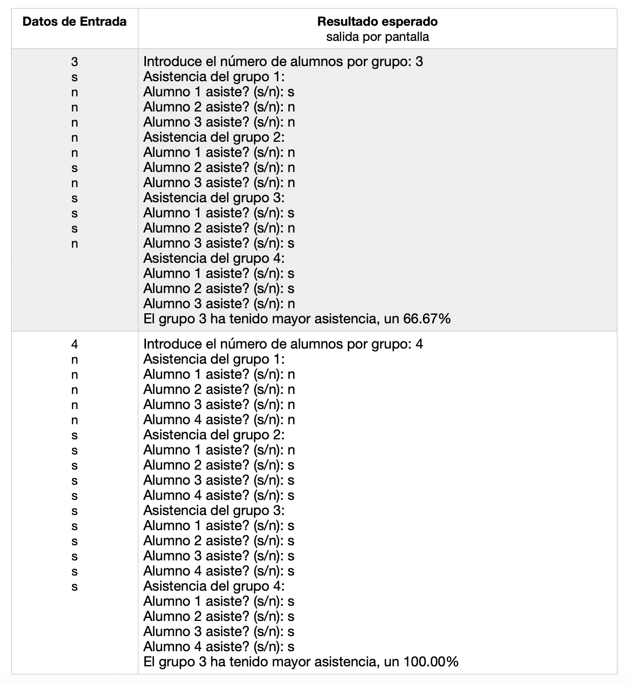

# Práctica 3: Sentencias de iteración

### Ejercicio 1 ###

Escribe un programa que solicite un número `n` impar y positivo, validando el dato, y muestre una matriz de `nxn` tal y como muestra el ejemplo:

Datos de entrada:  `número impar positivo`

**Ejemplo de ejecución:**

~~~text
Introduce un num impar positivo: 5

 1   6  11  16  21
 2   7  12  17  22
 3   8  13  18  23
 4   9  14  19  24
 5  10  15  20  25
~~~

**Casos de prueba:**

- Datos de entrada:

~~~text
2
-5
7
~~~
 
- Resultado esperado (salida por pantalla):

    ~~~text
    Introduce un num impar positivo: 2
    Introduce un num impar positivo: -5
    Introduce un num impar positivo: 7
      
     1   8  15  22  29  36  43
     2   9  16  23  30  37  44
     3  10  17  24  31  38  45
     4  11  18  25  32  39  46
     5  12  19  26  33  40  47
     6  13  20  27  34  41  48
     7  14  21  28  35  42  49
    ~~~

### Ejercicio 2 ###

Escribe un programa que calcule todos los números en un intervalo (el segundo número mayor que el primero) tales que la suma de los cubos de sus cifras sea igual al valor del número. 

Puedes usar la función `pow`de la librería `math.h`para calcular la potencia de un número: 

~~~c
cuadrado = pow(numero, 2);  // Cuadrado de un número
~~~

**Ejemplo de ejecución:**

~~~text
Introduce intervalo: 100 999

153 370 371 407
~~~

Datos de entrada: `dos números: intervalo`

**Casos de prueba:**

- Datos de entrada: 
    
    ~~~text
    100 400
    ~~~

- Resultado esperado (salida por pantalla):

    ~~~text
    Introduce intervalo: 100 400

    153 370 371
    ~~~

- Datos de entrada: 
    
    ~~~text
    999 400
    400 999
    ~~~

- Resultado esperado (salida por pantalla):

    ~~~text
    Introduce intervalo: 999 400
    Introduce intervalo: 400 999
    
    407
    ~~~
    
- Datos de entrada: 

    ~~~text
    0 30000
    ~~~

- Resultado esperado (salida por pantalla):
    
    ~~~text
    Introduce intervalo: 0 30000
    0 1 153 370 371 407
    ~~~

### Ejercicio 3 ###

Implementa un programa que vaya pidiendo una pareja de datos, un carácter y un número entero, y para cada pareja imprima en una línea el carácter (si es una letra minúscula o mayúscula) tantas veces como indique el número indicado, o si el carácter es un dígito, imprima en la línea los números consecutivos desde dicho dígito hasta el número indicado como segundo dato de la pareja.

Si el primer dato de la pareja no es una letra o un dígito, se debe imprimir un mensaje de error (ver ejemplo de ejecución) y se volverá a pedir otra pareja.

Si el número indicado como segundo dato no es positivo, entonces se imprimirá una línea en blanco y el programa finalizará.

Suponemos que el usuario siempre introducirá una pareja de datos formada por un carácter seguido de un número entero.

Ayuda: Para pasar de un carácter dígito a su correspondiente representación de número entero, puedes realizar la siguiente operación, en donde se usa los códigos ASCII de los caracteres:

`num = caracter - '0';`

Por ejemplo si carácter tiene el valor `'6'`, a la variable num se le asignará el valor numérico `6`.

**Ejemplo de ejecución:**

~~~text
Introduce un carácter y un número: a 12
aaaaaaaaaaaa
Introduce un carácter y un número: B 54
BBBBBBBBBBBBBBBBBBBBBBBBBBBBBBBBBBBBBBBBBBBBBBBBBBBBBB
Introduce un carácter y un número: * 4
Error: no has introducido una letra o un dígito en el primer dato
Introduce un carácter y un número: 3 23
3 4 5 6 7 8 9 10 11 12 13 14 15 16 17 18 19 20 21 22 23 
Introduce un carácter y un número: 7 4

Introduce un carácter y un número: t 0
~~~

Datos de entrada: `carácter y número`

**Casos de prueba:**

- Datos de entrada: 

    ~~~text
    4 10
    3 6
    z 10
    w 0
    ~~~
    
- Resultado esperado (salida por pantalla):

    ~~~text
    Introduce un carácter y un número: 4 10
    4 5 6 7 8 9 10 
    Introduce un carácter y un número: 3 6
    3 4 5 6 
    Introduce un carácter y un número: z 10
    zzzzzzzzzz
    Introduce un carácter y un número: w 0
    ~~~

- Datos de entrada: 

    ~~~text
    h 5
    h 10
    h -1
    ~~~
    
- Resultado esperado (salida por pantalla):

    ~~~text
    Introduce un carácter y un número: h 5
    hhhhh
    Introduce un carácter y un número: h 10
    hhhhhhhhhh
    Introduce un carácter y un número: h -1
    ~~~

### Ejercicio 4 ###

Implementa un programa que contabilice la asistencia a los grupos de prácticas de una determinada asignatura.

La asignatura tiene 4 grupos y cada grupo un mismo número de alumnos matriculados que se deberá indicar previamente.

El usuario deberá introducir si cada uno de los alumnos de los distintos grupos han asistido o no a clase. Para indicar si ha asistido, se deberá introducir el carácter ’s’ o ’S’. Con cualquier otro carácter introducido se considerará que no ha asistido.

Después de introducir todos los datos, el programa mostrará un mensaje indicando cuál ha sido el grupo con mayor asistencia y el porcentaje de la misma (ver ejemplo de ejecución). En caso de que haya varios grupos con la misma asistencia, mostraremos el primero de ellos.

**Ejemplo de ejecución:**

~~~text
Introduce el número de alumnos por grupo: 5
Asistencia del grupo 1:
Alumno 1 asiste? (s/n): s
Alumno 2 asiste? (s/n): s
Alumno 3 asiste? (s/n): n
Alumno 4 asiste? (s/n): n
Alumno 5 asiste? (s/n): n
Asistencia del grupo 2:
Alumno 1 asiste? (s/n): s
Alumno 2 asiste? (s/n): S
Alumno 3 asiste? (s/n): S
Alumno 4 asiste? (s/n): s
Alumno 5 asiste? (s/n): n
Asistencia del grupo 3:
Alumno 1 asiste? (s/n): a
Alumno 2 asiste? (s/n): s
Alumno 3 asiste? (s/n): d
Alumno 4 asiste? (s/n): f
Alumno 5 asiste? (s/n): g
Asistencia del grupo 4:
Alumno 1 asiste? (s/n): n
Alumno 2 asiste? (s/n): n
Alumno 3 asiste? (s/n): n
Alumno 4 asiste? (s/n): s
Alumno 5 asiste? (s/n): s
El grupo 2 ha tenido mayor asistencia, un 80.00%
~~~

**Casos de prueba:**

----

Programación 1, Grado de Robótica, curso 2020-21  
© Departamento Ciencia de la Computación e Inteligencia Artificial, Universidad de Alicante  
Antonio Botía, Cristina Pomares
