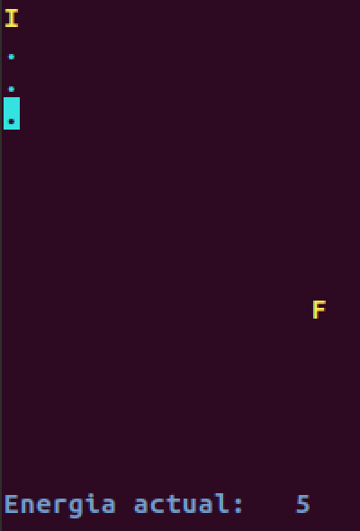
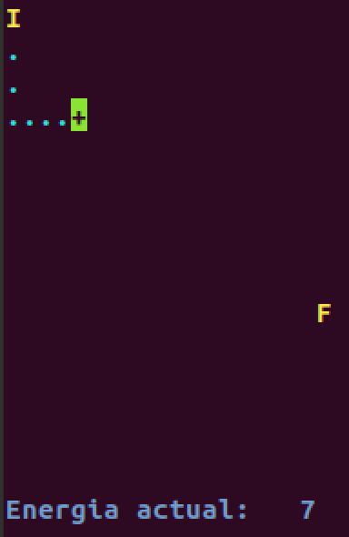
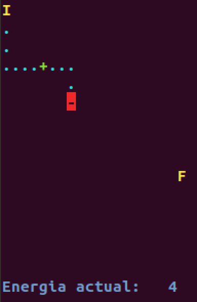
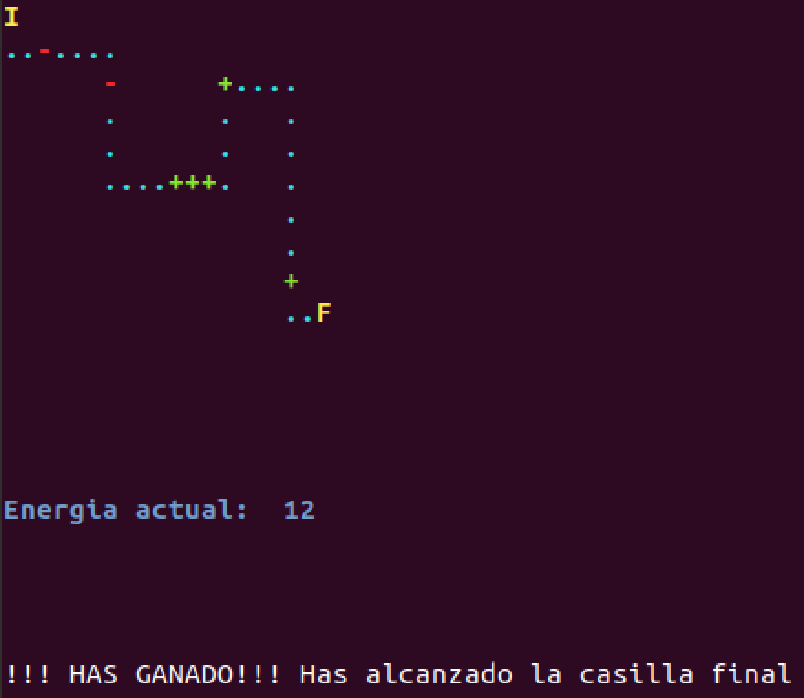
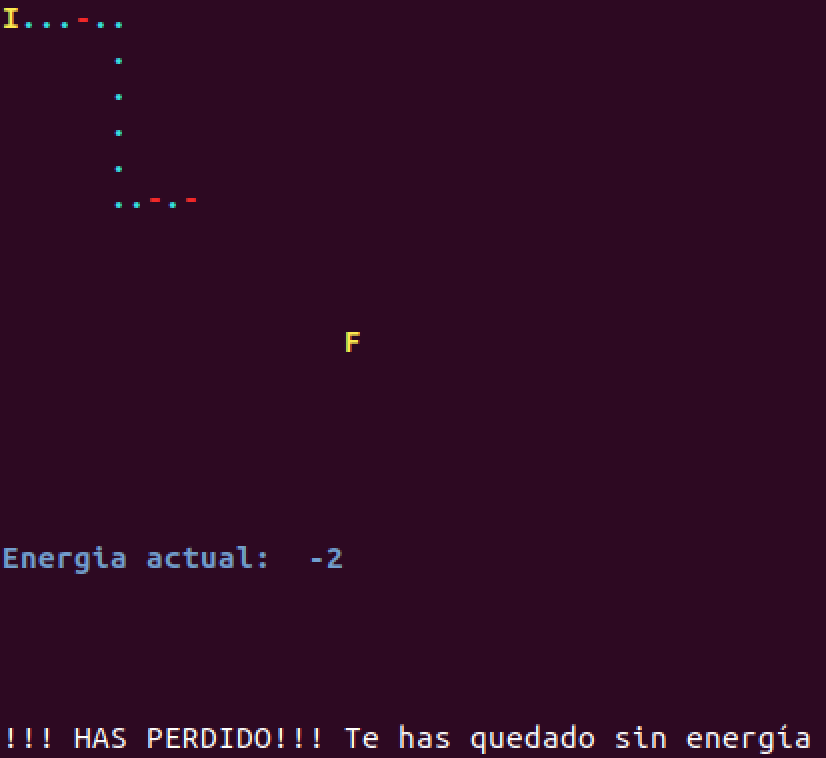
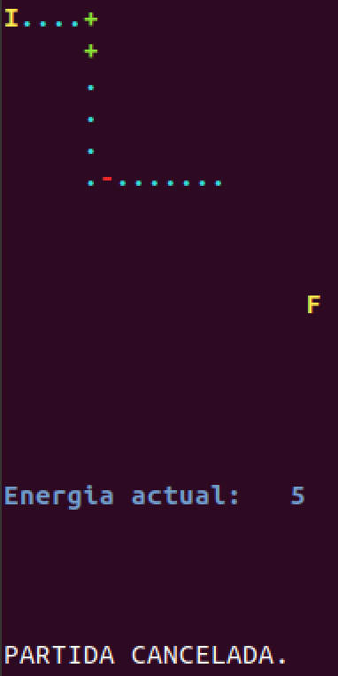

# Práctica 6: Datos estructurados: Registros

**Duración**: 2 semanas

## Juego: simulación de robot

### En qué consiste el juego

Vamos a implementar un pequeño juego que simula el movimiento dirigido de un robot de un punto a otro dentro de un campo de energía. 

El robot partirá de una posición inicial y lo iremos moviendo eligiendo cada vez una de las 4 posibles direcciones: arriba, derecha, abajo, izquierda. El cursor indicará donde está situado en cada instante el robot. 

Las casillas o posiciones inicialmente no son visibles, y pueden estar vacías o disponer de recarga o pérdida de energía. El robot dispone inicialmente de una determinada energía, y el objetivo del juego es alcanzar la posición final sin que el robot se quede sin ella. Las posiciones se irán mostrando conforme avance el robot.

### Ejemplos de ejecución del juego

En las siguientes imágenes se muestra distintas situaciones del funcionamiento del juego. Las 3 primeras imágenes muestran una secuencia de ejecución en la que desde una posición inicial (representada por el carácter `'I'`) y partiendo de una cantidad de energía de 5 unidades, hacemos 3 movimientos hacia abajo del robot, después de los cuales mantiene su energía inicial puesto que las posiciones visitadas están vacías (representadas con el carácter `'.'`). A continuación lo vamos desplazando a la derecha hasta alcanzar una posición en la que se recarga de energía (representada con el carácter `'+'`) en 2 unidades, y finalmente después de varios movimientos en distintas direcciones alcanza una posición en la que pierde energía (representada con el carácter `'-'`), en concreto 3 unidades de pérdida.

Las 3 siguientes imágenes muestran las 3 posibles situaciones de finalización del juego: 

- Alcanzar la posición final (representada por el carácter `'F'`).
- Quedarse sin energía.
- Cancelar la ejecución si lo decide el usuario.

### Otros detalles del juego

- El entorno por el que se puede mover el robot será un tablero con unas determinadas dimensiones, en donde cada casilla del mismo representa una posición.
- El robot no se puede mover a una posición que ya ha visitado y tampoco sobrepasar los límites del tablero. Si intenta realizar un movimiento no válido, no se llevará a cabo. 
- Al iniciar el juego, solo estarán visibles las casillas inicial y final, y se irán descubriendo el contenido del resto conforme sean visitadas por el robot.

### Implementación del juego

#### Librería `terminalIO`

Se os proporciona la librería de usuario `terminalIO.h`. Ten en cuenta que cuando usamos una librería de usuario o estándar del lenguaje, no necesitamos conocer cómo están implementadas sus funciones, sino **qué es lo que hacen y cómo se interactúa con ellas** (qué datos de entrada tienen y qué datos devuelven). Por lo tanto, estudia y analiza el fichero `terminalIO.h` para entender todas sus funcionalidades, pero no necesitas comprender el contenido del fichero `terminalIO.c`. La librería te permite hacer lo siguiente:

- Mover el cursor a una determinada posición de la pantalla, así como imprimir texto o un carácter en un determinado color.
- Utilizar el mismo sistema de coordenadas para representar el tablero del juego y para movernos a una posición en la pantalla, donde la coordenada (0,0) es la esquina superior izquierda.
- Detectar qué tecla se ha pulsado, para determinar en qué dirección hay que mover el cursor (utilizando las teclas de los caracteres `'i'` `'k'` `'j'` `'l'`) y también permitir que el usuario pueda terminar el juego en cualquier momento pulsando la tecla `<ESC>`.

#### Fichero `practica6.c`

Se os proporciona el fichero `practica6.c`a partir del cual tenéis que implementar vuestro juego. Este fichero contiene la declaración de constantes de configuración del juego y la función `main()` con un ejemplo de uso de la librería `terminalIO`. Al ejecutar el programa, puedes mover el cursor pulsando algunas de las teclas citadas anteriormente y se muestra un mensaje indicado la posición actual del mismo. El programa finaliza su ejecución cuando se pulsa la tecla `<ESC>`, mientras que la pulsación de cualquier otra tecla será ignorada.

Modifica el fichero `practica6.c`:

- Modifica la función `main()` teniendo en cuenta que **no debe contener más de 30 líneas de código**, aparte de la declaración de variables.
- Añade nuevas constantes y tipos de datos.
- Añade funciones que modularicen correctamente el programa.
- Guarda en una matriz la información necesaria para cada **casilla** del tablero:
    - descriptor de la casilla
    - color del descriptor
    - si ha sido visitada o no
    - cantidad de energía
    
- Antes del inicio del juego, tendrás que inicializar la información de todas las casillas, aunque sólo se visualizará en pantalla la posición inicial y final. No obstante, en las primeras pruebas de tu programa, es recomendable que muestres todo el tablero, para comprobar el correcto funcionamiento del mismo.
- La cantidad de energía que se asigna a una casilla debe ser un valor aleatorio, con un determinado máximo de energía establecido en una constante de configuración. Para generar valores aleatorios, utiliza las funciones de C `rand()` y `srand()`:
    - Añade las librerías `<stdlib.h>` y `<time.h>`.
    - Añade al principio de la función `main()` la sentencia siguiente, que inicializa la semilla para generar números aleatorios dependiendo del instante de tiempo en el que estamos ejecutando el programa.

        ~~~c
        srand(time(0));
        ~~~
        
    - Para generar un valor aleatorio dentro del intervalo `[a,b]`, utiliza la siguiente expresión: 

        ~~~c
        rand() % (b-a+1) + a
        ~~~

- Asegúrate que el mensaje de finalización del juego se imprima con el color por defecto, para restablecer dicho color en el terminal al finalizar tu programa.

### Ayuda para la compilación y creación del fichero ejecutable: `make`

Cuando nuestro programa utiliza librerías de usuario es recomendable automatizar el proceso de compilación y construcción del fichero ejecutable. Para ello se utiliza el comando `make`, que requiere un fichero de configuración, que se suele denominar `makefile` y que  contiene dependencias, reglas y comandos a ejecutar para la construcción de este proceso de construcción del ejecutable.

El fichero `makefile` proporcionado, permite que al ejecutar el comando `make`, se cree el fichero ejecutable `practica6` en caso de que compile correctamente el fichero `practica6.c` y la librería de usuario que estamos utilizando. 

Cada vez que se ejecute el comando `make`, sólo se recopilarán los ficheros que hayan sido modificados antes de la última construcción del ejecutable.

Si ejecutamos el comando `make clean` borrará el fichero ejecutable y los ficheros objeto que se guardan en el directorio `./obj`.

----

Programación 1, Grado de Robótica, curso 2019-20  
© Departamento Ciencia de la Computación e Inteligencia Artificial, Universidad de Alicante  
Antonio Botía, Cristina Pomares
