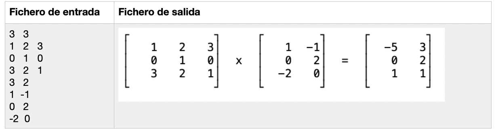
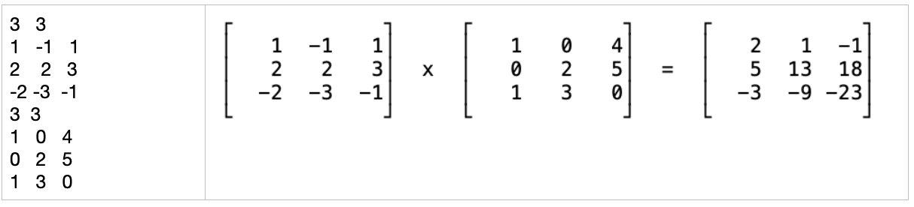

# Práctica 8: Entrada y salida

**Duración**: 2 semanas

## Ejercicio

Implementa un programa que lea desde un fichero de texto los datos de 2 matrices e imprima en otro fichero el resultado de la multiplicación de ambas matrices. El nombre del fichero de entrada se leerá desde línea de comandos. Al fichero de salida puedes ponerle el nombre que quieras.

El fichero de entrada tendrá el siguiente formato (ver también ejemplos de ejecución):

En la primera línea se indica el número de filas y columnas de dicha matriz. En las siguientes líneas están los datos de las distintas filas de la primera matriz. En la siguiente línea, el número de filas y columnas de la segunda matriz
en las líneas restantes los datos de la segunda matriz

Debes utilizar *reserva dinámica de memoria* para guardar las matrices.

Suponemos que las dimensiones de las dos matrices permiten realizar su producto.

**Ayudas para la implementación**:

Para imprimir en el fichero de salida los corchetes de las matrices, utiliza las siguientes constantes:

~~~c
#define LINEA_VERTICAL "\u2502"
#define ESQUINA_SUPERIOR_IZQ "\u250c"
#define ESQUINA_SUPERIOR_DER "\u2510"
#define ESQUINA_INFERIOR_IZQ "\u2514"
#define ESQUINA_INFERIOR_DER "\u2518"
~~~

Para simplificar el algoritmo de imprimir las matrices en el fichero de salida, vamos a suponer que **el número de filas de ambas matrices siempre será el mismo, aunque sí pueden tener distinto número de columnas**.

Ejemplos de ejecución:

~~~text
$ ./programa matrices.txt
~~~

Ejemplo 1:

Ejemplo 2:

----

Programación 1, Grado de Robótica, curso 2020-21  
© Departamento Ciencia de la Computación e Inteligencia Artificial, Universidad de Alicante  
Antonio Botía, Cristina Pomares
