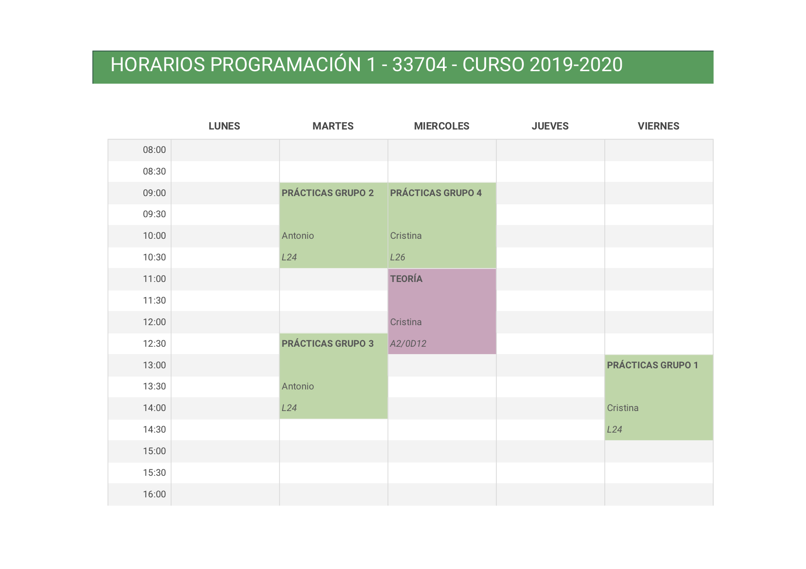
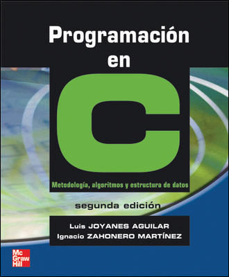
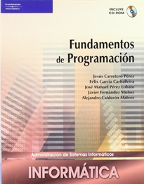
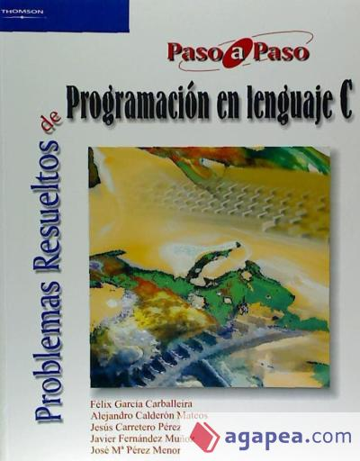
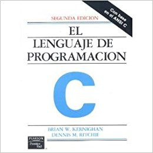

## Programación 1. Grado de Robótica. Curso 2020-2021

### Datos académicos de la asignatura

**Departamento de Ciencia de la Computación e Inteligencia Artificial**  
**6 créditos ECTS**: 1 clase de teoría de 2 h. y 1 clase de
prácticas de 2 h. a la semana  

**Profesores**:  

* Antonio Botía ([e-mail](mailto:abotia@ua.es)): Grupos de prácticas: 1 y 4.
* Cristina Pomares ([e-mail](mailto:cpomares@ua.es)): Grupo de teoría 1 y grupos de prácticas: 2 y 3.

### Recursos de la asignatura

* [Ficha de la asignatura](https://cvnet.cpd.ua.es/Guia-Docente/GuiaDocente/Index?wcodest=C211&wcodasi=33704&wlengua=es&scaca=2020-21)
* [Apuntes de la asignatura (teoría y prácticas)](https://cpomares.github.io/p1-robotica/)
* [Sitio Moodle](https://moodle2020-21.ua.es/moodle/course/view.php?id=962) contiene los
  apuntes, transparencias, prácticas y otros materiales docentes
* [Foro de consultas y anuncios](https://moodle2020-21.ua.es/moodle/mod/forum/view.php?id=13376)
  en el sitio Moodle

### Objetivos y competencias

**Objetivos**:

* Dominar los principios de la programación procedural.
* Resolver problemas de programación básica aplicando adecuadamente los tipos de datos elementales, los tipos de datos estructurados y las estructuras de control.
* Asimilar el concepto programación modular y saber aplicarlo en la resolución de problemas.
* Conocer el concepto de recursividad, aplicándolo a problemas sencillos.
* Comprender el concepto de fichero y saber utilizarlos.
* Ser capaz de utilizar herramientas de programación para editar, compilar, ejecutar y verificar un programa.
* Analizar problemas susceptibles de resolución por un ordenador y diseñar algoritmos que los solucionen.
* Implementar algoritmos mediante técnicas de programación estructurada y modular.
* Saber realizar programas de ordenador que capturen y envíen información a un sistema robótico.

**Competencias**:

* Interpretar el funcionamiento del código fuente de un programa.
* Definir los tipos de datos necesarios para la representación de la información.
* Diseñar algoritmos y codificarlos con distintas técnicas de programación, especialmente en sistemas robóticos.
* Verificar el correcto funcionamiento de un programa.

### Temario

* **Tema 1. Introducción a la programación**: Representación de la información. Concepto de programa. Fases de desarrollo de un programa. El lenguaje C. Estructura de un programa. Comentarios en un programa. Entornos de programación.

* **Tema 2. Tipos de datos simples**: Concepto de dato. Constantes y variables. Sentencias de asignación. Expresiones y operadores. Sentencias de entrada/salida de datos.

* **Tema 3. Sentencias de control**: Algoritmos y programas. Estructura secuencial. Estructuras de selección. Estructuras de repetición.

* **Tema 4. Programación modular**: Descomposición modular. Concepto de módulo. Comunicación entre módulos. Funciones. Parámetros actuales y formales. Paso de parámetros por valor y por referencia. Ámbito de una variable. Variables globales y locales. Efecto lateral. Funciones predefinidas

* **Tema 5. Tipos de datos estructurados: Arrays**: Concepto de dato estructurado. El tipo array. Arrays unidimensionales, bidimensionales y multidimensionales. Cadenas de caracteres

* **Tema 6. Tipos de datos estructurados: Registros**: Concepto de registro. Registros en C. Operaciones sobre registros. Arrays de registro

* **Tema 7. Punteros y memoria dinámica**: Memoria estática vs. dinámica. Creación, inicialización, asignación y liberación de memoria. Conversión de tipos.

* **Tema 8. Entrada/salida**: Declaración, apertura, lectura y escritura de ficheros de texto y binarios en C.

* **Tema 9. Recursión**: Definición. Esquema básico. Codificación en C. Características

### Prácticas

Durante las clases prácticas se realizarán de forma **individual** ejercicios de programación relacionados con los conceptos que se están estudiando en ese momento que servirán para reforzar y profundizar en las competencias de la asignatura.

### Horarios

La distribución de grupos del curso 2020-2021 es la siguiente:

### Evaluación

#### Convocatoria normal (evaluación continua)

En la convocatoria ordinaria (enero) se realizará una evaluación continua con las siguientes pruebas:

* **Examen 1**: Del tema 1 al tema 5. Pondera un 50% en la nota final. No se exige nota mínima. Fecha de examen aproximada, a la espera de que nos asignen aulas: **Miércoles 25 de Noviembre**.
* **Examen 2**: Del tema 1 al tema 9. Pondera un 50% en la nota final. No se exige nota mínima. Se realizará en la **fecha oficial** asignada al examen final de la convocatoria de enero.

Todos los exámenes de la asignatura se realizarán por escrito e incluirán conceptos y ejercicios relacionados con los trabajados tanto en las sesiones de teoría como de prácticas.

La realización de las prácticas es **imprescindible** para el aprendizaje de los conceptos, técnicas de la asignatura y para la preparación de las pruebas en las que se evaluarán los conocimientos adquiridos.

#### Convocatoria extraordinaria

En la convocatoria extraordinaria se realizará un examen final escrito sobre todos los bloques temáticos cuya calificación representará el 100% de la nota de la asignatura.

#### Plagios

Los trabajos teórico/prácticos realizados han de ser originales. La detección de copia o plagio supondrá la calificación de "0" en la prueba correspondiente. Se informará la dirección de Departamento y de la EPS sobre esta incidencia. La reiteración en la conducta en esta u otra asignatura conllevará la notificación al vicerrectorado correspondiente de las faltas cometidas para que estudien el caso y sancionen según la legislación.

#### Consejos para aprender con éxito los contenidos de la asignatura

El consejo fundamental para aprobar la asignatura es **trabajar todas las semanas y realizar por ti mismo los ejercicios**. Los conceptos de la asignatura se van construyendo de forma progresiva y lo visto en una semana depende muchas veces de lo aprendido en semanas anteriores.

La asignatura es fundamentalmente práctica. Para estudiar una asignatura de programación, no debes memorizar sino entender. No tiene sentido aprender de memoria los ejercicios y los ejemplos vistos en clase. Hay que trabajarlos. La única forma de aprender es: probando, equivocándose y encontrando la solución por uno mismo.

A la hora de enfrentarse con un problema es fundamental también usar lápiz y papel para plasmar las ideas y encontrar la solución más sencilla antes de programarla en el ordenador.

Resumiendo: trabajar todas las semanas, hacer uno mismo todos los ejercicios y no desanimarse ni descolgarse.

Son muy interesantes algunos comentarios de antiguos estudiantes que han aprobado la asignatura.

¿Qué hiciste para superar con éxito P1? ¿Qué consejos les das a los nuevos alumnos?

*Practicar, practicar y practicar. Los profesores os lo repetirán mucho, pero es la solución clave para poder superar la asignatura. También entender el por qué de los errores [...]*

*Una de las claves para superar esta asignatura  es ser constante y no dejar atrás ningún concepto sin entender (ya que concepto que das en un tema en el siguiente te ayudará ) y sobre todo practicar y practicar, para asentar bien los conocimientos expuestos en las clases de teoría[...]*

*No estudiéis los ejercicios de memoria. Programación se aprende, no se memoriza[...]*

*No dejéis todo para última hora porque la clave es llevar las cosas y conceptos explicados en teoría al día.
Además, también aconsejaría que practicaran ya no solo con las practicas de clase sino también con más ejercicios para asentar bien todo.
Y por último, que no se frustren si al principio les cuesta o no entienden bien lo que se explica, ya que puede que muchos no hayan dado nada de programación antes (como fue mi caso), pero no por ello les será imposible aprobar[...]*

*Intentad que no se os atasque en lo básico, porque sino luego avanzar es muy complicado. Lo recomendable aun que suene a lo típico es llevarlo bastante al día y practicar por ti mismo haciendo programas[...]*

*Yo creo que es indispensable hacer las prácticas, pues en las clases teóricas todo parece muy sencillo y lógico, pero todo cambia cuando te sientas delante de la pantalla y empiezas a escribir código. Lo importante para realizar de manera eficiente las prácticas es hacer un pequeño esquema en sucio de qué es lo que quieres hacer y cómo piensas hacerlo, pues de esa forma las ideas quedan mucho más claras y hay menos posibilidad de equivocarse[...]*

*Es totalmente necesario hacer las prácticas, porque de este modo los profesores pueden resolver las dudas en el momento, y también sirven para aprender los nuevos contenidos y repasar para el examen[...]*

### Bibliografía

En Moodle se publican los apuntes de la asignatura, con ejercicios, explicaciones y ejemplos de todos los conceptos estudiados, tanto en teoría como en práctica.

Los apuntes de la asignatura se han confeccionado utilizando la siguiente bibliografía, que podéis utilizar para consultar o ampliar algunos conceptos:

* JOYANES, Luis; ZAHONERO, Ignacio. Programación en C. Metodología, algoritmos y estructuras de datos. McGraw-Hill, 2a edición, 2005. ISBN: 8448198441

* CARRETERO Pérez, Jesús. Fundamentos de programación. 2007.  ISBN:	9788497325509

* Carballeira. Problemas resueltos de programación en lenguaje C

* KERNIGHAN, Brian W.; RITCHIE, Dennis M. El lenguaje de programación C. Pearson Educación, 1991. ISBN: 968-880-205-0

----

Programación 1, Grado de Robótica, curso 2020-21  
© Departamento Ciencia de la Computación e Inteligencia Artificial, Universidad de Alicante  
Cristina Pomares
