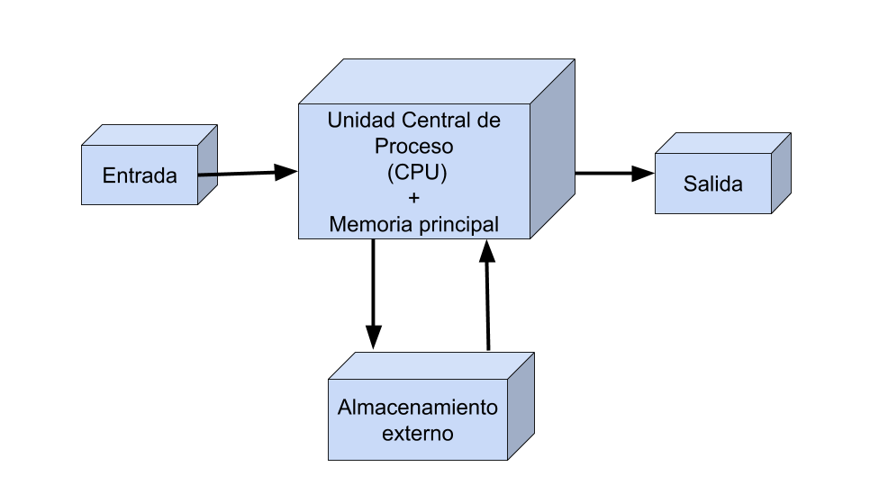
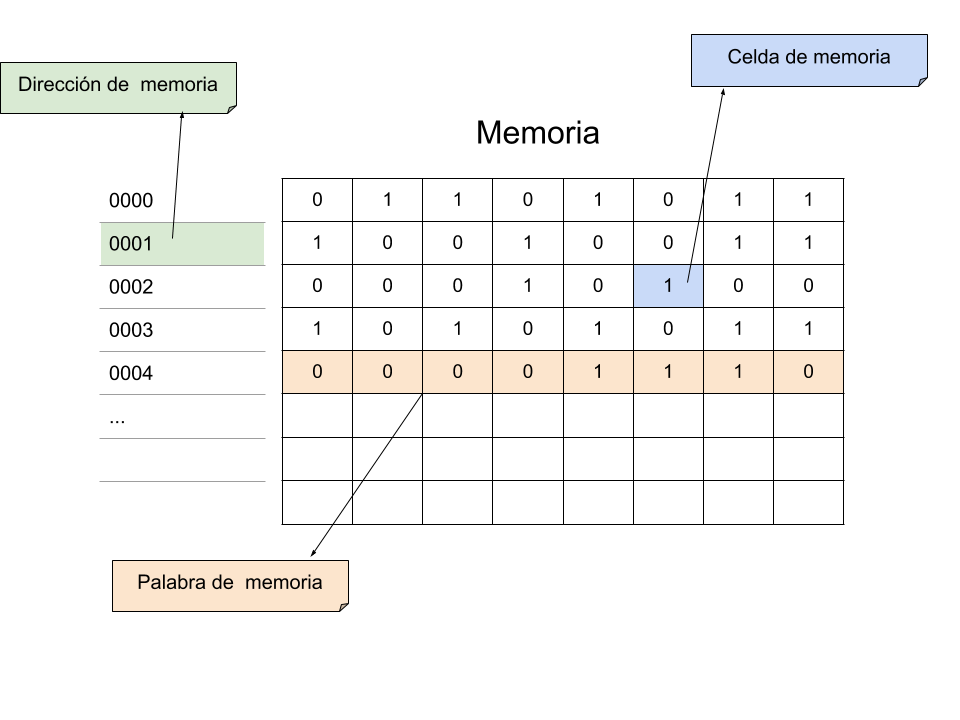
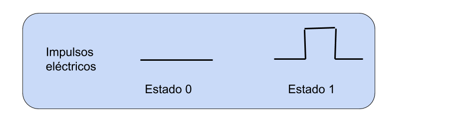
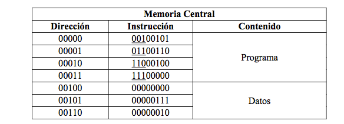
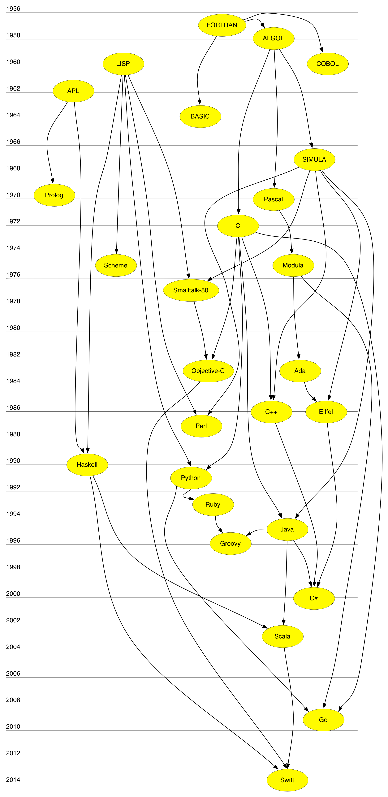
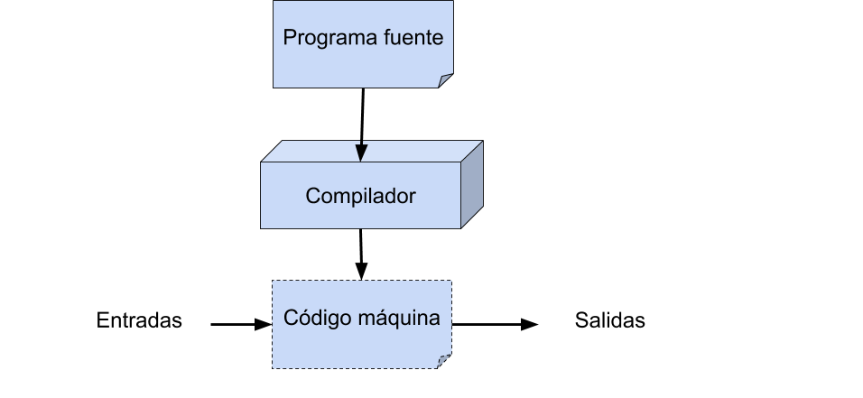
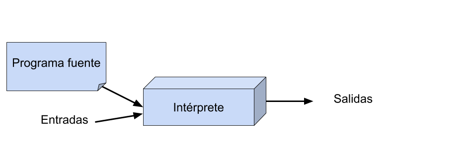
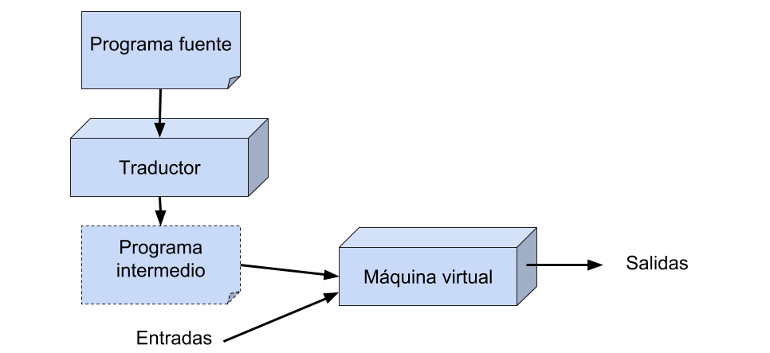
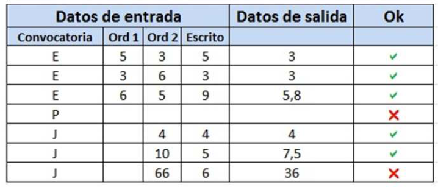

# Tema 1: Introducción a la  programación

## Contenidos

- [1. Lenguajes de programación](#1)
    - [1.1. El ordenador y sus componentes](#1-1)
    - [1.2. Representación de la información](#1-2)
    - [1.3. Programa](#1-3)
    - [1.4. Los primeros lenguajes de programación](#1-4)
    - [1.5. Los primeros lenguajes de alto nivel](#1-5)
    - [1.6. Compiladores e intérpretes](#1-6)
- [2. Lenguaje C](#2)
- [3. Aprender a programar](#3)
	 - [3.1. Características deseables de un programa](#3-1)
	 - [3.2. Pasos para desarrollar un programa](#3-2)
	 - 	[3.3. Normas de estilo para programar en C](#3-3)

## <a name="1"/> 1. Lenguajes de programación

Un lenguaje de programación permite especificar procesos que se
ejecutan en computadores. Un programa escrito en un determinado
lenguaje nos permite definir las instrucciones que realizará el
ordenador (o, más en concreto, el procesador) que lo ejecute. Por
ello, para entender en profundidad qué es un lenguaje de programación
es fundamental conocer el ordenador.

### <a name="1-1"/> 1.1. El ordenador y sus componentes

Lor ordenadores poseen los siguientes componentes:

* **Dispositivos de entrada**. Se encargan de capturar información de entrada a la computadora: teclado, ratón, micrófono, etc.
* **Dispositivos de salida**. Se encargan de la salida de información de la computadora: monitor, impresora, altavoces, etc.
* **Dispositivos de almacenamiento**. Se encargan de almacenar los datos para su uso posterior: disco duro, CD-ROM, etc.
* **Unidad de Procesamiento**. Realiza las operaciones con los datos
* **Memoria principal**. Es donde se almacenan temporalmente los datos con los que la CPU trabaja en cada momento. Está formada por circuitos electrónicos integrados capaces de
almacenar valores binarios (0 ó 1) en cada celda de memoria

Memoria principal:

- Palabra de memoria: menor conjunto de celdas de memoria que
se pueden leer o escribir simultáneamente. En el ejemplo, cada palabra es de 1 byte (8 bits)
- Dirección de memoria: número que identifica de forma unívoca
cada palabra de memoria

### <a name="1-2"/> 1.2. Representación de la información

La información se representa en una computadora mediante el uso de dos estados: ausencia y presencia de corriente. Esto se debe a la naturaleza eléctrica de la misma:

Esta dualidad nos permite adoptar un sistema **binario** para representar la información. Así, la presencia de señal se representa por el 1 y la ausencia por el 0. Esto nos lleva al concepto de **bit**, que es la unidad mínima de información. Un *bit* puede adoptar los valores 0 ó 1.
Un único *bit* aporta poca cantidad de información. Es por ello que los *bits* se
agrupan de 8 en 8 formando un **byte**. Un *byte* permite representar 2^8 = 256 combinaciones diferentes.
A su vez, los *bytes* se agrupan formando **palabras**, que dependiendo de cada computadora pueden ser de 8, 16, 32 ó 64 *bytes*.
### <a name="1-3"/> 1.3. Programa

Un programa es el conjunto ordenado de instrucciones que indican a la computadora las acciones que debe realizar para cumplir una tarea específica. En este sentido, con un programa especificamos al ordenador qué tiene que hacer, en el orden en el que lo tiene que hacer y los datos que ha de usar para ello.
Los programas están escritos en un determinado lenguaje formal libre de ambigüedades, de forma que la especificación de lo que queremos hacer sea unívoca.

Con respecto al nivel de abstracción de estos lenguajes, los podemos clasificar en dos grandes grupos:
  
  * **Lenguajes Máquina**: Como su propio nombre indica, se trata de los lenguajes "nativos" de la computadora, y por ello es capaz de procesarlos directamente. Sumamente costosos para el programador.
  * **Lenguajes de Alto Nivel**: Se trata de lenguajes mucho más cercanos al lenguaje humano, con un alto nivel de abstracción, por lo que son más comprensibles y menos engorrosos de usar para el programador. Los programas construidos con estos lenguajes han de ser traducidos a lenguaje máquina mediante el uso de un compilador para que la computadora los pueda procesar. Python, C, C++, Java, etc.

### <a name="1-4"/> 1.4. Los primeros lenguajes de programación

Los primeros computadores electrónicos se programan directamente usando el conjunto de instrucciones del procesador, en **código máquina**, código hexadecimal.

El siguiente programa, en lenguaje máquina, resta un número de otro y el resultado lo almacena en una posición de memoria:

El primer lenguaje de un nivel algo más elevado que el código máquina es el **ensamblador**. Programas que empiezan a ayudar a los programadores: ensambladores. Hay una relación casi directa entre la notación en ensamblador y el código hexadecimal que produce el
ensamblador.

El programa anterior en ensamblador sería:

~~~
	CAR A
	RES B
	ALM C
	STOP
C: 0
A: 7
B: 2
~~~

El lenguaje ensamblador constituye un gran avance en lo que a facilidad de comprensión se requiere a la hora de programar. De todas formas, este lenguaje sigue teniendo varios inconvenientes: Por un lado, cada computadora posee un lenguaje ensamblador distinto, por lo que para utilizar un programa en otra computadora distinta habría que rescribirlo. Por otro lado, el lenguaje sigue siendo demasiado cercano al lenguaje máquina, lo que dificulta su comprensión y por tanto encarece el desarrollo de programas de gran extensión.

Los **lenguajes de alto nivel** se caracterizan por no ser dependientes de máquina. Mediante la compilación de un programa escrito en lenguaje de alto nivel podremos ejecutarlo en cualquier máquina. Para ello, necesitaremos un compilador de ese lenguaje para cada máquina en la que queramos ejecutar nuestro programa.
Otra característica de estos lenguajes es su sintaxis es más cercana al lenguaje natural del programador y proporciona distintas herramientas de abstracción que facilitan la programación.

### <a name="1-5"/> 1.5. Los primeros lenguajes de alto nivel

Los primeros lenguajes de alto nivel se desarrollaron a finales de la
década de los 50:

- FORTRAN en 1956
- Lisp en 1958

Ambos lenguajes planteaban dos enfoques muy distintos desde el principio y fueron la base y la influencia del desarrollo de numerosos lenguajes posteriores.

Desde 1954 hasta la actualidad se han documentado más de 2.500
(consultar en [The Language List]).

[The Language List]: http://people.ku.edu/~nkinners/LangList/Extras/langlist.htm

#### Genealogía de los lenguajes de programación

El **lenguaje C** surgió en 1972, derivado de Fortran y Algol. Es el que vamos a estudiar en esta asignatura.

El **lenguaje Python** surgió en 1991, a partir de Lisp y C.

### <a name="1-6"/> 1.6. Compiladores e intérpretes

En el nivel de abstracción más bajo, la ejecución de un programa en un
computador consiste en la ejecución de un conjunto de instrucciones
del código máquina del procesador.

#### Compilación

La siguiente figura muestra el proceso de generación y
ejecución de un programa compilado.

*Compilación*

El proceso de compilación de un programa consiste en la traducción del
código fuente original en el lenguaje de alto nivel al código máquina
específico del procesador en el que va a ejecutarse el programa. El
código máquina resultante sólo corre en el procesador para el que se
ha generado. Por ejemplo, un programa C compilado para un procesador
Intel no puede ejecutarse en un procesador ARM, como los
[Ax de Apple](http://en.wikipedia.org/wiki/Apple_system_on_a_chip).

- Ejemplos: C, C++
- Diferentes momentos en la vida de un programa: tiempo de compilación
  y tiempo de ejecución
- Mayor eficiencia

#### Interpretación

*Interpretación*

- Ejemplos: Lisp, Python, Ruby
- No hay diferencia entre el tiempo de compilación y el tiempo de ejecución
- Mayor flexibilidad

Los lenguajes interpretados suelen proporcionar un *shell* o
intérprete. Se trata de un entorno interactivo en el que podemos
definir y evaluar expresiones. Este entorno se denomina en los
círculos de programación funcional un *REPL* (*Read*, *Eval*, *Print*,
*Loop*) y ya se utilizó en los primeros años de implementación del
Lisp. El uso del *REPL* promueve una programación interactiva en la
que continuamente evaluamos y comprobamos el código que desarrollamos.

#### Enfoques mixtos

Existen también enfoques mixtos, como el usado por el lenguaje de
programación Java, en el que se realizan ambos procesos: por un lado, el compilador (`javac`) traduce el código fuente original a un código intermedio binario (multiplataforma), que es interpretado posteriormente por el intérprete (`java`).

*Enfoque mixto (Java)*

- Ejemplos: Java, Scala

## <a name="2"/> 2. Lenguaje C

C es el lenguaje principal que vamos a estudiar en la asignatura, pero vamos a ver también algunos ejemplos en Python.

C presenta ciertas características que permiten ejercer un elevado control sobre la eficiencia
de los programas, tanto en la velocidad de ejecución como en el consumo de memoria, pero
a un precio importante: tenemos que proporcionar información explícita sobre gran cantidad de detalles,
por lo que generalmente resultan programas más largos y complicados que sus equivalentes en
otros lenguajes más modernos, aumentando así la probabilidad de que cometamos errores.

C es un lenguaje compilado: antes de ejecutar un programa escrito por nosotros, suministramos
su código fuente (en un fichero con extensión .c) a un compilador de C.
El compilador lee y analiza todo el programa. Si el programa está correctamente escrito
según la definición del lenguaje, el compilador genera un nuevo fichero con su traducción
a código de máquina (llamado programa objeto), y si no, muestra los errores que ha detectado. Para ejecutar el programa
utilizamos el nombre del fichero generado. Si no modificamos el código fuente, no
hace falta que lo compilemos nuevamente para volver a ejecutar el programa: basta con
volver a ejecutar el fichero generado por el compilador.

La principal ventaja de compilar los programas es que se gana en velocidad de ejecución,
ya que cuando el programa se ejecuta está completamente traducido a código de máquina y
se ahorra el proceso de traducción simultánea que conlleva interpretar un programa. Pero,
además, como se traduce a código máquina en una fase independiente de la fase de ejecución,
el programa traductor puede dedicar más tiempo a intentar encontrar la mejor traducción
posible, la que proporcione el programa de código máquina más rápido (o que consuma
menos memoria).

### Desarrollo de programas en lenguaje C

Cuando se implementa un programa, en primer lugar editamos el **código fuente** con un editor. Estos archivos contienen la implementación del programa en un determinado lenguaje, pero no se pueden ejecutar directamente. Para ello necesitamos **compilar** los programas oara obtener el **código objeto**, que es un código en binario intermedio que puede enlazarse con otros móulos ya compilados o con bibliotecas para obtener un **código ejecutable**. Este último es un fichero que se puede ejecutar directamente.

Este proceso es un ciclo, de forma que si después de ejecutar el programa hemos encontrado errores, volvemos a editar el programa, compilarlo y ejecutarlo.

**Compilador**: un programa que lee un código fuente y lo traduce a código objeto (ensamblador o binario).

**Enlazador**: combina archivos objeto y bibliotecas de forma que se puedan ejecutar en una sola unidad.

Ejemplo de programa en C:

~~~c
#include <stdio.h>

int main() {
	printf("Hola mundo!!\n");
	return 0;
}
~~~

Vamos a analizar este primer programa:

La primera línea `#include <stdio.h>` se debe incluir al principio de cada programa. Incluye las funciones de entrada y salida, por ejemplo la instrucción `printf`.

La línea `int main()`indica la función principal `main`, es un nombre especial que indica dónde empieza el programa su ejecución.

Los paréntesis tanto de `main`como de `printf` indican que ambas son funciones, y dentro de los paréntesis irán los argumentos de las mismas (si los tienen). El argumento de `printf` es la cadena de caracteres `"Hola mundo!!\n"`. La instrucción `printf`es una función que imprime su argumento por pantalla, en este caso `"Hola mundo"`. Los últimos dos caracteres de la cadena `\n' indican el carácter *newline* o salto de línea.

Todas las instrucciones en C terminan en un `;`.

La última sentencia `return 0;`indica que se termina la ejecución de `main`, y devuelve al sistema el valor 0. El cero es un valor que se usa para indicar que el programa ha terminado correctamente (sin errores). La devolución de un número distinto de cero indican distintos errores (por ejemplo que no se encuentra un fichero).

Vamos a compilar y ejecutar nuestro primer programa. Son tres pasos:

1. A partir del fichero de texto con nuestro programa con el código fuente en lenguaje C se realiza una fase de preprocesado en la que se eliminan comentarios y se satisfacen directivas # `gcc -­E holamundo.c`
2. Una vez preprocesado se genera un fichero con código objeto en el paso de compilación `gcc -­c holaMundo.c`. Nos genera `holaMundo.o`
3. El fichero objeto se debe enlazar con las librerías para generar el ejecutable en el paso de enlazado. Esto se puede realizar con una instrucción: `gcc holaMundo.c ­-o holaMundo`

Su forma de uso más básica es ésta (agrupamos los pasos anteriores en una única instrucción):

`gcc -o holamundo holamundo.c`

La opción -o es abreviatura de *output*, y a ella le sigue el nombre del fichero que contendrá la traducción a código máquina del programa. Este fichero sólo se genera si el programa C está correctamente escrito y no tiene errores de compilación.

Ahora ejecutamos el fichero ejecutable:

	./holamundo

y el resultado es la salida por pantalla:

	Hola mundo!!

#### Diferencias entre C y Python

- C es un lenguaje imperativo. Python es multiparadigma (imperativo, orientado a objetos y funcional).
- C es un lenguaje compilado. Python es interpretado.
- En C, el programador tiene que hacer la gestión de memoria (reservar, liberar, etc). Python tiene recolector de basura automático para la gestión de memoria.
- C es fuertemente tipado (obligatorio declarar el tipo de las variables). Python es débilmente tipado.
- La sintaxis de C es más compleja. La sintaxis de Python es más sencilla y sus programas son más fáciles de escribir y depurar.

## <a name="3"/> 3. Aprender a programar

**A programar se aprende programando**. En esta asignatura os daréis cuenta que no sirve de nada memorizar programas, ni mirar ejercicios resueltos o soluciones a las prácticas planteadas. Debéis empezar desde el principio a hacer pequeños programas y modificaciones de los que hagamos o planteemos en clase. Pelearos con el código, que os salgan errores, resolverlos, etc. Es la única forma de aprender. Una vez hayáis implementado una solución a un problema, entonces es el momento de mirar otra solución para ver si podéis mejorarlo, pero primero debéis haberlo resuelto vosotros o al menos intentado resolver.

Un programa de computadora es sólo una recopilación de las instrucciones necesarias para resolver un problema específico. El método utilizado para resolver el problema se conoce como algoritmo.

Por ejemplo, si queremos implementar un programa que comprueba si un número es impar, el conjunto de instrucciones que resuelve el problema es el *programa*. El método que se utiliza para comprobar si el número es par o impar es el *algoritmo*. Normalmente, para desarrollar un programa para resolver un problema particular, primero hay que pensar en el algoritmo y luego desarrollar un programa que implementa ese algoritmo. Por lo tanto, el algoritmo para resolver el problema par / impar podría expresarse de la siguiente manera: Primero, dividir el número por dos. Si el resto de la división es cero, el número es par; de lo contrario, el número es impar.

### <a name="3.1"/> 3.1 Características deseables de un programa

1. **Integridad**: Corrección de los cálculos
2. **Claridad**: Facilidad de lectura del programa en conjunto, con énfasis en la lógica subyacente.
3. **Sencillez**: La claridad y la corrección de un programa se suelen ver favorecidos con hacer las cosas de forma tan sencilla como sea posible, consistente con los objetivos del programa en su conjunto
4. **Eficiencia**: relacionado con la velocidad de ejecución y la utilización eficiente de la memoria
5. **Modularidad**: Casi todos los programas se pueden dividir en pequeñas subtareas. Es una buena práctica de programación implementar cada una de estas subtareas como un módulo. En C estos módulos son las funciones. El diseño modular aumenta la corrección y la claridad, y facilita los posibles cambios futuros del programa
6. **Generalidad**: Intentaremos que el programa sea lo más genérico posible

Todas estas características las tendremos en cuenta en la evaluación de vuestros programas en la asignatura.

### <a name="3-2"/> 3.2 Pasos para desarrollar un programa

Es fundamental comprender bien el problema antes de pensar en la solución. Antes de ponerse a escribir el programa es necesario tener claro cómo resolverlo, pensar en ello utilizando lápiz y papel:

1. Entender el problema
2. Diseñar la solución
3. Implementar el programa
4. Verificar y probar el programa

5. Optimizar

#### Entender el problema

Para entender el problema debemos pensar y analizarlo. Debemos plantearnos las siguientes cuestiones:

- Datos de entrada
- Datos de salida
- ¿Qué hay que resolver?
- ¿Cómo se puede resolver?

Ejemplo:

>
Se desea calcular la nota de una asignatura de un alumno teniendo en cuenta la nota de los exámenes realizados en una determinada convocatoria.
>
En Enero, la nota final se obtiene con el 15% de la nota de un primer examen con ordenador, el 35% de la nota de un segundo examen con ordenador y el 50% restante con la nota de un examen escrito, excepto si la nota del examen escrito o la del segundo examen con ordenador es menor que 4, en cuyo caso la nota final será la mínima de las dos.
>
En Julio, la nota final se obtendrá como 50% nota del examen escrito, 50% nota del examen con ordenador, excepto si cualquiera de estas dos notas es menor que 4, en cuyo caso la nota final será la mínima de las dos.

#### Diseñar la solución

- Detectar los pasos a seguir para solucionar el problema
- Estructurar el programa
- Plasmar esa solución de alguna manera

Algoritmo:
>
- Dime de qué convocatoria quieres saber tu nota final
- Si es la convocatoria de Enero entonces
	- Dime la nota de los 2 exámenes con ordenador y del examen escrito
	- Si la nota del examen escrito < 4 o nota examen ordenador 2 < 4 Entonces
TU NOTA FINAL ES = mínimo (nota ex. escrito, nota ex. ord. 2)
	- Sino TU NOTA FINAL ES =0,15* Ordenador_1+0,35* Ordenador_2+0,5*Escrito
- Si es la convocatoria de Julio
Entonces
	- Dime las notas del examen escrito y del examen con ordenador
	- Si la nota del examen escrito < 4 o nota examen ordenador < 4
Entonces
TU NOTA FINAL ES = mínimo (nota ex. escrito, nota ex. ord.)
	- Sino
TU NOTA FINAL ES = 0,5* Ordenador+0,5*Escrito

#### Implementar el programa

- Desarrollar en un lenguaje de programación los pasos a seguir para resolver el problema
- Importante: la solución debe ser (lo suficientemente) óptima. Se pueden encontrar distintas soluciones para resolver el mismo problema
- Este paso implica un proceso cíclico donde se programa (implementa) la solución (total o parcial), se prueba, se detectan errores y se vuelve a programar para resolverlos. Normalmente un programa no funciona a la primera.

Programa para calcular la nota:

~~~c
#include <stdio.h>

int main() {
	char convocatoria;
	float ordenador_1, ordenador_2, examen_escrito, nota_final;

	printf("Dime la convocatoria(E,J):");
	scanf("%c", &convocatoria);

	if (convocatoria == 'E') {
		printf("Dime la nota del primer examen con ordenador:");
		scanf("%f", &ordenador_1);
		printf("Dime la nota del segundo examen con ordenador:");
		scanf("%f", &ordenador_2);
		printf("Dime la nota del examen escrito:");
		scanf("%f",&examen_escrito);
		if (examen_escrito < 4 || ordenador_2 < 4)
			// minimo: función que calcula el número más pequeño entre 2 números
			nota_final = minimo(examen_escrito, ordenador_2);
		else
			nota_final = 0.15*ordenador_1 + 0.35*ordenador_2 + 0.5*examen_escrito;
		}
	else if (convocatoria == 'J' ) {
		printf("Dime la nota del examen escrito:");
		scanf("%f", &examen_escrito);
		printf("Dime la nota del examen con ordenador:");
		scanf("%f", &ordenador_2);
		if (examen_escrito < 4 || ordenador_2 < 4)
			// minimo: función que calcula el número más pequeño entre 2 números
			nota_final = minimo(examen_escrito, ordenador_2);
		else
			nota_final = 0.5*ordenador_2 + 0.5*examen_escrito;
		}
	printf("TU NOTA FINAL ES %f \n", nota_final);
	return 0;
}
~~~

#### Probar el programa

- Comprobar que el resultado obtenido es el adecuado. Para ello se deben realizar pruebas exhaustivas sobre nuestro programa y testear que los resultados obtenidos son los que esperamos
- Si no, volver al paso anterior

#### Optimización

Después de tener un programa correcto y validado, es conveniente estudiar si se puede mejorar la solución para que el programa sea más eficiente, más legible y menos redundante.

#### Documentación

La documentación es un parte fundamental en el desarrollo de código.

En C los comentarios son:

~~~c
/* uno o varios comentarios */
/* Pueden ser
multilínea */
~~~
El preprocesador elimina el texto del comentario.

No abusar de ellos:

~~~c
if (x==5) /* Si x es igual a 5 */
~~~

Usar lenguaje apropiado. Si tenemos funciones, comentar lo que hace justo antes de la definición de la función:

~~~c
/* Realiza la suma ponderada de los valores pasados por parámetro */
double sumap (double a, double b) {
~~~

La principal función de los comentarios es el mantenimiento: tanto por ti como para otros programadores

### <a name="3-3"/> 3-3. Normas de estilo para programar en C

> **Nota**:  En este apartado vamos a hablar de términos que iremos explicando poco a poco en la asignatura. La idea es recopilarlo para que os sirva de guía y de consulta.

Los programas, a lo largo del tiempo, se van quedando obsoletos, por ejemplo, actualización del software de un robot para una determinada tarea. Es muy normal tener que modificar un programa porque debamos actualizarlo o porque decidamos incluirle nuevas posibilidades que antes no estaban previstas.

Por otra parte, también es frecuente que uno deba modificar un programa escrito por otro programador, encontrándonos con problemas de legibilidad. Para poder modificarlo, primero hay que comprender su funcionamiento, y para facilitar esta tarea el programa debe estar escrito siguiendo unas normas básicas.

Además, el lenguaje C se presta a hacer programas complejos y difíciles de comprender. En C se pueden encapsular órdenes y operadores, de tal forma que, aunque consigamos mayor eficiencia su comprensión sea todo un reto.

No existen un conjunto de reglas fijas para programar con legibilidad. Lo que sí existen son un conjunto de reglas generales:

1. Identificadores significativos
2. Constantes simbólicas
3. Comentarios
4. Estructura del programa
5. Identación o sangrado

#### 1. Identificadores significativos

Un identificador es un nombre asociado a un objeto de programa, que puede ser una variable, función, constante, tipo de datos... El nombre de cada identificador debe expresar lo más claramente posible al objeto que identifica. Normalmente los identificadores deben empezar por una letra, no pueden contener espacios y suelen tener una longitud máxima que puede variar, pero que no debería superar los 10-20 caracteres para evitar lecturas muy pesadas.

Un identificador debe indicar lo más breve y claramente posible el objeto al que referencia. Por ejemplo, si una variable contiene la lectura del sensor de visión de un robot, la variable se puede llamar `sensorVision`.

Es muy normal usar variables como i, j o k para nombres de índices de bucles (for, while...), lo cual es aceptable siempre que la variable sirva sólo para el bucle y no tenga un significado especial. En determinados casos, dentro de una función o programa pequeño, se pueden usar este tipo de variables, si no crean problemas de comprensión, pero esto no es muy recomendable.

Para los identificadores de función se suelen usar las formas de los verbos en infinitivo, seguido de algún sustantivo, para indicar claramente lo que hace. Por ejemplo, una función podría llamarse `evitarObstaculo`, y sería más comprensible que si le hubiéramos llamado `evitar`.

#### 2. Constantes simbólicas

En un programa es muy normal usar constantes (numéricas, cadenas...). Si estas constantes las usamos directamente en el programa, el programa funcionará, pero es más recomendable usar constantes simbólicas, de forma que las definimos al principio del programa y luego las usamos cuando haga falta. Así, conseguimos principalmente dos ventajas:

- Los programas se hacen más legibles: Es más legible usar la constante simbólica `PI` que usar 3.14 en su lugar:

~~~c
volumen_esfera = 4/3. * PI * pow(radio,3);
~~~

- Los programas serán más fáciles de modificar: Si en un momento dado necesitamos usar PI con más decimales (3.141592) sólo tenemos que cambiar la definición, y no tenemos que cambiar todas las ocurrencias de 3.14 por 3.141592 que sería más costoso y podemos olvidarnos alguna.

En C, las constantes simbólicas se suelen poner usando una órden al preprocesador de C, quedando definidas desde el lugar en que se definen hasta el final del fichero (o hasta que expresamente se indique). Su formato general es:

~~~c
 #define CONSTANTE valor
~~~

Se encarga de cambiar todas las ocurrencias de CONSTANTE por el valor indicado en la segunda palabra (valor). Este cambio lo realiza el preprocesador de C, antes de empezar la compilación.

Por convenio, las constantes se suelen poner completamente en mayúsculas y las variables no, de forma que leyendo el programa podamos saber rápidamente qué es cada cosa. En general, se deben usar constantes simbólicas en constantes que aparezcan más de una vez en el programa referidas a un mismo elemento que pueda variar ocasionalmente.

#### 3. Comentarios

Sirven para aumentar la claridad de un programa, ayudan para la documentación y bien utilizados nos pueden ahorrar mucho tiempo.

Los comentarios deben ser breves y concisos. Se deben poner comentarios cuando se crean necesarios, y sobre todo:

- Al principio del programa o de cada fichero del programa que permita seguir un poco la historia de cada programa, indicando: Nombre del programa, objetivo, parámetros (si los tiene), condiciones de ejecución, módulos que lo componen, autor o autores, fecha de finalización, últimas modificaciones realizadas y sus fechas... y cualquier otra eventualidad que el programador quiera dejar constancia.
- En cada sentencia o bloque (bucle, if, switch...) que revista cierta complejidad, de forma que el comentario indique qué se realiza o cómo funciona.
- Al principio de cada función cuyo nombre no explique suficientemente su cometido. Se debe poner no sólo lo que hace sino la utilidad de cada parámetro, el valor que devuelve (si lo hubiera) y, si fuera oportuno, los requisitos necesarios para que dicha función opere correctamente.
- En la declaración de variables y constantes cuyo identificador no sea suficiente para comprender su utilidad.
- En los cierres de bloques con '}', para indicar a qué sentencias de control de flujo pertenecen, principalmente cuando existe mucho anidamiento de sentencias y/o los bloques contienen muchas líneas de código.

No olvidemos que los comentarios son textos para las personas, por lo que debemos cuidar el estilo, acentos y signos de puntuación.

#### 4. Estructura del programa

Un programa debe ser claro, estar bien organizado y ser fácil de leer y entender

Para aumentar la claridad no se deben escribir líneas muy largas que se salgan de la pantalla y funciones con muchas líneas de código (especialmente la función principal). Una función demasiado grande demuestra, en general, una programación descuidada y un análisis del problema poco estudiado.

Estructura típica de un programa C, es el que usaremos en esta asignatura:

>
1. Comentarios de presentación
2. Inclusión de bibliotecas del sistema. Ejemplo: `#include <stdio.h>`
3. Bibliotecas propias de la aplicación
4. Constantes simbólicas y definiciones de macros, con `#define`
5. Definición de tipos, con `typedef`
6. Declaración de funciones
7. Implementación de funciones

Este orden no es estricto y pueden cambiarse algunos puntos por otros, pero debemos ser coherentes y usar el mismo orden en todos nuestros programas

#### 5. Identación o sangrado

La indentación o sangrado consiste en tabular hacia la derecha todas las sentencias de una misma función o bloque, de forma que se vea rápidamente cuales pertenecen al bloque y cuales no.

Algunos estudios indican que el indentado debe hacerse con 3 ó 4 espacios. Usar más espacios no aumenta la claridad y puede originar que las líneas se salgan de la pantalla, complicando su lectura. La indentación es muy importante para que el programador no pierda la estructura del programa debido a los posibles anidamientos.

Normalmente, la llave de comienzo de una estructura de control `{` se pone al final de la linea y la que lo cierra `}` justo debajo de donde comienza (como veremos más adelante). Ejemplo:

~~~c
if (condición) {
    sentencia1;     
    sentencia2;
    ...
}
else {
    sentencia1;
    sentencia2;
    ...
}
~~~

~~~c
int main() {
   printf("Ejemplo de identación\n");
   return 0;
}
~~~

### Consejos para la realización de las prácticas de programación

* Pensar antes de escribir el código. Coger lápiz y papel y estructurar los pasos que se desean implementar (algoritmo).
* Detenerse ante cualquier mensaje de error o *warning* y solucionarlo antes de continuar.
* Ir paso a paso. Nunca escribas una gran porción de código sin haberla probado poco a poco.
* Leer bien el enunciado de lo que te piden.
* Escribir comentarios a medida que escribes código.
* Preguntar al profesor lo que no entiendas.

**IMPORTANTE**: No programas para el ordenador, programas para ti. Programar no es escribir código y olvidarlo, sino mantenerlo.

Puedes echarle un vistazo a este divertido [enlace](http://www.agustincernuda.info/noprog_ESP.html) donde explican qué no debes hacer cuando implementas un programa.

----

Programación 1, Grado de Robótica, curso 2018-19  
© Departamento Ciencia de la Computación e Inteligencia Artificial, Universidad de Alicante  
Cristina Pomares Puig
