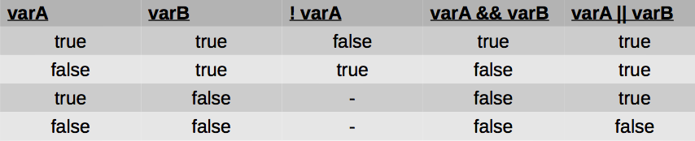

# Tema 2: Tipos de datos simples

## Contenidos

- [1. Tipos de datos](#1)
- [2. Identificadores](#2)
- [3. Variables y constantes](#3)
	- [3-1. Variables](#3-1)
	- [3-2. Constantes](#3-2)
- [4. Tipos de datos simples](#4)
	- [4-1. Enteros](#4-1)
	- [4-2. Reales](#4-2)
	- [4-3. Carácter](#4-3)
	- [4-4. Lógico](#4-4)
	- [4-5. Enumerados](#4-5)
- [5. Sentencias de entrada / salida](#5)
	- [5-1. Salida `printf`](#5-1)
	- [5-2. Entrada `scanf`](#5-2)

## <a name="1"/> 1. Tipos de datos

Los elementos básicos de los que consta un programa son:

- los datos
- las instrucciones que los procesan

Los *datos* son los elementos que manipulan los programas. Para almacenar datos necesitamos zonas de memoria del ordenador. La memoria del ordenador está dividida en casillas numeradas en las que se guardan los datos. Los lenguajes de programación nos permiten asignar nombres simbólicos a estas celdillas y controlar qué zonas de memoria están libres y ocupadas.

El programador únicamente tiene que indicarle al ordenador el nombre de las zonas de memoria donde se quiere almacenar la información y de qué tipo es son los datos. A estas zonas de memoria les llamaremos **variables**.

En un programa podemos distinguir entre:

- datos de entrada / salida: usados como punto de partida o resultado
- datos internos / auxiliares: usados por el programa para obtener el resultado

>
Por ejemplo, en un programa que calcula la longitud de una circunferencia ( Diámetro * PI )
>
- Dato de entrada: radio de la circunferencia
- Dato de salida: longitud de la circunferencia
- Datos internos: diámetro de la circunferencia, que toma como valor 2*radio de la circunferencia

El lenguaje C es **fuertemente tipado**, eso significa que tenemos que asignar explícitamente un tipo a cada dato. El tipo de un dato es el conjunto de valores que puede tomar durante el programa.

 La asignación de tipos a los datos tiene cuatro objetivos principales:

1. Determinar el rango de objetos que puede representar el dato.
2. Conocer qué operaciones se pueden realizar con ellos
3. Detectar errores en las operaciones
4. Determinar cómo ejecutar operaciones

La clasificación de los datos se hace teniendo en cuenta dos aspectos:

- Tamaño que ocupa en memoria fijo o variable: tipos *estáticos* o *dinámicos*
- Número de elementos que representan: tipos *simples* o *estructurados*

**Tipos estáticos**

Ocupan un tamaño fijo en memoria, es decir, su tamaño no puede variar durante la ejecución de un programa. Una vez declarada una variable de un tipo determinado, a ésta se le asigna un trozo de memoria fijo, y ese trozo no se podrá aumentar ni disminuir.

**Tipos dinámicos**

También llamados *punteros*, los veremos más adelante. Un puntero no define un tipo determinado, sino que apunta a una dirección de memoria. Podemos reservar un tamaño determinado de memoria, ampliarlo, reducirlo y liberarlo.

**Tipos simples**

Sólo representan un dato, son los tipos básicos: entero, carácter, real, etc.

**Tipos estructurados**

Están formados por un conjunto de elementos (tipos simples u otros estructurados). Los veremos en próximos temas

## <a name="2"/> 2. Identificadores

Un *identificador* es un nombre que se asigna a los distintos elementos de un programa: variables, funciones, etc. En lenguaje C son válidos los caracteres alfabéticos en mayúsculas, minúsculas, dígitos numéricos (0..9) y el subrayado (_), aunque no pueden empezar por un número. Las mayúsculas y minúsculas se consideran caracteres distintos, el identificador `hola`es distinto a `Hola`.

Ejemplo de identificadores válidos:

~~~c
X        Y12      sum_1       _temperature
names    area     tax_rate    TABLE
~~~

Ejemplo de identificadores **no** válidos:

~~~c
4th         /* El primer carácter debe ser una letra o (_) */
"x"         /* Carácter no válido (") */
num-orden   /* Carácter no válido (-) */
error flag  /* Carácter no válido (espacio) */
numero%1    /* Carácter no válido (%) */
numero$2    /* Carácter no válido ($) */
~~~

**Ejercicio**:
Indica qué identificadores son válidos en C:

~~~c
casa     mi-casa     mi*casa     micasa1
_MES     MES_1       MES%1       mes$1
a980     890a        _890        $a890
~~~

Solución: Son inválidos `mi-casa mi*casa MES%1 mes$1 $a89 890a`

Las *palabras reservadas* son identificadores que tienen un significado especial para el compilador. Las palabras reservadas no se pueden usar como identificadores. Todas las palabras reservadas en C se escriben en minúsculas.

Palabras reservadas en C:

~~~c
auto     else     long        typedef
break    enum     register    union
case     extern   return      unsigned
char     float    short       void
const    for      signed      volatile
continue goto     sizeof      while
default  if       static      _Bool
do       inline   struct      _Complex
double   int      switch      _Imaginary
~~~

## <a name="3"/> 3. Variables y constantes

### <a name="3-1"/> 3.1. Variables

Las variables son espacios reservados en la memoria que, como su nombre indica, pueden cambiar de contenido a lo largo de la ejecución de un programa. Una variable corresponde a un área reservada en la memoria principal del ordenador.

Para que nuestro código sea más entendible y claro, el identificador de la variable debe ser mnemotécnico, es decir que debe reflejar el uso dentro del programa de la misma

El tamaño de la zona de memoria, en bytes, dependerá del tipo de dato que se almacene en la variable. Todas las variables en C deben definirse antes de su uso. En una misma línea se pueden declarar varias variables del mismo tipo.

Sintaxis:

	<tipo_de_datos> <nombre1> [,<nombre2>,...];

Ejemplo:

~~~c
int temperaturaHorno;	// variable tipo int
long numeroTelefono;	// variable tipo long
float interes;			// variable tipo float
double nota1, nota2;	// variables tipo double
~~~

### <a name="3-2"/> 3.2. Constantes

Una constante representa un valor determinado que no cambia a lo largo del programa.

#### Constantes con `#define`

En C se definen mediante macros a través de la directiva `#define` mediante la sintaxis:

~~~c
 #define <nombre> <valor>
~~~

La palabra reservada `define`indica que la constante tiene un valor fijo durante toda la ejecución del programa. El preprocesador debe sustituir las ocurrencias de `nombre` por su `valor`.

Se suelen escribir en mayúsculas.

Ejemplo:

~~~c
#define PI 3.141516
#define VELOCIDAD_LUZ 300000
#define MENSAJE "pulse intro"
#define VERDADERO 1
~~~

#### Constantes con `const`

Otra forma de definir constantes es mediante la instrucción `const`.

Sintaxis:

~~~c
const tipo identificador = valor;
~~~

- `const`: palabra clave usado para crear constantes
- `tipo`: palabra clave que determina el tipo de la variable: char, short, int, float, double
- `identificador`: nombre asignado a la variable, a elección del desarrollador
- `valor`: valor compatible con el tipo de la variable

Ejemplo:

~~~c
const double cambioEuroPesetas = 166.386;
~~~

Diferencias entre `#define`y `const`:

- `#define` afecta durante el proceso de pre-procesado, antes de la compilación (donde p.e., se eliminan los comentarios).
- `const` permite indicar de forma explícita el tipo de la constante

**Variables y constantes en Python**

En C (lenguaje imperativo) hemos visto que las variables se pueden entender como "cajas" o zonas de memoria en las que se guardan los datos. Pero en Python (lenguaje orientado a objetos) las variables son "etiquetas" que permiten hacer referencia a los datos (objetos).

En C hemos visto que para definir una variable es necesario que antes de utilizar esa variable se defina el tipo de información que va a contener (C es un lenguaje fuertemente tipado). En Python (lenguaje débilmente tipado), es el intérprete del lenguaje el que decide el tipo de variable a utilizar en el momento que se guarda la información.

Definimos variables en Python:

~~~c
>>> a = 3
>>> nombre = "hola"
>>> precio = 30.95
~~~

## <a name="4"/> 4. Tipos de datos simples

En C hay 8 tipos de datos simples o elementales, a partir de los cuales se construyen todos los demás. Estos tipos sirven para hacer operaciones aritméticas (numéricos enteros o reales), representación de caracteres (caracteres) y valores lógicos (booleanos).

Vamos a ver los tipos de datos simples, sus operadores asociados y el tamaño que ocupan en memoria.

### <a name="4-1"/> 4.1. Enteros

Los tipos de datos que permiten representar números enteros en C son:

~~~c
short
int
long
~~~

Permiten representar números positivos y negativos sin partes decimales. Podemos utilizar el modificador previo `unsigned`para indicar que se trata de un número positivo (sin signo).

#### Tamaño de los números enteros

En el tamaño de los datos simples de C se suelen utilizar bytes (8 bits). Con 8 bits podemos representar hasta 28 = 256 combinaciones

Tipo  | Bytes | Valor mínimo | Valor máximo
----- | ----- | ------------ | ------------
short | 2: 28 * 28=216 | -32.767 | +32.767
unsigned short | 2: 216 | 0 | +65.535
int | 4: 232 | -2.147.483.647 | +2.147.483.647
unsigned int | 4: 232 | 0 | +4.294.967.295
long | 8: 264 | -9.223.372.036.854.775.808 | +9.223.372.036.854.775.808

Una forma de comprobar el tamaño que ocupa cada tipo en memoria es usar el operador `sizeof`.

~~~c
/* Este programa muestra para cada uno de los tipos de
* datos básicos enteros de C el tamaño que ocupa en
* bytes. */

#include <stdio.h>
int main()
{

   printf("Un int ocupa %d bytes\n", sizeof(int));
   printf("Un unsigned int ocupa %d bytes \n", sizeof(unsigned int));
   printf("Un short ocupa %d bytes \n", sizeof(short));
   printf("Un unsigned short ocupa %d bytes\n",
   sizeof(unsigned short));
   printf("Un long ocupa %d bytes\n", sizeof(long));
   printf("Un unsigned long ocupa %d bytes\n",
   sizeof(unsigned long));

   return(0);
}
~~~

Si se asigna a una variable de un tipo un valor que está fuera de su rango, no se obtiene ningún error ni aviso. Ese es uno de los problemas de C, su permisividad con los tipos. Hay que ser cuidadoso.

### <a name="4-2"/> 4.2. Reales

Hay dos tipos números reales o números en coma flotante en C:

~~~c
float
double
~~~

La representación interna de estos números es diferente (uso de coma flotante), ya que los valores máximos y mínimos no se obtienen sólo con los bytes. Además del rango (valores mínimos y máximos), importa la precisión (número de cifras decimales):

Tipo  | Bytes | Valor mínimo | Valor máximo | Precisión
----- | ----- | ------------ | ------------ | ---------
float | 4 | -1038 | +1038 | 7 cifras decimales
double | 8 | -10308 | +10308 | 15 cifras decimales

#### Operaciones con números enteros y reales

Operadores aritméticos.

Operador  | Significado
----- | -----
= | Asignación
* | Multiplicación
/ | División
% | Resto de división entera (mod)
+ | Suma
- | Resta

~~~c
// Ejemplo operador módulo %
int a = 6;

a % 3; //→ devuelve 0
a % 4; //→ devuelve 2
~~~

Cuando la división se realiza entre enteros, el resultado se trunca al entero más próximo por debajo. Por ejemplo, el resultado de 23/5 es 4 (se llama división entera). Sin embargo en la división real (alguno de los operandos es un número real) no se trunca el resultado. 23/4 da 5.75

### <a name="4-3"/> 4.3. Carácter

El tipo carácter `char`permite representar valores consistentes en un único carácter, como 'a', 'z', 'B', '%', '5', etc.

Los caracteres válidos son los que están incluidos en la tabla del estándar ASCII extendido. El estándar incluye 256 caracteres, por lo que se necesitan 8 bits (1 byte) para representar un carácter en C.

### <a name="4-4"/> 4.4. Lógico

A diferencia de otros lenguajes, C no tiene un tipo booleano nativo. Necesitamos añadir la cabecera:

~~~c
#include <stdbool.h>
~~~

Se maneja como número de 1 byte (un bit sería suficiente). Válido para operaciones lógicas.

#### Operaciones con booleanos

Operadores lógicos.

Operador | Significado
----- | -----
&&    | AND lógico
\|\|  | OR lógico
!     | NOT lógico

~~~c
// Ejemplo
bool a = true, b = false;

a && b; // devuelve false
a || b; // devuelve true
!a; // devuelve false

~~~

Operadores relacionales: el resultado es un booleano

Operador | Significado
----- | -----
< <=  | menor o menor/igual
> >=  | mayor o mayor/igual
==    | comparación
!=    | distinto

~~~c
// Ejemplo
int a = 3, b = 2;

a > b; // devuelve true
a != b  // devuelve true
a == b; // devuelve false
~~~

Guía operaciones lógicas:

~~~c
/* Algunas operaciones lógicas */
int main()
{
   printf("Operaciones lógicas:");
   printf("!true es %d\n", !true);
   printf("!false es %d\n", !false);
   printf("true AND false es %d\n", true && false);
   printf("false OR true es %d\n", false || true);

   return(0);
}
~~~

Ejemplo del tamaño de tipos de datos simples:

~~~c
/* Programa que muestra los tamaños de cada tipo */
#include <stdio.h>
#include <limits.h>

int main()
{
   printf("\n número de bits por char: %d", CHAR_BIT);
   printf("\n mínimo valor para un signed char: %d", SCHAR_MIN);
   printf("\n máximo valor para un signed char %d", SCHAR_MAX);
   printf("\n mínimo valor para un signed short %d", SHRT_MIN);
   printf("\n máximo valor para un signed short %d", SHRT_MAX);
   printf("\n máximo valor para un unsigned short %d", USHRT_MAX);
   printf("\n mínimo valor para un int %d", INT_MIN);
   printf("\n máximo valor para un int %d", INT_MAX);
   printf("\n mínimo valor para un long %ld", LONG_MIN);
   printf("\n máximo valor para un long %ld", LONG_MAX);

   return(0);
}
~~~

---

Precedencia de los operadores

Precedencia | Operador  | Asociatividad
----- | ----- | -----
0	| ()[] -> . |	izq. a derecha
1 |	sizeof (tipo) ! ~ ++ -- signo* &	| derecha a izq.
2	| * / %	| izq. a derecha
3	| + -	| izq. a derecha
4	| >	 | izq. a derecha
5	| >=	| izq. a derecha
6	| == !=	| izq. a derecha
7	| &&	| izq. a derecha
8	| = += -= *= etc	| derecha a izq.

### <a name="4-5"/> 4.5. Enumerados

Un tipo enumerado permite definir un conjunto de constantes simbólicas con valor entero. Limita los posibles valores a los expresados explícitamente a través de una lista. Cada valor de la enumeración se asocia internamente a un número entero, comenzando por 0 y aumentando de 1 en 1.

~~~c
enum calificacion {suspenso, aprobado, notable, sobresaliente, matricula };
~~~

~~~c
// Programa que hace operaciones con días de la semana

int main()
{
   enum DiasSemana {lunes, martes, miercoles, jueves,
      viernes, sabado, domingo};
   enum DiasSemana dia; // variable tipo enum
   dia = lunes;
   printf ("Primer día de la semana: %d\n", dia); //0
   dia = martes;
   printf ("Segundo día de la semana: %d\n", dia); //1
   dia = miercoles;
   printf ("Tercer día de la semana: %d\n", dia); //2
   dia = jueves;
   printf ("Cuarto día de la semana: %d\n", dia); //3
   dia = viernes;
   printf ("Quinto día de la semana: %d\n", dia); //4
   dia = sabado;
   printf ("Sexto día de la semana: %d\n", dia); //5
   dia = domingo;
   printf ("Ultimo día de la semana: %d\n", dia); //6
}
~~~

También podemos asignar un valor distinto a cada elemento de la enumeración:

~~~c
enum Respuesta {No = -1, Si = 1};
~~~

Otro ejemplo:

~~~c
enum paloPoker{pica, corazon, trebol, diamante };
enum paloPoker paloCarta; //variable tipo enum
paloCarta = corazon;
paloCarta = espada; // Error! espada no definida en enum
~~~

## <a name="3"/> 3. Definición de tipos con `typedef`

C permite que el programador defina sus propios tipos de datos mediante la palabra clave `typedef`. Esta palabra puede tener distintos usos, los iremos viendo conforme vayamos aprendiendo los distintos tipos de datos.

Su función es asignar un nombre alternativo (alias) a tipos existentes, a menudo cuando su declaración normal es aparatosa, o potencialmente confusa.

La sintaxis es:

~~~c
typedef declaración;
~~~

Ejemplo básico con `int`:

~~~c
int notas;
notas = 100;
~~~

Le damos un alias a `int`:

~~~c
typedef int nota_alumno_t;
nota_alumno_t notas;
notas = 100;
~~~

Ambas secciones de código hacen lo mismo: crean un tipo `int` (notas) y le dan un valor de 100. La segunda sección es más legible.

Es más útil usarlo con definiciones de tipos más complejas, como `enum`:

~~~c
typedef enum {pica, corazon, trebol, diamante }TPaloPoker;
TPaloPoker paloCarta; //variable tipo TPaloPoker
paloCarta = corazon;
~~~

## <a name="4"/> 4. Sentencias de entrada / salida

Las sentencias de entrada permiten asociar a las variables valores aportados por el usuario.
Por ejemplo, un programa que pida al usuario un precio en euros para convertirlo a pesetas. Las veremos más adelante.

Las sentencias de salida permiten mostrar datos al usuario, incluyendo el valor de las variables.
Por ejemplo, mostrar el precio una vez convertido a pesetas.

### <a name="4-1"/> 4.1. Salida: `printf`

Permite imprimir en la pantalla en un formato determinado:

- cadenas de caracteres que se mostrarán conforme se hayan introducido
- variables que mostrarán su valor en base a un tipo indicado

Las cadena de caracteres puede incluir valores especiales para introducir saltos de linea usando `\n`

####Sintaxis
~~~c
printf(cadena de control, val1, val2, ..., valN);
~~~

La cadena de control debe ir entre comillas dobles. Ejemplo: `“Hola mundo”`

Si queremos mostrar el valor de una variable o valor, haremos uso de especificadores de formato (marcas) dentro de la cadena de control. Por cada marca debemos añadir una variable o valor. La marca determina cómo visualizar la variable (número, base
del numero, cifras decimales, etc). El valor puede ser el resultado de una operación

Las marcas se definen usando `%tipo`:

- Números enteros en base 10 → d, i
- Números reales → f, g
- Número en base hexadecimal → x
- Número real con notación científica → e
- Carácter → c

Ejemplos:

~~~c
int operandoA = 2;
float operandoB = 5.4;
printf("La suma de %d + %f es: %f\n", operandoA, operandoB, operandoA + operandoB);
// La suma de 2 + 5.400000 es: 7.400000
printf("La suma de %d + %f es: %e\n", operandoA, operandoB, operandoA + operandoB);
// La suma de 2 + 5.400000 es: 7.400000e+00
~~~

~~~c
char inicial = 'g';

printf("El apellido más común es %carcia\n", inicial);
// El apellido más común es garcia
printf("El apellido más común es \n\n%carcia\n", inicial);
// El apellido más común es

// garcia
~~~

Ejemplo con tipo char:

~~~c
char valorImprimir = 65;
printf("El valor de valorImprimir es: %c\n", valorImprimir);
// El valor de valorImprimir es: A
char valorImprimir = 'A';
printf("El valor de valorImprimir es: %d\n", valorImprimir);
// El valor de valorImprimir es: 65
~~~

### <a name="4-2"/> 4.2. `scanf`

La sentencia `scanf` nos permite leer un dato que ha introducido el usuario desde teclado y almacenarlo en una variable.

Se utilizan una serie de marcas, de forma análoga a `printf`, para dar formato a la entrada en base a los tipos base.

Su **sintaxis** es similar a `printf`:

~~~c
scanf(cadena de control, &var1, &var2, ..., &varN);
~~~

- La cadena de control debe ir entre comillas dobles e incluir tantas marcas como valores queramos solicitar al usuario. Cada marca consta de un `%` y una letra indicando el tipo esperado.
- Ejemplo: `"%d %c"`: Esperamos que el usuario introduzca un entero y un carácter simple
- Cada variable debe ir precedida de `&`, usado para el manejo de punteros (se verá en futuros temas)
- La ejecución se detendrá cuando que el usuario haya introducido valores paras las N variables solicitadas

Respecto a las marcas, utilizaremos los tipos usados con `printf` excepto en el tipo `double` que debemos usar `%lf` y el `%u` para enumerados. El resto se mantienen: `%c` para `char`, `%d` para `int` y `%f` para `float`.

Ejemplo:

~~~c
#include <stdio.h>

int main() {
   char letra;
   char siguiente;

   printf("Introduce una letra: ");
   scanf("%c", &letra);

   printf("El valor de letra es %c\n", letra);
   siguiente = letra + 1;
   printf("La siguiente letra es %c\n", siguiente);
}
~~~

Ejemplo:

~~~c
// Cálculo el índice de masa corporal IMC de una persona

   double peso, imc;
   int altura;
   char nom, ap1, ap2;

   printf("Introduce tus iniciales \n");
   scanf("%c %c %c", &nom, &ap1, &ap2);

   printf("Introduce tu altura en centímetros\n");
   scanf("%d", &altura);

   printf("Introduce tu peso en kilos\n");
   scanf("%lf", &peso);

   printf("Peso: %g kilogramos y Altura: %d,%d metros\n", peso, (altura/100), altura%100);

   imc = peso / ((altura/100.0) * (altura/100.0));
   printf("El IMC de %c%c%c es %g\n", nom, ap1, ap2, imc );
~~~

Tenemos que tener cuidado cuando leamos caracteres utilizando `scanf`.

Fijaros en el siguiente código. ¿Qué sucede?

~~~c
int main()
{
    char c;

    printf("letra 1:\n");
    scanf("%c", &c);
    printf("c = %c\n", c);

    printf("letra 2:\n");
    scanf("%c", &c);
    printf("c = %c\n", c);

    printf("letra 3:\n");
    scanf("%c", &c);
    printf("c = %c\n", c);

}
~~~

Si observamos la salida por pantalla, obtenemos:

~~~c
letra 1:
s
c = s
letra 2:
c =  
letra 3:
a
c = a
~~~

¿Qué ha sucedido con la segunda entrada? Se ha saltado. ¿Por qué?

El `scanf` funciona mediante un buffer. Cuando tecleamos cualquier valor en el teclado y pulsamos 'intro', el `\n` también es un carácter ASCII y se queda almacenado en el buffer. De forma que si lo que leemos a continuación es otro carácter, se recoge el `\n` que estaba en el buffer y se salta a la siguiente instrucción. Esto no sucede si lo que leemos es un entero u otro tipo de dato.

Para solucionarlo, tenemos que quitar del buffer el `\n` antes de leer cualquier carácter. La forma más sencilla consiste en poner un `\n` en el `scanf` antes del `%c` (sólo cuando se lean caracteres):

~~~c
scanf("\n%c", &c);
~~~

### Tipos de datos en Python

Ya vimos en el tema anterior que Python es un lenguaje débilmente tipado. Eso significa que cuando definimos una variable no tenemos que indicar de qué tipo es el dato que va almacenar, porque el intérprete lo puede inferir, pero internamente sí que se trabaja con tipos datos. En Python, para saber de qué tipo es una variable tenemos la instrucción `type`.

Los tipos de datos que encontramos en Python son muy similares a los de C (pero siempre son objetos): enteros, decimales, complejos, cadenas, etc. También incluye otros como tuplas, listas, diccionarios, etc.

----

Programación 1, Grado de Robótica, curso 2018-19  
© Departamento Ciencia de la Computación e Inteligencia Artificial, Universidad de Alicante  
Cristina Pomares Puig
