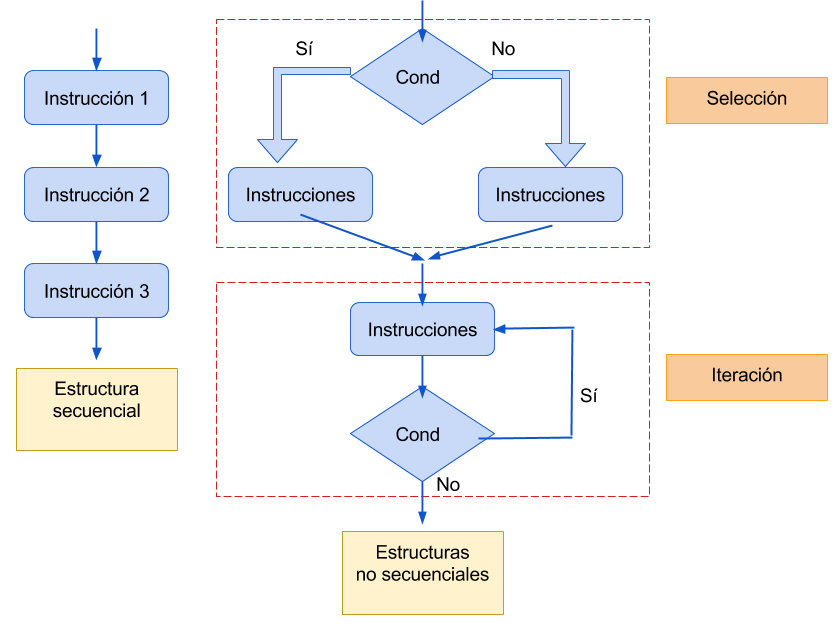
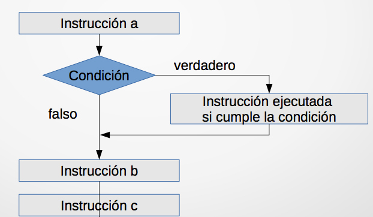
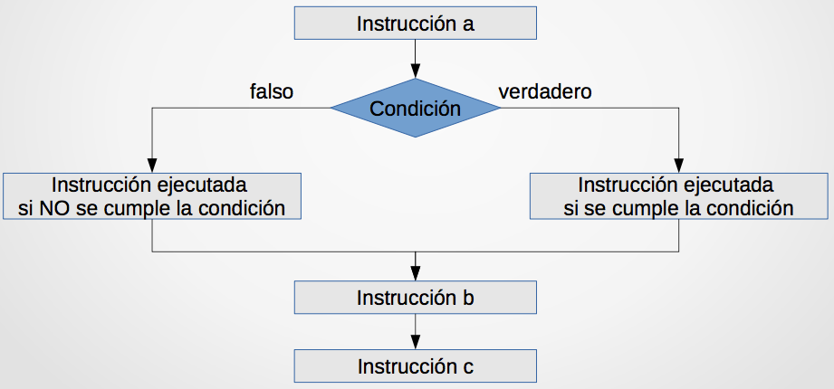
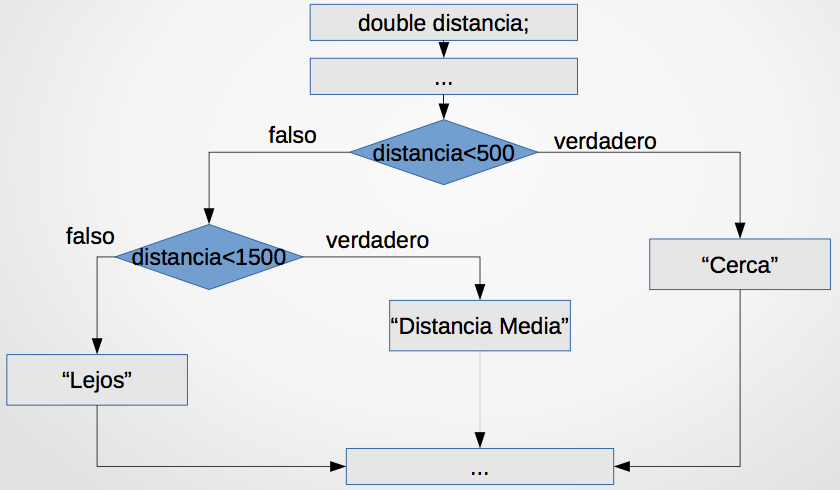
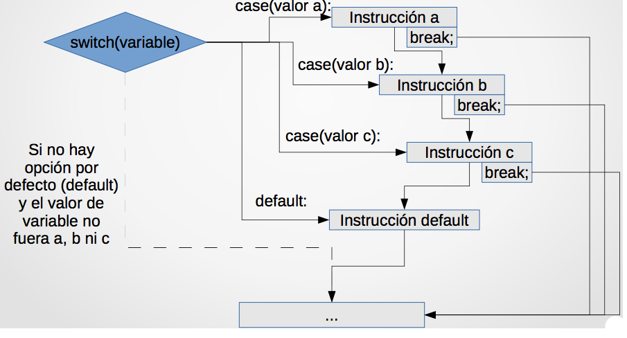
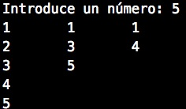

# Tema 3: Sentencias de control

## Contenidos

- [1. Programas y algoritmos](#1)
- [2. Estructuras de selección](#2)
	- [2-1. Sentencia `if`](#2-1)
	- [2-2. Sentencia `if-else`](#2-2)
	- [2-3. Sentencias `if`anidadas](#2-3)
	- [2-4. Operador `?`](#2-4)
	- [2-5. Sentencias `switch`](#2-5)
	- [2-6. Ejercicios](#2-6)
- [3. Estructuras de iteración](#3)
	- [3-1. Bucle `while`](#3-1)  
	- [3-2. Bucle `do-while`](#3-2)
	- [3-3. Bucle `for`](#3-3)
	- [3-4. Ejemplos de bucles](#3-4)
- [4. Traza de ejecución de un programa](#4)

## <a name="1"/> 1. Programas y algoritmos

- Un **algoritmo** es un conjunto de instrucciones que permiten hallar la solución a un determinado problema.
- Un **programa** es un conjunto de sentencias escritas en un lenguaje determinado para que un ordenador lleve a cabo una tarea. Los programas codifican algoritmos.

> Ejemplo. Tarea: Obtener el área de un triángulo
>
> - Algoritmo: multiplicar la base del triángulo por la altura del mismo y dividirla entre dos
> - Programa:

~~~c
int base = 3, altura = 5;
double area = base * altura / 2.0;
printf("El area de un triángulo de base %d y altura %d es %g\n", base, altura, area);
~~~

En un determinado instante, el **estado de un programa** queda definido por el valor que tienen sus variables en ese momento. El estado de un programa es dinámico, y puede cambiar con la ejecución de sentencias dentro del mismo. Es **imprescindible realizar las sentencias adecuadas en el orden adecuado**.

## <a name="2"/> 2. Sentencias de control

 El **flujo de ejecución de un programa** define el orden que siguen las sentencias durante la ejecución del mismo.

La **estructura secuencial** es aquella en la que las instrucciones o sentencias se ejecutan una a una en el orden establecido.

Ejemplo:

~~~c
int valorA = 11, valorB = 4, resultado; 
resultado = valorA / valorB;
valorA = valorA + 1; // resultado = 2
~~~

No es lo mismo que:

~~~c
int valorA = 11, valorB = 4, resultado; 
valorA = valorA + 1;
resultado = valorA / valorB; // resultado = 3
~~~

Se puede alterar esa secuencialidad usando estructuras no secuenciales, que permiten variar el flujo de control del programa dependiendo de ciertas condiciones. Las estructuras no secuenciales son:

- **Estructuras de selección**: Permite que se tomen rutas
alternativas de acción dependiendo del resultado de una
condición.
- **Estructuras de iteración**: Permite repetir un conjunto de sentencias.

## <a name="2"/> 2. Estructuras de selección

Permiten que el programa determine las sentencias a ejecutar en base a determinadas **condiciones**.

Las condiciones se presentan como operadores relacionales (condiciones booleanas), integrando como operandos valores, variables o constantes.

Suponen una **bifurcación** en la secuencia de ejecución de las instrucciones de un programa

> Ejemplos donde se utilizan estructuras de selección:
>
> - Si el robot no tiene batería: ir a la zona de carga
> - Si el robot está cerca de un obstáculo: reducir su velocidad
> - Si el semáforo esta en rojo: detenernos, en cualquier otro caso: continuar

### <a name="2-1"/> 2.1 Sentencia `if`

La sentencia `if` permite decidir qué secuencia de código se va a ejecutar a continuación en base a una condición.

La **sintaxis** de la sentencia `if` es:

~~~c
// Cuando la ejecución condicional afecta a una única línea

if (condicion_a_cumplir)
	instrucción a realizar;
~~~

~~~c
// Cuando la ejecución condicional afecta a una o más líneas

if (condicion_a_cumplir) {
	instrucción(es) a realizar;
}
~~~

La **semántica** (funcionamiento) del `if` es el siguiente:

- Si la `condicion_a_cumplir` devuelve un valor verdadero (o distinto de 0), se ejecutará la secuencia de instrucciones a realizar.
- Si la `condicion_a_cumplir`devuelve un valor falso (o 0), el `if`finalizará sin ejecutar la sencuencia de instrucciones asociada, pasándose a ejecutar la sentencia siguiente al `if`.

Como hemos comentado, el lenguaje C nativo no incorpora el tipo `bool`, por lo que tenemos que incluir la librería `#include <stdbool.h>`para trabajar con booleanos. La condición del `if` admite variables de otro tipo (`int`, `char`, `double`, ...) y se manejan como una variable `bool`, tomando el valor `false` si vale 0 o `true` para cualquier otro valor. No es aconsejable.

Ejemplo de sentencia `if`:

~~~c
bool fumador = true;
double dineroAhorrado = 500;
...
if (fumador)
	dineroAhorrado = 0;
...
if (dineroAhorrado > 1000 ) {
	fumador = false;
}
~~~

El uso de llaves es opcional si la instrucción a ejecutar tiene una única sentencia y es obligatorio si la instrucción tiene dos o más sentencias. Si no se añaden llaves, solamente la primera instrucción después del `if (condicion_a_cumplir)` será condicional: la segunda y sucesivas se ejecutarán siempre.

~~~c
bool condicionCumplida = false;

if (condicionCumplida)
   printf("Primera instrucción \n");
printf("Segunda instrucción \n"); // se ejecuta siempre
printf("Tercera instrucción \n"); // se ejecuta siempre

if (condicionCumplida) {
   printf("Primera instrucción \n");
   printf("Segunda instrucción \n");
   printf("Tercera instrucción \n");
}
~~~
La `condicion_a_cumplir` puede obtenerse mediante la combinación (usando operadores lógicos) de diferentes (sub)condiciones.

Precedencia de operadores:

	1. ()
	2. *, /, %
	3. +, -
	4. <, <=, >, >= – ==, !=
	5. &&
	6. ||

Ejemplo:

~~~c++
bool oscuridad = true,
bateriaAgotada = false,
prioridad = false,
camaraEncendida = true;
int tiempoEnEspera = 100;
...
if(oscuridad || bateriaAgotada || (tiempoEnEspera>60 && !prioridad))
	cameraEncendida = false;
~~~

Un programa con sentencias `if` puede visualizarse como un diagrama de la siguiente forma:

~~~c
instruccion_a;

if(condicion)
	instruccionSiSeCumpleCondicion;

instruccion_b;
instruccion_c;
~~~

### <a name="2-2"/> 2.2 Sentencia `if-else`

La sentencia `if-else`es una forma ampliada de la sentencia `if`. La utilizamos cuando tenemos instrucciones que sólo queremos que se
ejecuten cuando no se cumple la condición (opción `else`)

La **sintaxis** de la sentencia `if-else`es:

~~~c
if (condicion_a_cumplir) {
   instruccion(es)_a_ejecutar_condicion_verdadera;
}
else {
   instruccion(es)_a_ejecutar_condicion_falsa;
}
~~~

La **semántica** de la sentencia `if-else`es:

- Si la `condicion_a_cumplir`devuelve verdadero, se ejecuta `instruccion(es)_a_ejecutar_condicion_verdadera`.
- Si la `condicion_a_cumplir`devuelve falso, se ejecuta `instruccion(es)_a_ejecutar_condicion_falsa`.

El uso de llaves es idéntico a la sentencia `if`: opcional si la instrucción a ejecutar tiene una única sentencia y obligatorio si la instrucción tiene dos o más sentencias, tanto en la parte del `if`como en el `else`.

Ejemplo de `if-else`:

~~~c
int dineroAhorrado = 25500;
int precioCoche = 15000;


if (dineroAhorrado < precioCoche)
   printf("Necesitas ahorrar, sólo tienes %d euros \n", dineroAhorrado);
else
   printf("Ya puedes comprarte el coche de %d euros \n", precioCoche);
~~~

Diagrama de sentencias `if-else`:

~~~c
instruccion_a;

if(condicion)
   instruccionSiSeCumpleCondicion;
else
   instruccionSiNoSeCumpleCondicion;

instruccion_b;
instruccion_c;
~~~

### <a name="2-3"/> 2.3  Sentencias `if` anidadas

Podemos anidar condiciones usando la combinación `else if`:

~~~c
double distancia;
...
if(distancia<500)
   printf("Cerca \n");
else if(distancia<1500)
   printf("Distancia media \n");

else
  printf("Lejos\n");
~~~

Diagrama sentencia `if anidada`:

#### Sentencias condicionales en Python

Las estructuras de control de flujo condicionales, se definen mediante el uso de tres palabras claves reservadas, del lenguaje: `if` , `elif` (como el `else-if`de C) y `else`.

Veamos su sintaxis con algunos ejemplos:

~~~python
if semaforo == verde:
    print "Cruzar la calle"
else:
    print "Esperar"
~~~

~~~python
if compra <= 100:
    print "Pago en efectivo"
elif compra > 100 and compra < 300:
    print "Pago con tarjeta de débito"
else:
    print "Pago con tarjeta de crédito"
~~~

~~~python
importe_a_pagar = total_compra
if total_compra > 100:
    tasa_descuento = 10
    importe_descuento = total_compra * tasa_descuento / 100
    importe_a_pagar = total_compra – importe_descuento
~~~

### <a name="2-4"/> 2.4  Operador `?`

Es una herramienta útil para evaluar expresiones condicionales de forma abreviada.

Su **sintaxis** general es la siguiente:

~~~c
expresión1 ? expresión2 : expresión3;
~~~

**Semántica**:

Si la `expresión1` es cierta, entonces se evalúa la `expresión2`, en
otro caso se evalúa la `expresión3`.

Ejemplo:

~~~c
a = b < 0 ? -b : b;

/*
Si el valor de b es menor que 0, la expresión completa tomará el valor de -b, en otro caso tomará el valor de b.
En definitiva, a la variable a se le asigna el valor absoluto de b
dependiendo de la condición b < 0. La sentencia anterior completa
es equivalente a: if (b<0) a = -b; else a = b;
*/
~~~

### <a name="2-5"/> 2.5  Sentencias `switch`

La sentencia `switch`permite seleccionar entre múltiples opciones.

La **sintaxis** de la sentencia `switch`es:

~~~c
switch (variable_entera_a_evaluar) {
   case resultado_a:
      instruccion_a_realizar_resultado_a;
      break;
   case resultado_b:
      instruccion_a_realizar_resultado_b;
      break;
   default :
      instruccion_a_realizar_resultado_diferente_a_b;
}
~~~

La **semántica** de la sentencia `switch`es:

- Se evalúa en primer lugar la expresión que va entre paréntesis a continuación del `switch`. Debe dar como resultado un número entero.
- Después la ejecución empieza en el primer `case` cuya expresión coincida con el resultado obtenido en `variable_entera_a_evaluar`. Se ejecutan todas las instrucciones hasta el `break`.
- El `default`se ejecuta si no ha habido ningún `case`cuyo resultado coincida con `variable_entera_a_evaluar`.

Diagrama:

Ejemplo sentencia `switch-case`:

~~~c
int numHermanos = 6; // Prueba a usar 0,1,2,3,4 ...

switch (numHermanos) {
   case 0:      
      printf("Hijo/a único\n");
      break;
   case 1:
      printf("Pareja \n");
      break;
   case 2:
      printf("Familia numerosa \n");
      break;
   default :
   	  printf("Familia muy numerosa \n");
}
~~~

Cada bloque de sentencias `case`debe terminar con un `break`. Si no es así, el compilador entiende que también debe ejecutarse el bloque del case siguiente y lo engloba como el mismo bloque. Ejemplo:

~~~c
// Sentencias case sin break (no recomendable)
// Si contador vale 1 se ejecutarán las dos sentencias `printf`:
switch (contador) {
   case 1:
      printf("Opcion 1");
   case 2:
      printf("Opcion 2");
}
~~~

Ejemplo de enumeraciones y `switch`:

~~~c
enum paloPoker {pica, corazon, trebol, diamante};
enum paloPoker miCarta = pica;

switch (miCarta) {
   case diamante:
      printf("Diamante \n");
      break;
   case trebol:
      printf("Trébol \n");
      break;
   case corazon:
      printf("Corazón \n");
      break;
   case pica:
      printf("Pica \n");
      break;
   default :
      printf("La carta no es de poker \n");
}
~~~

Ejemplo con caracteres (internamente se almacenan con un valor entero, su valor ASCII):

~~~c
    char letra;
    printf("Introduzca una letra: ");
    scanf("%c", &letra);
    switch(letra) {
        case 'a':
            printf("Se ha pulsado una a.");
            break;
        case 'e':
            printf("Se ha pulsado una e.");
            break;
        case 'i':
            printf("Se ha pulsado una i.");
            break;
        case 'o':
            printf("Se ha pulsado una o.");
            break;
        case 'u':
            printf("Se ha pulsado una u.");
            break;
        default:
            printf("Otro carácter");
    }
~~~

### <a name="2-6"/> 2.6  Ejercicios

1. Escribe un programa que pida dos números por teclado y nos indique cual es el mayor, cual es el menor o si son iguales.
2. Escribe un programa que pida dos número por teclado y nos diga si uno es múltiplo del otro (divisible).
3. Escribe un programa que pida tres números por teclado y nos diga cuál es el menor.
4. Escribe un programa que pida una nota de 0 a 10 y la muestre en forma de texto: "Suspenso", "Aprobado", "Notable", "Sobresaliente".
5. Escribe un programa que pida dos números por teclado y una de las cuatro operaciones aritméticas de una calculadora (+, -, *, /). Devuelve el resultado de la operación aplicada a los dos números.
6. Escribe un programa que calcule el índice de masa corporal IMC de una persona. Se debe introducir el peso en kg y la altura en m. El IMC = peso / (altura * altura). El programa muestra por pantalla el tipo de peso:
	- IMC < 18.0 --> "Inferior al normal"
	- 18.1 - 24.9 --> "Normal"
	- 25.0 - 29.9 --> "Sobrepeso"
	- IMC > 30.0 --> "Obesidad"
7. Escribe un programa que solicite al usuario una letra (mayúscula o minúscula) e indique si es una vocal o una consonante.

___

## <a name="3"/> 3. Estructuras de iteración

Un **bucle** es una estructura de programación formada por una secuencia de sentencias, denominada **cuerpo del bucle**, que se puede repetir varias veces. Cada ejecución del cuerpo del bucle es una **iteración**. El número de veces que se ejecuta el cuerpo del bucle está controlado por una **condición** (expresión lógica).

  Por lo tanto, a la hora de diseñar e implementar un bucle, hay
que tener en cuenta dos aspectos:

- El cuerpo del bucle
- Cuántas veces debe iterarse el cuerpo del bucle

El lenguaje C proporciona tres sentencias de iteración: `while`, `do-while` y `for`.

Se pueden agrupar en dos tipos, dependiendo si conocemos de antemano el número de iteraciones:

- Bucles **determinados**: Sabemos a priori el número de veces que se repetirá el bucle. Es el caso del bucle `for`
- Bucles **indeterminados**: No sabemos de antemano cuántas iteraciones se realizarán. Es el caso de los bucles `while`y `do-while`

### <a name="3-1"/> 3.1  Bucle `while`

Permite repetir **cero** o más veces la ejecución de una secuencia de sentencias mientras la condición sea verdadera.

**Sintaxis:**

~~~c
while (condicion_a_cumplir) {
	secuencia_de_instrucciones;
}
~~~

**Semántica:**

- Mientras la `condicion_a_cumplir`devuelva un valor verdadero (distinto de cero), se ejecutará repetidamente la `secuencia de instrucciones`, evaluando nuevamente la condición en cada iteración.
- Si la `condicion_a_cumplir`devuelve un valor falso (igual a cero), finalizara la ejecución de la sentencia `while`.

La `condición_a_cumplir`debe ir entre paréntesis. La condición se sitúa al inicio, por lo que es posible que si inicialmente no se cumple, no se llegue a ejecutar nunca la `secuencia_de_instrucciones`.

Ejemplo:

~~~c
int cargaBateria = 0;

while (cargaBateria < 100) {
	cargaBateria = cargaBateria + 1;
}
~~~

Otro ejemplo:

~~~c
int caramelos = 0;
char res;

printf("¿Quieres un caramelo (s/n)?:");
scanf("%c", &res);

while (res == 'S' || res == 's') {
   caramelos = caramelos + 1;
   printf("¿Quieres otro caramelo? (s/n):");
   scanf("\n%c", &res); //"\n" es para que res ignore el intro
} // fin de la sentencia while

printf("Te he dado %d caramelos\n", caramelos);
~~~

### <a name="3-2"/> 3.2.  Bucle `do-while`

Permite repetir **una** o más veces la ejecución de una secuencia de sentencias mientras la condición sea verdadera.

**Sintaxis**:

~~~c
do {
	secuencia_de_instrucciones;
} while (condición_a_cumplir);
~~~

**Semántica**:

- En primer lugar se ejecuta la `secuencia_de_instrucciones`.
- Después se evalúa la `condicion_a_cumplir`. Si el resultado es verdadero se repite la ejecución de `secuencia de instrucciones`. Si es falso, finaliza la ejecución.

Ejemplo:

~~~c
int num;
int suma = 0;

do {
   printf("Introduzca un número: (0 para finalizar)");
   scanf("%d", &num);
   suma += num;
}while (num != 0);

printf("La suma de todos los números introducidos es: %d\n", suma);
~~~

Al situarse la condición se sitúa al final, la `secuencia_de_instrucciones` se ejecuta al menos una vez.

### <a name="3-3"/> 3.3. Bucle `for`

Permite repetir un número determinado de veces la ejecución de una secuencia de instrucciones. El número de iteraciones del bucle es controlado por una variable usada como un **contador**.

Es un bucle determinado porque conocemos de antemano el número de iteraciones.

**Sintaxis**:

~~~c
for (inicialización_contador; condicion; modificación_contador){
   secuencia_de_instrucciones;
}
~~~

**Semántica**:

- Primera vez que se ejecuta:
	- Se ejecuta la `inicialización_contador`
	- Se evalúa la `condición`. Si el resultado es verdadero se ejecuta la `secuencia_de_instrucciones`. Si es falso, finaliza.
- Segunda vez y sucesivas ejecuciones:
	- Se ejecuta la `modificación_contador`
	- Se evalúa la `condición`. Si el resultado es verdadero se ejecuta la `secuencia_de_instrucciones`. Si es falso, finaliza.

Ejemplos:

~~~c
for (i = 0; i < 10; i++) {
   printf ("Esta es la iteración %d", i);
}
~~~

Ejemplo con un incremento de 2 en 2:

~~~c
int i;
for (i = 6; i <= 20 ; i+=2) {  // incremento de 2 en 2
   if (i % 3 == 0)  //  múltiplos de 3
      printf("%d ", i);
}

// Imprime 6 12 18
~~~

Cualquier bucle `for`se puede escribir con un bucle `while`:

~~~c
for (expresión_1; expresión_2; expresión_3) {
   secuencia de sentencias;
}
~~~

Es equivalente a:

~~~c

expresión_1 ;
while (expresión_2) {
   secuencia de sentencias;
   expresión_3;

}
~~~

El equivalente usando `while` del ejemplo anterior es:

~~~c
i = 0;
while(i < 10) {
   printf ("Esta es la iteración %d", i);
   i++;

}
~~~

Para saber qué tipo de bucle hay que usar:

- Si el cuerpo del bucle (secuencia de instrucciones) se tiene que ejecutar al menos una vez: `do-while`
- Si no (0 ó más veces):
	- Si no sabemos de antemano el número de iteraciones: `while`
	- Si sabemos el número de iteraciones (usamos un contador): `for`

### Variables en los bucles

En los bucles se suelen utilizar variables para unas tareas específicas:

- **Contadores**: son variables destinadas a contener un valor que se irá incrementando o decrementando en una cantidad fija. Se suelen utilizar para el control de procesos repetitivos.
- **Acumuladores**: Son variables destinadas a contener distintas cantidades provenientes de los resultados obtenidos en operaciones aritméticas previamente analizadas de manera sucesiva, lo que nos permitirá obtener el total acumulado de dichas cantidades. A diferencia de los contadores, no controlan los procesos repetitivos. Su inicialización depende de en qué operación matemática van a ser utilizados.
- **Interruptores** (switches): también denominados conmutadores o indicadores, son variables que pueden tomar dos únicos valores considerados como lógicos y opuestos entre sí a lo largo de todo el programa (0 ó 1, 1 ó -1, Verdadero o Falso, on/off, etc.).
Su objetivo es recordar en un determinado lugar del programa un suceso determinado o hacer que dos acciones diferentes se ejecuten alternativamente en un proceso repetitivo. También deben ser inicializados. No se debe abusar de su utilización cuando no sea necesario.

Ejercicio:

Implementa un programa que lea números que el usuario introduzca por teclado hasta que introduzca el cero. El programa tiene que imprimir la suma de todos los números introducidos y el número de números que se han introducido.

### Validación de datos

Cuando estamos desarrollando un programa es frecuente que nos pidan por teclado un número que esté en un rango determinado (por ejemplo entre 1 y 10) o que nos pidan unos determinados caracteres (por ejemplo 's' o 'n'). Normalmente en estos casos, si el dato introducido no es válido, se tiene que volver a solicitar un nuevo dato hasta que sea correcto. Para ello utilizamos bucles que pidan repetidamente el dato mientras no sea correcto.

Por ejemplo, nos piden un número par. Si no es par, se tiene que volver a pedir:

~~~c
int num;

do {
   printf("Introduce un número par: ");
   scanf("%d", num);
}while(num % 2 != 0);  //repetir mientras no sea par

~~~

#### Bucles en Python

**Bucle while en Python**

~~~python
num = 1
while num <= 10:
    print "El número es: ", num
    num = num + 1
~~~

**Bucle for en Python**

Ejemplo que itera sobre una lista:

~~~python
lista_animales = ['gato', 'perro', 'pez']

for animal in lista_animales:
    print "El animal es:", animal
~~~

### <a name="3-4"/> 3.4. Ejemplos de bucles en C

Ejemplo con bucle `while`. Utilizamos el bucle indeterminado `while`porque no sabemos de antemano el número de iteraciones: el bucle terminará cuando el usuario introduzca un cero.

~~~c
/* Obtener la media de una lista de números. La
lista termina cuando se introduce el número cero */

void main() {
   int total = 0;
   float num = 0, media = 0;

   printf(“Dime un número: ”);
   scanf(“%f”, &num);

   while(num != 0) {
      media = media + num;
      total++;
      printf(“Dime otro número: ”);
      scanf(“%f”, &num);
   }

   if(total != 0)
      printf(“La media es %f.\n”, media/total);
   else
      printf(“No hay media.\n”);
}
~~~

Ejemplo con bucle `do-while`

~~~c
/* Calcular el número más grande de una lista de
números mayores que cero. La entrada de números
terminará cuando se introduzca un número negativo
o cero. */

void main() {
   int num, max = 0;

   do {
      printf(“Dame un número: ”);
      scanf(“%d”, &num);
      if(num > max)
      max = num;
   } while(num>0);

   if(max != 0)
      printf(“El número más grande es %d.\n”, max);
   else
      printf(“No hay máximo.\n”);
}
~~~

Ejemplo con bucle `for` y `do-while`

~~~c
#define NUM_PARCIALES 5 // Número de exámenes parciales
int main() {
	float nota_parcial, nota_final;
	float suma;
	int i;
	suma = 0;

	// Introducir las notas de todos los parciales y sumarlas (sólo cuando el dato introducido sea correcto)
	for (i = 1; i <= NUM_PARCIALES; i++) {
		do {
			printf("Dime tu nota del parcial %d\n", i);
			scanf("%f", &nota_parcial);
		} while (nota_parcial < 0.0 || nota_parcial > 10.0);
		suma = suma + nota_parcial;
	}
	// Calcular la nota media e imprimirla por pantalla
	nota_final = suma / NUM_PARCIALES;
	printf("Tu nota final es: %.2f\n", nota_final); //%.2f imprime sólo dos decimales
}
~~~

Factorial de un número:

~~~c
int n;
int res = 1;

printf("Introduce un número n: ");
scanf("%d", &n);

do {
   res *= n;
   n--;
}while(n > 1);

printf("El factorial de %d es %d\n", n, res);
~~~

Ejercicio: Haz el ejercicio anterior (factorial de un número) utilizando un bucle for

## <a name="4"/> 4. Traza de ejecución de un programa

Se utiliza para estudiar la secuencia de **estados** por los que pasa un programa, es decir, el valor que van tomando las variables instrucción a instrucción. Las variables almacenan el estado de un programa y mediante los pasos de ejecución se va modificando su estado. Se utilizan principalmente para depurar un programa (corregir errores de ejecución) o para comprender qué hace un programa o parte del mismo.

La traza se lleva a cabo normalmente mediante la ejecución manual de forma secuencial de las sentencias que componen el programa. También existen herramientas de depuración que nos permiten ejecutar paso a paso, o parar la ejecución en un punto concreto para observar el estado del programa. Por ejemplo el depurador *gdb*.

Ejemplo:

> Realiza una traza de ejecición del siguiente programa y explica lo que hace:
>
~~~c
void main() {
   int i, res;
   res = 0;
   for (i = 1; i <= 10; i++) {
      res += i * i;
   }
   printf("%d\n", res);
}
~~~
> Para realizar la traza tenemos que hacer una tabla de este estilo:
>
i   | i * i | res
--- | --- | ---
1   | 1   | 1
2   | 4   | 5
3   | 9   | 14
4   | 16  | 30
5   | 25  | 55
6   | 36  | 91
7   | 49  | 140
8   | 64  | 204
9   | 81  | 285
10  | 100 | 385
>
> ¿Qué hace el código?

Veamos otro ejemplo:

> Todos los días paso por una librería y me compro una serie de libros siguiendo este patrón
> 
- día 1 → 1 libro
- día 2 → 2 libros
- día N → N libros

>Si tengo una estantería donde caben M libros
¿ qué día llegaré a casa y no podré poner todos los libros que he comprado ?

>Programa:
>
~~~c
int capacidadMaxima = 15,
    capacidadActual = 0,
    dia = 0;
do {
	dia = dia + 1;
	capacidadActual = capacidadActual + dia;
} while(capacidadActual <= capacidadMaxima);
printf("Rebasamos la capacidad el día %d", dia);
~~~
>
>Traza:
>
Iteración | dia | capacidadActual
--------- | --- | ---
1   | 1   | 0 + 1 = 1
2   | 2   | 1 + 2 = 3
3   | 3   | 3 + 3 = 6
4   | 4   | 6 + 4 = 10
5   | 5   | 10 + 5 = 15
6   | 6   | 15 + 6 = **21**

---
## <a name="5"/> 5.  Ejercicios resueltos

#### Ejercicio 1
Escribe un programa que lea cantidades y precios y al final indique el total de la factura. 
Primero se pregunta la cantidad vendida, tras lo cual el usuario introducirá un número entero positivo.
Después se pregunta el precio que será un número decimal positivo. La lectura termina cuando en la cantidad se introduzca un cero. Si es así se escribirá el total.

~~~c
int main(){
   int n;
   double precio, total=0;
   
   do{
      do{
         printf("\nIntroduzca la cantidad vendida: ");
         scanf("%d",&n);
         if(n<0)
            printf("Cantidad no valida");
      }while(n<0);  // validación de datos

      if (n>0){
         printf("Introduzca el precio: ");
         do{
            scanf("%lf",&precio);
            if(precio<0)
               printf("Precio no valido");
            else
               total+=n*precio;
         }while(precio<0); // validación de datos
      }
   }while(n!=0);
   printf("Total vendido = %.2f", total);
}
~~~

#### Ejercicio 2

Escribe un programa que escriba la tabla de multiplicar de un número pedido entre 1 y 10


~~~c
int main() {
   int num, i;

   do {
      printf("Introduce un num entre 1 y 10: ");
      scanf("%d", &num);
   }while(num < 1 || num > 10);  // validación de datos

   for(i = 1; i <= 10; i++) {
      printf("%d x %d = %d\n", i, num, i * num);
   }
}
~~~

#### Ejercicio 3

Escribe un programa que lea un número entero y positivo y que escriba tres columnas. La primera cuenta desde uno hasta el número escrito contando de uno en uno; la segunda columna contando de dos en dos y la tercera de tres en tres.

~~~c
int main(){
  int col1 = 1, col2 = 1, col3 = 1;
  int n;

  printf("Introduce un número: ");
  scanf("%d",&n);

  while(col1 <= n){
    printf("%d",col1);
    if(col2 <= n) {
      printf("\t%d",col2);  //\t para tabular
      if(col3 <= n){
        printf("\t%d",col3);
        col3 += 3;
      }
      col2 += 2;
    }
    printf("\n");
    col1++;
  }
}
~~~

#### Ejercicio 4

Escribe un programa que muestre un menú como este:

1. Salir
2. Sumatorio
3. Factorial

Tras mostrar el menú, el programa debe leer un número del 1 al 3:

- si se elige 1, el programa acaba.
- si se elige 2 se calcula el sumatorio del número
- si se elige 3 se calcula el factorial

En las opciones 2 y 3 el programa pedirá el número sobre el que se calcula el sumatorio o el factorial. Tras calcular el sumatorio o el factorial e indicar el resultado, el programa volverá a mostrar el menú y así sucesivamente.


~~~c

int main(){
   int seleccion;
   int n, aux;
   double res;

   do{
      /* Mostrar el menú*/
      do{
         printf("******************\n");
         printf("1 Salir\n");
         printf("2 Sumatorio\n");
         printf("3 Factorial\n");
         printf("******************\n");
         printf("Escriba su opcion: ");
         scanf("%d", &seleccion);
      } while(seleccion!=1 && seleccion!=2 && seleccion!=3);

      switch(seleccion){
         case 2:/* Sumatorio */
            printf("Escriba el numero sobre el que quiere el sumatorio: ");
            scanf("%d", &n);
            res = 0;
            for(aux = n;aux >= 1;aux--)
               res += aux;
            printf("El sumatorio es: %.0lf\n\n\n", res);
            break;

         case 3: /* Factorial */
            printf("Escriba el numero sobre el que quiere el factorial: ");
            scanf("%d", &n);
            res = 1;
            for(aux = n;aux >= 1;aux--)
               res *= aux;
            printf("El factorial es: %.0lf\n\n\n", res);
            break;
      }
   }while(seleccion!=1);
}

~~~

#### Ejercicio 5

Escribe un programa que lea un número entero y a partir de él imprima un cuadrado de asteriscos de ese tamaño. Los asteriscos sólo se verán en el borde del cuadrado, no en el interior.

~~~c
int main(){
  int n, fil, col;

  printf("tamaño del cuadrado: ");
  scanf("%d", &n);

  for (fil = 0; fil < n; fil++) {
    for (col = 0; col < n; col++) {
      if(fil == 0 || fil == n-1 || col == 0 || col == n-1)
        printf("*");
      else
        printf(" ");
    }
    printf("\n");
  }

}
~~~

---

## <a name="6"/> 6.  Ejercicios propuestos

1. Escribe un programa que muestre todos los multiplos de un número dado en el rango [0, 100] – Pedir el número por teclado
2. Escribe un programa que muestre todos los divisores de un número dado
	– Pedir el número por consola
	– Uso del operando módulo %
3. Hacer las trazas de los ejercicios 1 (valor de entrada 40) y 2 (valor de entrada 16)
4. Escribir un programa que pida dos números y muestre un menú como este:

	1. Suma
	2. Resta
	3. Multiplicación
	4. División
	5. Módulo
	6. Salir

Tras mostrar el menú, el programa debe leer un número del 1 al 6 y realizar la opción indicada con los dos números. Tras realizar las operaciones e indicar el resultado, el programa volverá a mostrar el menú y así sucesivamente. Finalizará cuando se introduzca la opción 6.

----

Programación 1, Grado de Robótica, curso 2018-19  
© Departamento Ciencia de la Computación e Inteligencia Artificial, Universidad de Alicante  
Cristina Pomares Puig
