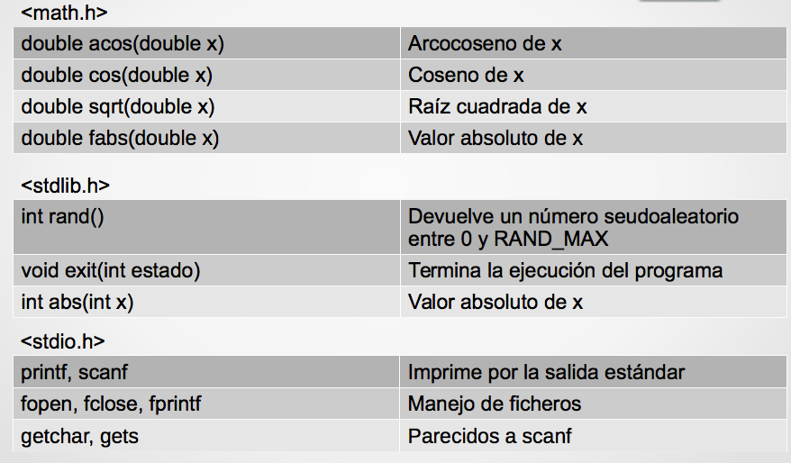
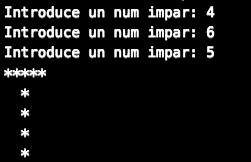

# Tema 4: Descomposición modular

## Contenidos

- [1. Descomposición modular](#1)
- [2. Funciones](#2)
- [3. Ámbito de las variables](#3)
- [4. Paso de parámetros por valor y por referencia](#4)
- [5. Estructura de un programa en C](#5)
- [6. Bibliotecas del lenguaje C](#6)
- [7. Ejercicios](#7)

## <a name="1"/> 1. Descomposición modular

Ya hemos visto que en C se utilizan funciones de biblioteca (como `printf` o `scanf`). También hemos utilizado la función `main`, que es la función principal del programa. Sin embargo, también es posible que el programador pueda definir sus propias funciones que realicen determinadas tareas.

El uso de funciones definidas por el programador permite dividir un programa grande en un cierto número de componentes más pequeñas, cada una de las cuales con un propósito único e identificable. Por tanto, un programa en C se puede modularizar en subproblemas (programar de forma estructurada) mediante el uso adecuado de funciones.

Podemos decir que la ejecución de cualquier programa en C empieza ejecutando la función `main` instrucción a instrucción desde la primera a la última. Si alguna instrucción hace una llamada a una función (la invoca), el programa deja en espera el punto de ejecución por donde iba y pasa a ejecutar la función, de la misma forma. Cuando termina, vuelve a seguir por la función principal por donde la había dejado. Cada función puede llamar a otras funciones, e incluso a sí misma (recursión).

Una de las habilidades fundamentales del pensamiento computacional es la **abstracción**: definir subproblemas que creen nueva semántica, dividir un problema grande en pequeños problemas (funciones), ... Esto hace el código más fácil de entender, probar, modificar, compartir, reutilizar.

Ventajas de modularizar un programa:

- **Generalización**: si un programa tiene instrucciones repetidas en distintas partes, esas instrucciones repetidas se pueden agrupar en una sola función, a la que acceder cuando sea necesario.
- **Claridad lógica**: programas más fáciles de escribir y depurar. La estructura lógica es más fácil de entender.
- También permite al programador construir bibliotecas de funciones de **uso frecuente**. Evita la reescritura del código.
- Favorece la **portabilidad**.
- Facilita el diseño descendente y la **programación estructurada**.
- Reduce el tiempo de programación: **reutilización** y división de tareas
- Disminuye el tamaño total del programa
- Facilita la detección y corrección de errores
- Facilita el **mantenimiento** del programa

Cuando empezamos a abordar un problema, lo mejor es ir dividiéndolo en subproblemas.

>Por ejemplo: guiado de un robot desde la clase hasta la puerta de salida
>
Subproblemas:
>
- Encontrar la puerta del aula y salir
- Guiado por el pasillo hasta encontrar las escaleras
- Bajar las escaleras
- Encontrar la puerta de salida y salir

Cada subproblema puede ser tratado por separado: analizado, dividido a su vez en subproblemas, probado de manera independiente, y tenemos la posibilidad de reutilizar código ya hecho

## <a name="2"/> 2. Funciones

Algunos lenguajes de programación tienen dos tipos de
herramientas para modularizar: procedimientos y funciones. En el lenguaje C sólo existen las **funciones**.

Un programa en C está estructurado en funciones. De hecho, `main()` es una función, es la función principal.

Una función es una unidad de código diseñada para realizar una tarea determinada.

Las funciones en programación son similares a las funciones matemáticas, pudiendo tener argumentos o parámetros.

Ejemplo:

> Definición de una función en matemáticas: f(x) = x + 5;
>
- f es el nombre de la función que tiene un parámetro formal: x.
- La función f, una vez definida, puede usarse o llamarse en algunas expresiones: y = f(4) + 1;
- Para descubrir el valor de f(4) hay que sustituir el parámetro formal x por el valor 4 (argumento actual), f(4) = 4+5 = 9, de donde obtenemos que y = 9 + 1 = 10.
- Se dice que la función f devuelve el valor 9.

Las funciones en programación son más generales que las
funciones matemáticas: pueden tener parámetros  de cualquier tipo y pueden incorporar estructuras de control.

#### Funciones como cajas negras

Podemos plantearnos las funciones como cajas negras, definidas exclusivamente por los datos de entrada (información que hay que suministrarles) y los datos de salida. Lo que suceda dentro de la caja negra no tiene por qué saberse, sólo importa a los que han diseñado la función. El usuario debe saber cómo funciona y cómo se usa, pero no cómo está implementada.

#### Elementos de las funciones

Las funciones en programación también tienen todos los
elementos vistos en las funciones matemáticas:

- **Definición**: Donde se define su nombre, los parámetroparámetros que va a tener (nombre, número y tipo) y lo que la función debe hacer o cómo calcular el valor que devuelve la función. También se define el tipo
del valor que se devuelve (tipo de la función).
- **parámetros formales**: Son los nombres de los parámetros que aparecen en la definición de una función.
- **Llamada a una función**: Es la instrucción donde se invoca a la función.
- **parámetros actuales**: Son los parámetros utilizados en la llamada.

Ejemplo: implementamos en C la función matemática f(x)=x+5:

~~~c
/*int f: Tipo del valor que devuelve la función (tipo de la función).
Debe coincidir con el tipo de la expresión que hay después de la palabra return
f: nombre de la función
(int x): parámetro formal y su tipo*/

int f (int x) {
	return x + 5; /*valor que devuelve la función*/
}
~~~

En un programa definimos la función una vez y la utilizamos (llamamos) siempre que sea necesario. La llamada a una función puede utilizarse en cualquier lugar en el que pueda utilizarse una expresión del tipo de la función.

Ejemplo: ¿Qué salida produce el siguiente programa para un determinado valor de entrada ?

~~~c
#include<stdio.h>

int f (int x);  // Prototipo o declaración de la función f

void main() {
   int num1, num2 num3;

   printf("\n- Introduzca un número: ");
   scanf("%d", &num1);

   num2 = f(5);
   num2 = f(num1) + num1 - num2;
   num3 = f(num2+1);

   printf("\n- Valores: %d, %d y %d.", num1, num2, f(num3));
}

int f (int x) {   // Definición de la función f
   return x + 5;
}
~~~

Cuando se llama a la función `f(5)`, el parámetro **formal** `x` toma el valor de `5`que es el parámetro **actual**.

### Sintaxis de una función en C

~~~c
<tipo_devuelto> <nombre_funcion> (<parámetros formales>) {
	<cuerpo de la función>
}
~~~

- El `<tipo_devuelto>` indica el tipo del valor que devuelve la función. En el caso del ejemplo de la función `mínimo`, el tipo de retorno es `int`. Es posible que la función no devuelva nada, en ese caso el tipo de devuelto es `void`.
- El `<nombre_función>`, en nuestro ejemplo `minimo`. Debe ser indicativo de la funcionalidad desarrollada. Usaremos la misma norma que para las variables
- `<parámetros formales>`: es una lista con la declaración de todos los parámetros formales (tipo y nombre), separados por comas. Puede estar vacía. Los parámetros formales permiten que se transfiera información desde el punto del programa en donde se llama a la función a ésta. Cada parámetro formal debe ser del mismo tipo que el dato que recibe desde el punto de llamada.
- El `<cuerpo de la función>`  contiene las instrucciones que realizan la tarea concreta de la función. Es la implementación de la función.
	- Pueden declararse variables locales a la función.
	- Puede contener la sentencia `return` para devolver el valor que corresponda.
		- Formato: `return <expresión>;`
		- Esta sentencia puede aparecer varias veces, aunque  es deseable que sólo aparezca una vez al final.
		- En cuanto se ejecute una sentencia `return` la función termina, devolviendo el valor que haya en esa sentencia `return`.
		- El valor devuelto debe ser del tipo especificado `tipo_devuelto`.

#### Prototipo o declaración de una función

Sintaxis:

~~~c
<tipo_devuelto> <nombre_f> (<tipo_args_formales>);
~~~

- `<tipo_args_formales>`: Es una lista con la declaración de todos los parámetros formales, separados por comas. Pueden ponerse sólo los tipos (sin el nombre de los parámetros).
- El resto es como la sintaxis de definición de una función, pero sin el cuerpo.

El prototipo, también llamado declaración de una función o cabecera (*header*) sirve para especificar o declarar que existe una función con cierto número
y tipo de parámetros y que devuelve un determinado tipo de datos.

El prototipo no define el proceso que se realiza, el cual se especifica en la definición de la función.
El prototipo de una función debe ser coherente con
la cabecera de su definición.

Ejemplo de prototipos de funciones:

~~~c
int sumaValores (int valorA, int valorB);
void muestraResultados (int);
bool estaDentroLimites (int x, int y);
char preguntaUsuario ();
~~~

#### Variables locales a una función

Las **variables locales** son aquellas que se declaran dentro de una función. Las variables de sus parámetros formales son locales a la función:

- Sólo tienen sentido y sólo pueden usarse dentro de esa función: su **ámbito es local** a la función
- Su nombre es totalmente independiente de las variables locales de
otras funciones, incluyendo la función `main()`.

~~~c
int f (int x){
   int y = 3;
   return x + y;
}

void g (char x){
   printf("%c", x);
}

~~~

Si nos fijamos en las variables `x` de las funciones anteriores, vemos que se llaman igual pero
son variables distintas: tienen distinto ámbito (visibilidad), distinto significado, distinta utilidad...

Otros ejemplos:

~~~c
// Esta función recibe dos parámetros y devuelve el menor de ellos

int minimo(int a, int b) {
   int menor; // el menor de dos números

   menor = a;
   if (b < menor)
      menor = b;

	return(menor);
}
~~~

~~~c
// Esta función no recibe parámetros e imprime la cadena de texto "hola mundo"

void holamundo() {
   printf("Hola mundo\n");
}
~~~

## <a name="3"/> 3. Ámbito de las variables

**Variables locales**: Son variables que sólo son visibles y accesibles dentro del ámbito donde se han creado

- Si declaramos una variable dentro del cuerpo de una función, es accesible en toda la función. En cuanto la función termine su ejecución, esa variable desaparece. 
- Si esta declaración se realiza dentro de un bloque de código (dentro de un if, switch, for, while ...), sólo es accesible dentro del bloque de código

**Variables globales** (NO SE PERMITEN EN ESTA ASIGNATURA): Son variables que se declaran fuera de todas las funciones. Pueden ser utilizadas por todas las funciones que haya después de su declaración. Normalmente, estas variables se declaran antes que las funciones, por lo que su ámbito o visibilidad es global. Su uso está desaconsejado, especialmente en programadores noveles, porque complica la comprensión de los programas y pueden dar lugar a **efectos laterales** erróneos que suelen ser muy difícil de localizar.

Ejemplos:

~~~c
int main() {
   int a = 1;

   if(a > 0) {
      int b = 8; // variable local al if
   }
   printf("El valor de la variable es: %d", b); //Error, variable no definida

   return 0;
}
~~~

### Dónde definir las funciones en C

En un programa en C las funciones pueden situarse en dos sitios distintos:

1. Antes de la función `main()`:

	- En este caso se definirá la función `main()` al final.
	- Las funciones se ordenarán teniendo en cuenta que para utilizar
una función ésta debe estar definida previamente.
2. Después de la función `main()`:
	- En este caso lo habitual es definir la función `main()` al principio.
	- Antes de la función `main()` se incluirán los prototipos de todas las funciones. Esto es imprescindible, ya que, al estar definidas las funciones al final, el compilador no reconoce las llamadas a las mismas que puedan haberse realizado.
	- El orden de las funciones ya no es importante, ya que todas podrán utilizar a todas las demás, puesto que están todos los prototipos declarados previamente.

Esta segunda forma es más laboriosa pero evita errores en el orden de las funciones. Además, el tener todos los prototipos juntos simplifica localizar las características de cada función.

## <a name="4"/> 4. Paso de parámetros por valor y por referencia

#### Paso de parámetros por valor

Cuando se produce la llamada a una función, se transfiere la ejecución del programa al cuerpo de la función. Se crea un **nuevo ámbito local** donde la función se ejecuta. Pasos:

1. Se declaran las variables de los parámetros formales.
2. Se copia el valor de los parámetros actuales en las
variables de los parámetros formales.
	- Esta copia se hace por orden: el primer parámetro actual en
el primer parámetro formal, el segundo en el segundo...
	Esta copia no se hace por el nombre de los respectivos parámetros formales y actuales.
	- Se copia el valor: si el argumento
actual es una variable, se copia su valor en el correspondiente argumento formal, pero ambos argumentos actuales y formales son variables distintas.
3. Se declaran las variables locales a la función.
4. Se ejecuta el código de la función en ese ámbito local.
5. Al terminar la función las variables LOCALES son destruidas, es decir, el **ámbito donde la función se ejecutó desaparece**. Si los argumentos formales se modifican dentro de la función, no se modificarán los argumentos
actuales, puesto que son variables distintas.

Ejemplo:

~~~c
/*¿Qué salida produce el siguiente programa para distintas entradas?*/

#include<stdio.h>

float func (float x, float y); // prototipo

void main(){
   float x, y, z;

   printf("\n- Introduzca un número: ");
   scanf("%f",&x);

   y = x + x;
   z = func(y,x);

   printf("\n- Valores: %.1f, %.1f y %.1f.", x, y, z);
}

float func (float x, float y){
   x = x + 1;
   y = y + 2;
   return x - y;
}

~~~

Ejemplo de funciones con enumerados:

~~~c
typedef enum {Avance, Retroceso} TMotor;

TMotor leerPalanca();
void modificaEstadoMotor(TMotor);

int main() {
   TMotor estadoMotor;

   estadoMotor = leerPalanca();
   modificaEstadoMotor(estadoMotor);
}

TMotor leerPalanca() {
   TMotor direccionMotor;

   do {
      printf("¿En qué posición está la palanca del cortacésped? 0-Avance 1-Restroceso\n");
      scanf("%d", &direccionMotor);
   }while(direccionMotor != Avance && direccionMotor != Retroceso);
   
   return direccionMotor;
}

void modificaEstadoMotor(TMotor estado) {
   switch(estado) {
      case Avance:
         //Llamada a función para modificar el motor hacia adelante
         break;
      case Retroceso:
         //Llamada a función para modificar el motor hacia atrás
         break;
   }
}
~~~

#### Paso de parámetros por referencia

En el paso de parámetros **por valor**, si los argumentos formales se modifican, los argumentos actuales no cambian.

Sin embargo, a veces resulta muy útil poder modificar en una función los argumentos actuales. Esto se consigue usando el paso de argumentos **por referencia**:

- Esto es otra forma de conseguir que una función devuelva valores (aparte de la instrucción `return`).
- Además, de esta forma una función puede devolver tantos valores como se deseen.

En lenguaje C, por defecto todos los pasos de parámetros son por valor. Se llama paso de parámetros por referencia a una técnica
que permite a una función modificar variables utilizadas como argumentos actuales.

La función recibe la referencia a la posición de memoria donde se encuentra el valor a utilizar.
Este parámetro debe ser una variable, la cual puede o no contener un valor inicial.
Las modificaciones realizadas sobre el parámetro dentro de la función se trasladan a la variable actual ya que se realizan sobre su zona de memoria.

##### Cómo pasar argumentos por referencia:

1. En la llamada a la función:
	- usar el operador de dirección `&` (ampersand) delante del argumento en la llamada. El operador `&` indica que dicha variable puede verse modificada por la función.
2. En la definición de la función:
	- Usar el operador de indirección `*` (asterisco) delante del argumento formal correspondiente.
	- Se usará el operador `*` cada vez que la variable del argumento formal sea utilizada, tanto en la declaración de la variable (entre los paréntesis de la función) como en el cuerpo de la función.

Ejemplo 1:

~~~c
void swap (int*, int*); // prototipo de la función swap

int main(){
   int x = 1, y = 2, z = 3;

   swap(&x, &y);
   swap(&y, &z);

   printf("x: %d, y: %d, z:%d\n", x, y, z);
}

/* Intercambio de valores entre dos variables */
void swap (int *x, int *y){ // definición de la función swap
   int aux = *x;
   *x = *y;
   *y = aux;
}
~~~

Ejemplo 2:

~~~c

void dividirSeguro(int , int , int *, bool *);

int main() {
    int valor1, valor2, result;
    bool error;

    printf("Introduce dos numeros:\n");
    scanf("%d",&valor1);
    scanf("%d",&valor2);

    dividirSeguro(valor1, valor2, &result, &error);

    if(error)
        printf("Error: Division por cero\n");
    else
        printf("%d/%d = %d\n",valor1, valor2, result);

    return 0;
}

/* División segura */
void dividirSeguro(int dividendo, int divisor, int *result, bool *error) {
    *error = false;

    if(divisor != 0)
        *result = dividendo / divisor;
    else
        *error = true;

}

~~~

Ejemplo 3:

~~~c
int elevarAlCuadrado(int entrada); // prototipo
int main() {
   int valor = 7, resultado;

   resultado = elevarAlCuadrado(valor);

   printf("El resultado es: %d \n", resultado);
}

int elevarAlCuadrado(int entrada) { // definición
      return entrada * entrada;
}

~~~

~~~c
Ejemplo 4:

// Prototipo o declaración de la función
int potencia(int base, int exponente);
// int potencia(int, int);

int main() {
   int res;

   res = potencia(2,4);  // Llamada a la función
}

// Definición de la función
int potencia(int base, int exponente) {
   int resultado, i;

   resultado = base;

   for (i = 0; i < exponente; i++)
      resultado *= base;

   return resultado;
}
~~~

Ejemplo 5:

~~~c
// Prototipos
int pedirDato();
void pedirXY(int* , int*);

int main() {
   int numero, posX, posY;

   pedirXY(&posX, &posY);
   printf("X: %d, Y: %d\n", posX, posY);
}

// Definiciones de funciones

int pedirDato() {
   int dato;

   do {
      printf("Introduce un num entre 1 y 8: ");
      scanf("%d", &dato);
   }while(dato < 1 || dato > 8);

   return dato;
}

void pedirXY(int *x, int *y) {

   *x = pedirDato();
   *y = pedirDato();
}

~~~

Por lo general, usaremos funciones con paso de parámetros **por valor** cuando sólo queramos devolver **un resultado**, y éste se devuelve con `return`. Y cuando se necesite devolver **más de un resultado**, usaremos funciones con paso de parámetros **por referencia**, siendo esta función tipo `void`.

#### Funciones en Python

En Python, la definición de funciones se realiza mediante la instrucción `def` más un nombre de función descriptivo seguido de paréntesis de apertura y cierre y `:`

~~~python
def mi_funcion():
    print "Hola Mundo"
~~~

Cuando una función, haga un retorno de datos, éstos, pueden ser asignados a una variable:

~~~python
def funcion():
    return "Hola Mundo"

frase = funcion()
print frase
~~~

En Python todos los parámetros se pasan por valor. El paso por referencia es la manera en que los lenguajes (como C) pueden devolver más de un valor en una misma función. En cambio, Python permite devolver varios datos utilizando tuplas o listas. Por ejemplo:

~~~Python
a = 1
b = 2
c = 3
def f():
    return 4, 5, 6
a, b, c = f()
# Ahora "a" es 4, "b" es 5 y "c" es 6.
~~~

## <a name="5"/> 5. Estructura de un programa en C

1. Comentarios: En primer lugar se deben incluir unos comentarios indicando qué hace el programa, requisitos, autor, fecha...
2. Inclusión de las Bibliotecas:
	- Las del sistema (como stdio.h, math.h, etc.) van entre ángulos: <...>.
	- Las creadas por el programador van entre comillas dobles: "...".
3. Declaraciones globales: variables y constantes globales (con `const`), constantes simbólicas del preprocesador (con `#define`) y definición de tipos de datos (con `typedef`).
	- Como norma general, **NO DEBEN USARSE VARIABLES GLOBALES**.
4. Prototipos o declaración de las funciones.
5. Implementación de las funciones, incluida `main()`, que puede ponerse la primera o la última. Las demás funciones deberían ponerse en el mismo orden que sus prototipos para que sea fácil localizarlas.
	- Antes de cada función debe incluirse un comentario indicando qué hace la función, significado de sus argumentos, etc.
	- Si se escriben antes las funciones que son llamadas por otras, poniendo `main()` al
final, los prototipos no son estrictamente necesarios.

La comunicación entre funciones debe realizarse a través de parámetros, y **no** de variables globales

## <a name="6"/> 6. Bibliotecas del lenguaje C

La mayoría de lenguajes de programación proporcionan una colección de procedimientos y funciones de uso común (bibliotecas o librerías). En lenguaje C, para hacer uso de los módulos incluidos en una biblioteca se utiliza la directiva del compilador `#include`.

Existe una gran variedad de bibliotecas disponibles:
  - Funciones matemáticas
  - Manejo de caracteres y de cadenas de caracteres
  - Manejo de entrada y salida de datos
  - Manejo del tiempo (fecha, hora, ...)

#### Algunas funciones predefinidas en C

---

## <a name="7"/> 7. Ejercicios

1. Define un programa que pida un número impar y dibuje una T de ese tamaño. Define las funciones que consideres necesarias.

2. Define un programa que permita leer y validar dos datos de entrada de manera que en uno de ellos el valor sea mayor que 0 y menor que 100 y el otro impar y mayor que el número anterior. El programa imprime la suma y la cuenta de los números entre los dos valores.

3. Escribe un programa en C que permita convertir grados Celsius a Fahrenheit y viceversa. El programa debe mostrar un menú para poder seleccionar qué opción
se desea (más la opción terminar) y preguntar la temperatura que desea convertir. **Cada una de las conversiones se debe realizar en una función distinta**.
	- La conversión de grados Celsius a grados Fahrenheit se obtiene multiplicando la temperatura en Celsius por 1,8 y sumando 32.
	- La conversión de grados Fahrenheit a grados Celsius se obtiene restándole 32 a la temperatura en grados Fahrenheit y dividiéndolo por 1,8.

4. Escribe la función `binarioADecimal` que reciba como parámetro un número en binario y devuelva su correspondiente número en decimal. Después, pruébala desde `main`.

5. Escribe un programa que realice dos operaciones a partir de un número entero n. Las operaciones a realizar son:
 - Calcular de cuántas cifras se compone
 - Mostrar la cifra i-ésima de dicho número (la posición i debe pedirse al usuario).

 Ejemplo de ejecución:

 ~~~c
 Introduce num: 5634
 El num 5634 tiene 4 cifras
 La cifra 2 del número 5634 es 3
 ~~~

6. Escribe un programa que pida caracteres hasta introducir el '.'. El programa deberá mostrar el primer carácter introducido, el último y el total de caracteres (incluido el '.').

7. Dada la siguiente función que calcula y muestra por pantalla la suma de los números enteros que hay entre un intervalo y que se lleva a cabo para 3 intervalos:

~~~c
void SumaIntervalos() {
	int suma, i;

	suma = 0;
	printf("La suma de los números entre 2 y 5 es: ");
	for (i=2; i<=5; i++) {
		suma = suma + i;
	}
	printf("%d\n", suma);

	suma = 0;
	printf("La suma de los números entre 0 y 3 es: ");
	for (i=0; i<=3; i++) {
		suma = suma + i;
	}
	printf("%d\n", suma);

	suma = 0;
	printf("La suma de los números entre 1 y 4 es: ");
	for (i=1; i<=4; i++) {
		suma = suma + i;
	}
	printf("%d\n", suma);
}
~~~

La ejecución de dicha función, muestra por pantalla los siguientes mensajes:

~~~c
La suma de los números entre 2 y 5 es: 14
La suma de los números entre 0 y 3 es: 6
La suma de los números entre 1 y 4 es: 10
~~~

Se pide definir las funciones necesarias (al menos 2) que permitan generalizar y evitar código duplicado, pidiendo por teclado los datos necesarios.

Un ejemplo de ejecución equivalente a la anterior, pero solicitando datos por teclado  sería:

~~~c
Introduce el número de intervalos: 3
Introduce el intervalo: 2 5
la suma de los números entre 2 y 5 es: 14
Introduce el intervalo: 0 3
la suma de los números entre 0 y 3 es: 6
Introduce el intervalo: 1 4
la suma de los números entre 1 y 4 es: 10
~~~

---

#### Solución ejercicio 1

~~~c
///////////
// Prototipos de funciones
///////////
int pedirDato();
void dibujaT(int tam);

///////////
// Función principal
///////////
int main() {
   int n;

   n = pedirDato();
   dibujaT(n);

}

//////////
// Definiciones de funciones
/////////
int pedirDato() {
   int n;

   do {
      printf("Introduce un num impar: ");
      scanf("%d", &n);
   } while(n % 2 == 0);

   return n;
}

void dibujaT(int tam) {
   int fil, col;

   for (fil = 1; fil <= tam; fil++) {
      for (col = 1; col <= tam; col++) {
         if (col == tam/2+1 || fil == 1)
            printf("*");
         else
            printf(" ");
      }
      printf("\n");
   }
}

~~~

#### Solución ejercicio 2
~~~c
///////////
// Prototipos de funciones
///////////
void pedirDatos(int *, int *);
void sumaYCuenta(int, int, int*, int*);

///////////
// Función principal
///////////
int main() {
   int n1, n2;
   int suma = 0, cuenta = 0;

   pedirDatos(&n1, &n2);
   sumaYCuenta(n1, n2, &suma, &cuenta);
   printf("La suma entre %d y %d es: %d y hay %d números\n", n1, n2, suma, cuenta);
}

//////////
// Definiciones de funciones
/////////
void pedirDatos(int *n1, int *n2) {

   do {
      printf("Introduce un num entre 1 y 100: ");
      scanf("%d", n1);
   } while(*n1 < 1 || *n1 > 100);

   do {
      printf("Introduce un num impar y mayor que %d: ", *n1);
      scanf("%d", n2);
   } while(*n2 % 2 == 0 || *n2 < *n1);

}

void sumaYCuenta(int n1, int n2, int *suma, int *cuenta) {
   int i;

   *suma = 0;
   *cuenta = 0;

   for (i = n1; i < n2; i++) {
      *suma += i;
      *cuenta += 1;
   }
}

~~~

#### Solución ejercicio 3
~~~c
///////////
// Prototipos de funciones
///////////
void mostrar_menu();
float celsius_to_Fahrenheit(float);
float fahrenheit_to_Celsius(float);

///////////
// Función principal
///////////
int main(){
   int opcion;
   float celsius, fahr;

   do{
      mostrar_menu();
      printf("Opción: ");
      scanf("%d", &opcion);

      switch(opcion){
         case 1:
            printf("Introduzca la temperatura en grados Celsius:");
            scanf("%f",&celsius);
            fahr = celsius_to_Fahrenheit(celsius);
            printf("La temperatura en grados Fahrenheit es: %.2f\n", fahr);
            break;
         case 2:
            printf("Introduzca la temperatura en grados faherenheit: ");
            scanf("%f",&fahr);
            celsius = fahrenheit_to_Celsius(fahr);
            printf("La temperatura en grados Celsius es: %.2f\n", celsius);
            break;
         case 3:
            printf("Ha seleccionado la opción Salir\n");
            break;
         default:
            printf("Debe introducir una opción de 1 a 3\n");
      }
   } while(opcion!=3);
}

//////////
// Definiciones de funciones
/////////
void mostrar_menu() {
   printf("Seleccione qué tipo de conversión desea realizar:\n");
   printf("1. Convertir grados Celsius a Fahrenheit.\n");
   printf("2. Convertir grados Fahrenheit a Celsius.\n");
   printf("3. Terminar el programa.\n");
}

float celsius_to_Fahrenheit(float cel) {
   float fah;
   fah = cel * 1.8 + 32;
   return(fah);
}

float fahrenheit_to_Celsius(float fah) {
   float cel;
   cel = (fah-32)/1.8;
   return (cel);
}

~~~

#### Solución ejercicio 4

~~~c
///////////
// Prototipo de función
///////////
int binarioADecimal(int);

///////////
// Función principal
///////////
int main() {
   int num2,num10;

   printf("Introduzca un numero en base 2:\n");
   scanf("%d", &num2);

   // Llamada a la función
   num10 = binarioADecimal(num2);

   // Mostrar Resultados
   printf("El numero %d en base 2 equivale a %d en base 10\n", num2, num10);

}

//////////
// Definición de función
/////////
int binarioADecimal(int n) {
   int n_decimal = 0, coef = 1;

   while (n != 0) {
      n_decimal += coef * (n % 10);
      coef *= 2;
      n = n / 10;
	}
   return (n_decimal);
}
~~~

#### Solución ejercicio 5

~~~c
int pedirNum();
int numCifras(int);
int cifra_i_esima(int, int);

int main(){
   int n, cifras, cifra;

   n = pedirNum();
   cifras = numCifras(n);

   printf("El num %d tiene %d cifras\n", n, cifras);
   cifra = cifra_i_esima(n, 2);
   printf("La cifra 2 del número %d es %d\n", n, cifra);

   return 0;
}

int pedirNum() {
   int n;

   printf("Introduce num: ");
   scanf("%d", &n);

   return n;
}

int numCifras(int num) {
   int contador = 1;

   while(num >= 10) {
      num = num / 10;
      contador++;
   }

   return contador;
}

int cifra_i_esima(int num, int i) {
   int posicion = 1;
   int cifra;

   cifra = num % 10;
   while(num > 9 && posicion < i) {
      num = num / 10;  // num /= 10;
      cifra = num % 10;
      posicion ++;
   }

   return cifra;
}
~~~

#### Solución ejercicio 6

~~~c
void cuentaCaracteres(char *, char *, int*);

int main() {
   char primero, ultimo;
   int total;

   cuentaCaracteres(&primero, &ultimo, &total);
   printf("El primer carácter es: %c\n", primero);
   printf("El último es: %c\n", ultimo);
   printf("El total es: %d\n", total);

   return 0;
}

void cuentaCaracteres(char *primero, char *ultimo, int *total){
   char caracter;
   *total = 0;

   do {
      printf("Introduce un carácter: ");
      scanf("\n%c", &caracter);

      if (*total == 0)
         *primero = caracter;
      else if (caracter != '.')
         *ultimo = caracter;

      (*total)++;
   }while(caracter != '.');

}
~~~

#### Solución ejercicio 7

~~~c
void solucion() {
	int a, b;
	int n, i;

	printf("Introduce el número de intervalos: ");
	scanf("%d", &n);

	for (i = 0; i < n; i++) {
		printf("Introduce el intervalo: ");
		scanf("%d %d", &a, &b);
		printf("la suma de los números entre %d y %d es: ",a,b);
		printf("%d\n", sumaIntervalo(a,b));
	}
}

int sumaIntervalo(int a, int b) {
	int suma = 0;
	int i;

	for (i = a; i <= b; i++) {
		suma = suma + i;
	}
	return(suma);
}

~~~

----

Programación 1, Grado de Robótica, curso 2018-19  
© Departamento Ciencia de la Computación e Inteligencia Artificial, Universidad de Alicante  
Cristina Pomares Puig
