# Tema 5: Datos estructurados: Arrays

## 1. Tipos de datos estructurados

A partir de los tipos de datos simples que hemos visto, se pueden definir en C otros tipos de datos compuestos por colecciones o agrupaciones de elementos de tipos simples.
Los tipos estructurados o compuestos pueden almacenar más de un elemento (valor) a la vez. Se dividen en:

- **Arrays**: todos los elementos que almacena una variable de tipo array deben ser del **mismo tipo**. Pueden ser:
	- Unidimensionales
	- Multidimensionales
	- Cadenas de caracteres
- **Registros** o estructuras: una variable de tipo registro puede almacenar elementos de **distinto tipo**. En C, se utiliza el tipo `struct`equivalente al `record` de otros lenguajes.  

## 2. Tipo Array  

Es una estructura de datos que contiene una colección de datos finita, homogénea y ordenada de elementos, y se almacena en posiciones de memoria contiguas.

- **finita**: debe determinarse cuál será el número máximo de elementos que podrán almacenarse en el array
- **homogénea**: todos los elementos deben ser del mismo tipo
- **ordenada**: se puede determinar cuál es el n-ésimo elemento del array   

A un elemento específico de un array se accede mediante un **índice**, que siempre empieza en la posición 0 (la primera posición del array) y se numeran consecutivamente 0, 1, 2, 3, etc. La última posición tendrá como índice el número de elementos del array menos uno.

### 2.1 Declaración de un array

**Sintaxis** para declarar un array **unidimensional** en C:

~~~c
tipoDato nombreArray[dimension];
~~~

donde `tipoDato`representa el tipo de los elementos que constituyen el array, `nombreArray`el nombre de la variable utilizada para el array y `dimension`el número de elementos del array. Por ejemplo:

~~~c
int numeros[10];
~~~

define un array llamado `numeros` que está formado por 10 elementos de tipo `int`. A cada elemento se acccede mediante un índice entre 0 y `dimension-1` (0 y 9 en este caso).

La declaración anterior hace que el compilador reserve espacio sufuciente para contener 10 valores enteros. En C los enteros ocupan 2 bytes, por lo que un array de 10 enteros ocupa 20 bytes de memoria.

**Sintaxis** para acceder a un elemento del array:

~~~c
array[indice]
~~~

Así, por ejemplo, `numeros[0]` representa el primer elemento del array, y `numeros[6]` el séptimo elemento.

Hay que tener cuidado y no utilizar valores de índices fuera del rango ya que provocaría errores en la ejecución de nuestro programa. El compilador de C no comprueba que los índices de un array estén dentro del rango definido, por lo que si se intenta acceder a un índice fuera del rango, tendremos un error durante la ejecución de nuestro programa.

Otro ejemplo:

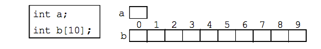

- El tipo del valor de la variable `a` es un entero.
- Cada elemento del array `b` (b[0], ...,b[9]) es un entero y puede
ser usado en cualquier contexto donde es usado un entero
- Si nos referimos a `b`sin corchetes, obtenemos la dirección de memoria donde empieza el array (veremos los punteros más adelante)

#### Inicialización de un Array

- Si se conocen los valores que toman las componentes del array al definirlo, podemos definir y asignar valores simultáneamente. Un array se puede inicializar en su declaración utilizando llaves {}:

~~~c
int vector[5] = {10, 20, 30, 40, 50};
~~~
Los valores se asignan uno a uno consecutivamente:

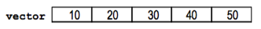

- Tamaño automático: si no especificamos el tamaño del array, el compilador cuenta el número de elementos de la inicialización y ése es el tamaño del array

~~~c
int vectorB[] = {11, 23, 3, 10};
~~~

- Inicialización incompleta:  

~~~c
// Se inicializan sólo los 4 primeros elementos
int vectorC[10] = {7, 7, 7, 7};
~~~

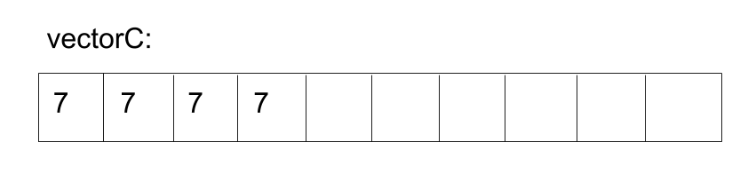

~~~c
// Si hay más valores, da ERROR:
int vectorD[5]={1, 20, 3, 40, 5, 60};
~~~

- También podemos inicializar un array haciendo que el usuario introduzca los datos por teclado:

~~~c
#define TAM 10

void inicializarArray(float calificaciones[]);

int main () {
    float calificaciones[TAM];
    inicializarArray(calificaciones);
}

// función para inicializar el array
void inicializarArray(float calificaciones[]) {
    int i;
    for (i = 0;i < TAM ;i++) {
        printf("Introduce la calificación %d: ", i);
        scanf("%f", &calificaciones[i]);
	}
}

~~~

**Precaución**:  C permite asignar valores fuera de rango a los subíondices. Se debe tener cuidado con no hacer esta acción, ya que se sobreescribirían datos o código

### 2.2 Arrays y funciones

- En lenguaje C, el paso de parámetros de los arrays siempre es por **referencia**.
- En lenguaje C, las funciones no pueden devolver un tipo array estático. Para modificar un array, ha de ser pasado como parámetro (siempre es por referencia y por tanto se modificará el array original)
- Es imposible que la función determine el tamaño del array. Si se necesita el tamaño en la función, se tiene que pasar como argumento
- Si el número de elementos es fijo, se puede utilizar una constante


#### Ejemplos

Ejemplo 1:

~~~c
#define TAM 20
float calculaMedia(float [], int);
int rellenaDatos(float []);

int main()
{
    int longitud;
    float v[TAM];
    float media;

    longitud = rellenaDatos(v);
    media = calculaMedia(v, longitud);
    printf("La nota media es %.2f\n", media);

    return 0;
}

float calculaMedia(float a[], int len) {
    int i;
    float suma;

    suma = 0.0;

    for (i = 0; i < len; i++)
        suma = suma + a[i];

    // suponemos len > 0
    return(suma / len);
}

int rellenaDatos(float vector[]) {
    int indice = 0;
    float nota;

    do {
        printf("Introduce nota: ");
        scanf("%f", &nota);
        if (nota != -1) {
            vector[indice] = nota;
            indice++;
        }
    }while(nota != -1);

    return indice;
}
~~~

Ejemplo 2:

~~~c
void printArray(float array[], int len){
    int i;

    for (i = 0; i < len; i++)
        printf("[%.2f]\n", array[i]);
}
~~~

Ejemplo 3:

~~~c
/* Dado un array de enteros, mover todos sus elementos una posición a la derecha.
El desplazamiento será circular, es decir, el último elemento pasará a ser el primero*/

void moverEnCircular (int v[]) {
    int i, ult;

    // guardar el valor de la última posición del array
    ult = v[LMAX-1];

    // mover todos los elementos una posición a la derecha, excepto el último
    for (i = LMAX-1; i > 0; i--)
        v[i] = v[i-1];
    // actualizar la primera posición con el valor que teníamos en la última
    v[0] = ult;
}
~~~

Ejemplo 4:

~~~c
/* Dado un array de enteros, devolver el mayor valor, el número de ocurrencias de dicho valor,
y la posición de la primera y última aparición en la que se encuentra almacenada*/
void ocurrencias(int v[], int *mayor, int *num_ocur, int *pos_pri, int *pos_ult) {
     int i;

    *mayor = v[0]; // inicialmente el número mayor será el que está en la primera posición num_ocur = 1;
    *pos_pri = 0;
    *pos_ult = 0;

    // recorrer el array: desde la segunda posición hasta la posición final (constante LMAX)
    for (i=1; i < LMAX; i++) {
        if (v[i] > *mayor) { // encontramos un nuevo número mayor
            *mayor = v[i];
            *num_ocur = 1;
            *pos_pri = i;
            *pos_ult = i;
        }
        else if (v[i] == *mayor) {
        // encontramos una nueva ocurrencia del número mayor hasta el momento
            *num_ocur = *num_ocur +1;
            *pos_ult = i;
        }
    }
 }

int main()
{
    int mayor, num_ocur, pos_pri, pos_ult;
    int v[] = {1,3,5,1,3,5};

    ocurrencias(v, &mayor, &num_ocur, &pos_pri, &pos_ult);

    return 0;
}
~~~

## 3. Arrays multidimensionales

Hemos visto los arrays unidimensionales, cuyos elementos se almacenan en posiciones contiguas de memoria, a cada una de las cuales se puede acceder directamente mediante un índice.

A los arrays de más de una dimensión se les denomina **multidimensionales**.

Sintaxis:

~~~c
tipo_elemento nombre_array [a][b][c]...[z];
~~~

- Una matriz es un array de 2 dimensiones, es decir un array
unidimensional de arrays unidimensionales.
- En general, un array de dimensión n es un array unidimensional de
arrays de dimensión n–1.

Ejemplos:

~~~c
// Array bidimensional de 6*10 enteros (matriz de 60 elems):
int matriz[6][10];
//Array tridimensional de 3*2*5 reales (cubo de 30 elems):
float cubo[3][2][5];
~~~

#### Almacenamiento en memoria arrays multidimensionales

Los elementos también se almacenan contiguos en memoria:

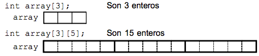

#### Inicialización arrays multidimensionales

- Si se conocen todos los elementos al declarar el array, hay dos modos de escribir la lista de inicializaciones:

	1. Todos los valores seguidos:

	~~~c
	int matriz[2][3]={0,1,2,10,11,12};
	~~~

	2. Por partes (mejor, mayor claridad):

	~~~c
	int matriz[2][3] = { {0,1,2},
                        {10,11,12} } ;
	~~~

- Si no se conocen, es útil recorrer el array (un bucle por cada dimensión) e ir asignando los valores

#### Arrays multidimensionales y funciones

Un array multidimensional, al igual que uno unidimensional, también puede pasarse como argumento a una función.

- Se pasa la dirección del primer elemento del array.
- Ese primer elemento es otro array (de 1 dimensión menos).

- Se puede usar el siguiente prototipo:

~~~c
// Recibe una matriz en la cual cada fila
// tiene 10 enteros y con cualquier número de filas
void func(int mat[][10]);
~~~

#### Acceso a los elementos (por índices)

- Para identificar un elemento de un array multidimensional, se
debe dar un índice para cada dimensión, en el mismo orden
que en la declaración.
- Cada índice se encierra en sus propios corchetes

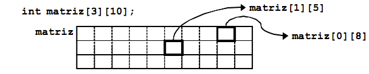

Ejemplo 1:

~~~c
// Array bidimensional con los números del 1 al 12

void main(){
    int num[3][4], i,j;

    for(i = 0;i < 3; i++)
        for(j = 0;j < 4; j++)
            num[i][j] = (i * 4) + j + 1;

    return 0;
}
~~~

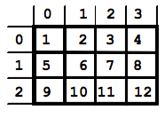

Ejemplo 2:

~~~c
//Programa que muestra los valores almacenados en
//un array bidimensional 2 x 3

#define FILAS 2
#define COLUMNAS 3

int main() {
    int matriz[FILAS][COLUMNAS]= { {1,2,3},
                                   {4,5,6} };
    int fil,col;

    for(fil = 0; fil < FILAS; fil++)
        for(col = 0; col < COLUMNAS; col++)
            printf("El valor de [%d][%d] es %d\n", fil, col, matriz[fil][col]);

    return 0;
}

// Salida por pantalla:
/*
El valor de [0][0] es 1
El valor de [0][1] es 2
El valor de [0][2] es 3
El valor de [1][0] es 4
El valor de [1][1] es 5
El valor de [1][2] es 6
*/
~~~

Ejemplo 3:

~~~c
// Suma de matrices

#define FILAS 5
#define COLUMNAS 7

void rellena(int m[][COLUMNAS]);
void suma(int m1[][COLUMNAS], int m2[][COLUMNAS], int r[][COLUMNAS]);
void imprime(int m[][COLUMNAS]);

int main() {
    int a[FILAS][COLUMNAS],
        b[FILAS][COLUMNAS],
        c[FILAS][COLUMNAS];

    rellena(a);
    rellena(b);
    suma(a,b,c);
    imprime(c);

    return 0;
}

/* Función que rellena los
valores de una matriz */
void rellena(int m[][COLUMNAS]) {
    int i,j;

    for(i = 0; i < FILAS; i++)
        for(j = 0; j < COLUMNAS; j++) {
            printf("Valor [%d,%d]: ",
i,j);
            scanf("%d", &m[i][j]);
        }
}
/* Suma dos matrices */
void suma(int m1[][COLUMNAS], int m2[][COLUMNAS], int r[][COLUMNAS]) {
    int i, j;

    for(i = 0; i < FILAS; i++)
        for( j = 0; j < COLUMNAS; j++) {
            r[i][j] = m1[i][j] + m2[i][j];
    }
}

/* Muestra una matriz*/
void imprime(int m[][COLUMNAS]) {
    int i,j;

    for(i = 0; i < FILAS; i++) {
        for(j = 0; j < COLUMNAS; j++)
            printf(" %d", m[i][j]);
        printf("\n");
    }
}
~~~

Ejemplo donde pasamos como parámetro a una función sólo una fila de una matriz:

~~~c
void rellenaFila(int []);
void imprimir(int [][5]);
void rellenar(int m[][5]);

int main(){
    int vec[5][5];
    int cont;

    cont = 3;
    rellenar(vec);
    rellenaFila(vec[cont]); //Modifica la fila 3 (vector)
    imprimir(vec);

    return 0;
}

void rellenaFila(int v[]){  //Recibe una fila (vector)
    int i;
    for( i = 0; i < 5; i++){
        v[i]= 100;
    }
}

void imprimir(int m[][5]) {
   int i, j;
   for(i = 0; i < 5; i++){
      for(j = 0; j < 5; j++){
         printf("%d ", m[i][j]);
      }
         printf("\n");
   }

}

void rellenar(int m[][5]) {
   int i, j;
   for(i = 0; i < 5; i++){
      for(j = 0; j < 5; j++){
         m[i][j] = 20;
      }
   }
   printf("\n");
}
~~~

## 4. Cadenas de caracteres

- En C no existe un tipo específico para trabajar con
cadenas de caracteres (en otros lenguajes es el tipo `String`).
- En C, una cadena de caracteres es un array unidimensional de tipo
`char`.
- El último carácter visible de la cadena debe estar seguido del
carácter nulo que se representa por `'\0'`. Este carácter marca el final de la cadena de caracteres
- Existen librerías con funciones para realizar la mayor
parte de las operaciones básicas sobre cadenas.

Ejemplos:

~~~c
char cadena[20];
char cadena[]="Adios";
~~~                                                                                                         En las dos últimas declaraciones el tamaño del array será el
número de caracteres dado en la inicialización más 1 (que corresponde al carácter ‘\0’).

Las cadenas se deben almacenar en arrays de caracteres, pero no todos lo arrays de caracteres contienen cadenas. Las cadenas contienen un carácter nulo al final del array de caracteres.

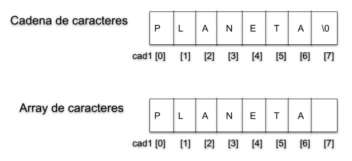

##### `printf` y `scanf` con cadenas
Las funciones `printf` y `scanf` tratan el `'\0'` automáticamente con `%s`

~~~c
printf("%s\n",cadena);
scanf("%s", cadena);
scanf("%[^\n]s", cadena); //lee la entrada estandar hasta encontrar \n, sin detenerse en espacios
~~~

##### Librería `string.h`

Para trabajar con cadenas de caracteres, en C tenemos la librería `string.h`:

~~~c
#include <string.h>
~~~

Algunas de las funciones que incluye:

- **`int strlen(char *s);`** Devuelve el tamaño de la cadena antes de `'\0'`

- **`char *strcpy(char *dest, char *src);`**
Copia la cadena origen `src` en la cadena destino `dest`.

- **`char *strcat(char *dest, char *src);`**
Concatena la cadena origen `src` al final de la cadena destino `dest`
- **`int strcmp(char *s1, char *s2);`**
Compara dos cadenas. Devuelve 0 en caso de que sean iguales. <0 si la primera cadena es menor y >0 si la primera cadena es mayor. Orden lexicográfico

`strcpy` y `strcat` devuelven un puntero a la cadena
resultante. No comprueban si el resultado cabe en la cadena final.

#### Ejemplos con cadenas de caracteres

Ejemplo 1:

~~~c
// devuelve la longitud de una cadena de caracteres
// esta función es equivalente a strlen()
int longitudCadena(char cad[])
{
    
   int len;

   len = 0;
    
   while (cad[len] != '\0')
       
      len++;

   return len;
}
~~~

Ejemplo 2:

~~~c
int main() {
    int n;
    char nombre1[20], nombre2[20];

    printf("Teclea el primer nombre: ");
    scanf("%s", nombre1);
    printf("Teclea el segundo nombre: ");
    scanf("%s", nombre2);

    n = strcmp(nombre1,nombre2);
    if(n == 0)
        printf("Nombres iguales\n");
    else if (n>0)
        printf("Primer nombre mayor que el segundo\n");
    else
        printf("Primer nombre menor que el segundo\n");

    return 0;
}
~~~

Ejemplo 3:

~~~c
int main() {
    char cad1[10], cad2[10];

    strcpy(cad1, "Hola "); /* Se guardan en cad1 6
                            caracteres (incluido el ‘\0’)*/
    strcpy(cad2, "y adios"); /* Se guardan en cad2 8
                            caracteres (incluido el ‘\0’) */
    strcat(cad1, cad2); /* Se concatena la cadena cad2 al
                        final de cad1. Observa que se intentan guardar
                        en cad1 más caracteres que la longitud de la
                        cadena. El compilador no da error y se escribe
                        a continuación de cad1, en memoria que no
                        pertenece a cad1. */
    printf("cad1: %s\n", cad1); /* ERROR. Se intenta escribir cad1 hasta que encuentre un
                          ‘\0’. El resultado es impredecible: puede
                            escribir "Hola y adios" a pesar de que en total
                            son más de 10 caracteres, puede escribir otra
                            cosa o puede quedarse colgado el terminal. */
    return 0;
}
~~~

Para solucionar el problema anterior (en `cad1`no cabe la cadena), podemos comprobar si se puede concatenar antes de hacerlo:

~~~c
// comprobar si se puede concatenar antes de hacerlo:
if(strlen(cad1) + strlen(cad2) < 10)
    strcat(cad1,cad2);
~~~

#### Funciones relacionadas con cadenas de caracteres

Algunas funciones de conversión incluidas en la librería `stdlib.h`

- **`double atof(char *s)`**: convierte la cadena `s` a `float`

~~~c
char numero[11] = "123.456789";
printf( "Convertimos la cadena \"%s\" en un float: %f\n", numPtr, atof(numero) );
~~~

- **`int atoi(char *s)`**: convierte la cadena `s` a `int`

~~~c
int num;
num = atoi("123");
printf("El int es: %d\n", num);
~~~

- **`long atol(char *s)`**: convierte la cadena `s` a `long int`

~~~c
char numero[11] = "1234567890";
printf( "Convertimos la cadena \"%s\" en un long int: %u\n", numPtr, atol(numero) );
~~~

### Ejemplos de arrays utilizando `typedef`

1. Escribe un programa completo que lea un vector de enteros positivos e imprima el número mayor.
Para la realización del programa utilizaremos tres funciones, una para leer el vector, otra para imprimir el vector por pantalla y otra para encontrar el elemento mayor.

    ~~~c
    #include <stdio.h>
    #include <stdlib.h>
    #include <stdbool.h>

    #define TAM 10
    typedef int TVector[TAM];

    void leerVector(TVector vector);
    void imprimirVector(TVector vector);
    int mayorVector(TVector vector);

    int main() {
       TVector vector;
       int mayor;

       leerVector(vector);
       imprimirVector(vector);
       mayor = mayorVector(vector);

       printf("El elemento mayor del vector es : %d\n",mayor);

       return 0;
    }
    //Función para leer el contenido del vector.
    //Leeremos números enteros positivos
    void leerVector(TVector vector)
    {
        int i;
        i = 0;

        do {
          printf("Introduce el numero de la posición %d: ",i);
          scanf("%d", &vector[i]);
          if (vector[i] < 0)
             printf("Número incorrecto\n");
          else
             i++; // Incrementamos contador
          } while (i < TAM);
    }

    //Imprime por pantalla los elementos del vector.
    void imprimirVector(TVector vector)
    {
       int i;

       printf("Valores del vector: \n");
       for(i = 0; i < TAM; i++)
          printf("%d ",vector[i]);
       printf("\n");
    }

    //Función que devuelve el mayor número del vector.
    int mayorVector(TVector vector)
    {
       int i, mayor;
       mayor = vector[0]; // Al principio el mayor será el primer elemento.

       for(i = 1; i < TAM; i++)
          if(vector[i] > mayor)
             mayor = vector[i];

       return mayor;
    }
    ~~~

2. Escribe un programa que pida una cadena de caracteres (de máximo 15 caracteres) y devuelva la cadena escrita al revés.

    ~~~c
    #define TAM 15
    typedef char TCadena[TAM];

    void alReves(TCadena, TCadena, int);

    int main(){
       TCadena palabra, palabra_reves;
       int i, cont, longitud_palabra;

       printf("Introduzca una palabra: ");
       scanf("%s", palabra);

       longitud_palabra = strlen(palabra);
       alReves(palabra, palabra_reves, longitud_palabra);

       printf("Palabra escrita al revés: %s\n", palabra_reves);

       return 0;
    }

    void alReves(TCadena palabra, TCadena palabra_reves, int longitud){
       int i, cont = 0;

       for(i = longitud - 1; i >= 0; i--) {
          palabra_reves[cont] = palabra[i];
          cont++;
       }

       palabra_reves[cont] = '\0';
    }
    ~~~

3. Escribe un programa que lea los datos de un array bidimensional o matriz de 5 filas por 4 columnas y luego imprima esta matriz por pantalla.

    ~~~c
    #define FILS 5
    #define COLS 4

    typedef int TMatriz[FILS][COLS];

    void leerMatriz(TMatriz matriz);
    void escribirMatriz(TMatriz matriz);

    int main() {
       TMatriz matriz;

       leerMatriz(matriz);
       escribirMatriz(matriz);

       return 0;
    }

    void leerMatriz(TMatriz matriz) {
       int i, j;

       for(i = 0; i< FILS; i++)
          for(j = 0; j< COLS; j++) {
             printf("Introduzca el elemento (%d,%d): ", i, j);
             scanf("%d", &matriz[i][j]);
          }
    }

    void escribirMatriz(TMatriz matriz) {
       int i, j;

       for(i = 0; i< FILS; i++) {
          for(j = 0; j< COLS; j++) {
             // %5d formatea rellenando con espacios a tam 5
             printf("%5d", matriz[i][j]);
          }
          printf("\n");
       }
    }
    ~~~

4. Implementa un programa que rellene una matriz que contenga las tablas de multiplicar.

    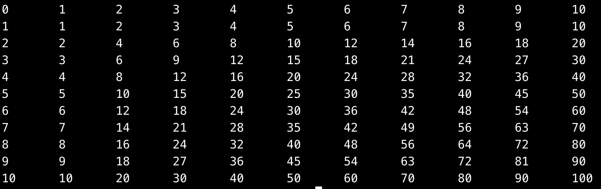

    ~~~c
    #define TAM 11
    typedef int TMatriz[TAM][TAM];

    void rellenaTablaMultiplicar(TMatriz A);
    void imprimir(TMatriz matriz);

    int main() {
       TMatriz tabla;

       rellenaTablaMultiplicar(tabla);
       imprimir(tabla);

       return 0;
    }

    void rellenaTablaMultiplicar(TMatriz A) {
       int i, j;

       A[0][0] = 0;

       // Rellenamos la tabla
       for (i = 0; i < TAM; i++)
       {
           for (j = 0; j < TAM; j++)
           {
               A[i][j] = i * j;
           }
           A[0][i] = i ;
           A[i][0] = i ;
       }
    }

    void imprimir(TMatriz matriz) {
       int i, j;

       for(i = 0; i < TAM; i++ )
       {
         for(j = 0; j < TAM; j++) {
           printf("%d\t", matriz[i][j]);
         }
         printf("\n");
       }
    }
    ~~~

## 5. Algoritmos de ordenación

Es interesante y habitual la operación de ordenación en un array. La búsqueda de un dato dentro de un conjunto es otro de los procesos más habituales en el tratamiento de información. Si los datos están ordenados, la localización de uno de ellos puede acelerarse.

Por ejemplo, si quereos mantener ordenado un vector de calificaciones para poder consultar rápidamente las cinco mejores notas, tendríamos que ordenar nuestro vector de mayor a menor (en orden decreciente) y acceder a las cinco primeras posiciones del vector.

Imaginemos que tenemos declarado el siguiente vector:

~~~c
int vec[5]={1, 5, 6, 4, 2};
~~~

Ahora queremos saber si un determinado valor, 3 por ejemplo, se encuentra en dicho vector, o queremos devolver el valor más parecido ¿qué haríamos?
Lo mismo podemos hacer para cadenas de caracteres (que es donde más se usa la ordenación).

Vamos a ver varios métodos (algoritmos) de ordenación de vectores.
Aunque los veamos para enteros, son perfectamente extensibles a otros tipos de datos (incluso registros).
Sólo tendríamos que definir la manera de comparar datos (<, >, =) Podemos ordenar de mayor a menor o de menor a mayor.

Cada algoritmo tiene su **complejidad**. Son métricas que permiten conocer el tiempo de procesamiento de cada algoritmo.
La forma estándar es utilizar ordenes de complejidad, que relacionan el tiempo de computación con el tamaño del problema a tratar.
La jerarquía de ordenes de complejidad sería O(1)<O(log n)<O(n)<O(n logn)<O(n2)<O(n3)<O(n4)..

### 5.1 Algoritmo de la burbuja

El método de la burbuja funciona revisando cada elemento del vector que va a ser ordenado con el siguiente, intercambiándolos de posición si están en el orden equivocado. Es necesario revisar varias veces todo el vector hasta que no se necesiten más intercambios, lo cual significa que está ordenado. Este algoritmo obtiene su nombre de la forma con la que suben por la lista los elementos durante los intercambios, como si fueran pequeñas burbujas. También es conocido como el método del intercambio directo.

Características:

- Más sencillo e intuitivo de aplicar
- En el peor de los casos tenemos una complejidad cuadrática (si tenemos n datos, O(n2))
- Se empieza por el primer elemento de la lista y se recorre toda la lista.
- Dado un elemento, este se compara con el siguiente y si no está en el orden adecuado (por ejemplo, es mayor) se intercambia.
- Hay que recorrer n-1 veces la lista. Si es la iteración k, el punto anterior lo hacemos hasta n-k
Pseudocódigo:

~~~c
desde i = 1 hasta n hacer
   desde j = 0 hasta n-i hacer
      si elemento[j] > elemento[j+1] entonces
         // Intercambiar los elementos
         aux = V[j]
         V[j] = V[j+1]
         V[j+1] = aux
      fin_si
   fin_desde
fin_desde
~~~

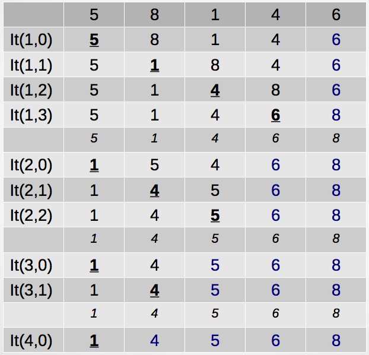

Implementación en C:

~~~c
void burbuja(int v[], int elems) {
   int temp, i, j;

   for (i = 1; i < elems; i++) {
      for (j = 0; j < elems-i ; j++) {
         if (v[j] > v[j+1]) {
            temp = v[j];
            v[j] = v[j+1];
            v[j+1] = temp;
         }
      }
   }
}
~~~

### 5.2 Algoritmo de selección

Consiste en encontrar el menor de todos los elementos del vector e intercambiarlo con el que está en la primera posición. Luego el segundo mas pequeño, y así sucesivamente hasta ordenarlo todo. Su implementación requiere O(n2) comparaciones e intercambios para ordenar una secuencia de elementos.

- Mejora algo el anterior, aunque todavía tiene una complejidad O(n2)
- Realizamos n iteraciones
- Para cada iteración, buscamos el elemento con menor (mayor) valor del vector.
- Intercambiamos ese valor por la posición actual del vector
- En la primera iteración, buscamos el menor valor de todo el vector
- En la segunda, el segundo menor valor o el menor valor del resto del vector

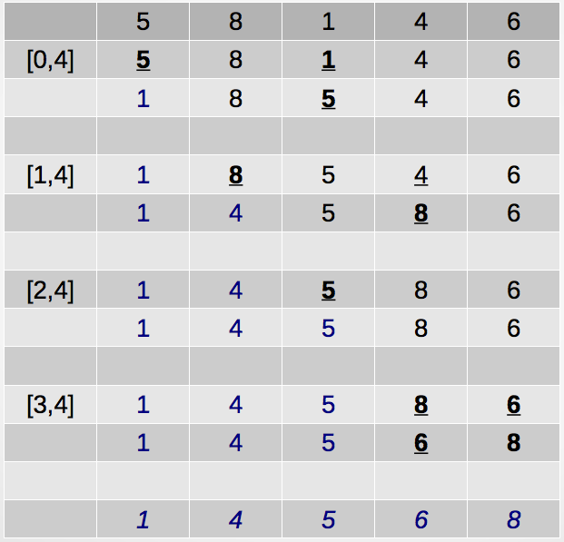

Pseudocódigo:

~~~c
para i=1 hasta n-1;
   minimo = i;
   para j=i+1 hasta n
       si lista[j] < lista[minimo] entonces
           minimo = j
       fin si
   fin para
   intercambiar(lista[i], lista[minimo])
fin para
~~~

Implementación en C:

~~~c
void seleccion(int v[], int tam) {
   int minimo=0, i, j;
   int swap;

   for(i = 0 ; i < tam-1 ; i++) {
      minimo = i;
      for(j = i+1 ; j < tam ; j++)
         if (v[minimo] > v[j])
            minimo = j;
      swap = v[minimo];
      v[minimo] = v[i];
      v[i] = swap;
   }
}
~~~

### 5.3 Algoritmo de inserción

Este método consiste en insertar un elemento del vector en la parte izquierda del mismo que ya se encuentra ordenada. Este proceso se repite desde el segundo hasta el n-esimo elemento.

- Seguimos teniendo una complejidad O(n2)
- Es lo más parecido a ordenar un mazo de cartas
- El primer elemento de la lista lo consideramos ordenado
- Para el resto, vamos analizando uno a uno cada valor
- Cogemos el valor y lo insertamos en la posición correcta del vector que nos queda a la izquierda de dicho valor, desplazando los valores hacia la derecha

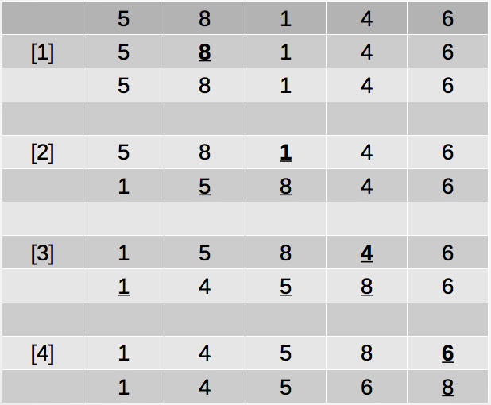

Implementación en C:

~~~c
void insercion(int numbers[], int array_size) {
  int i, a, index;
  for (i=1; i < array_size; i++) {
    index = numbers[i];
    a = i-1;
    while (a >= 0 && numbers[a] > index) {
      numbers[a + 1] = numbers[a];
      a--;
    }
    numbers[a+1] = index;
  }
}
~~~

---

### Ejercicios propuestos de Arrays

1. Implementa una función que rellene una matriz con los primeros N números en zigzag, como indica la figura:

    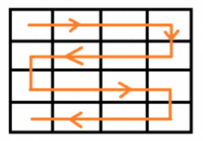

    Matriz 4x4 resultante:

    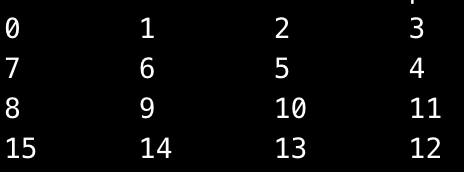

2. Implementa las funciones sobre cadenas de caracteres `strcmp` y `atoi`.

3. Implementa una función que reciba dos arrays ordenados de manera ascendente de 10 números y devuelva un vector de 20 números formado por los números de los vectores de entrada. Este array resultante también debe estar ordenado.

4. Implementa una función que reciba como parámetro una matriz de enteros de M filas y N columnas. La función debe cambiar el valor de la primera y última celda de cada fila de la siguiente manera:
    - primera celda → valor más pequeño de las celdas adyacentes
    - última celda → valor más grande de las celdas adyacentes.

        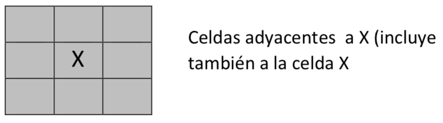

    Por ejemplo, para la matriz:

    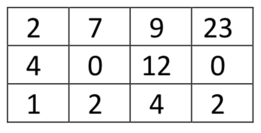

    La matriz resultante sería:

    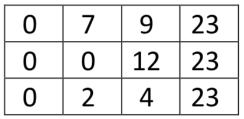

## Bibliografía

- Capítulos 9.1 a 9.5 de "Programación en C, metodología, algoritmos y estructuras de datos", Luis Joyanes, Ignacio Zahonero
- Capítulos 8.1 y 8.2 de "Fundamentos de Programación", Jesús Carretero y otros

----

Programación 1, Grado de Robótica, curso 2019-20  
© Departamento Ciencia de la Computación e Inteligencia Artificial, Universidad de Alicante  
Cristina Pomares Puig
