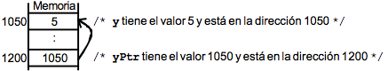

# Tema 7: Punteros y memoria dinámica

## 1. Punteros

Ya hemos visto que la **memoria** del ordenador es el lugar donde se almacenan los datos y las instrucciones de un programa. Se llama memoria RAM, que es diferente a la memoria de almacenamiento como discos duros, etc. Está compuesta por un gran número de **celdas** (bytes) de información. A cada una de estas celdas se le asigna una **dirección de memoria**, que permite distinguir unas celdas de otras. De forma que, dada la dirección de memoria de una celda, se podrá obtener su valor actual y modificarlo, como ya hemos visto por ejemplo en el paso de parámetros por referencia.

Cuando se accede a una variable almacenada en memoria el compilador necesita saber:

- número de bytes que componen la variable
- dirección de memoria del byte inicial de la variable

Estos términos ya los hemos utilizado al definir una variable:

- la dirección de memoria se representa con el nombre de la variable (el compilador se encarga de sustituir el nombre por su dirección de memoria)
- El tamaño se define con el tipo de datos de la variable (`int`, `char`...). El compilador se encarga de reservar los bytes necesarios.

Los **punteros** son un nuevo tipo de datos. La diferencia con el resto es que los que hemos visto hasta ahora almacenan datos y los punteros almacenan **direcciones de memoria**. Es decir, hacen referencia a otra zona de memoria donde se encuentran los datos. Se dice que un puntero *apunta* a un dato.

Características:

- Un **puntero** es una variable que almacena una dirección de memoria.
- Una variable contiene siempre un valor (de un tipo).
- Un puntero contiene la dirección de una variable que contiene un valor.
- El valor de un puntero es una dirección de memoria.
- Un puntero puede apuntar a una variable de cualquier tipo: tipos básicos, tipos definidos por el usuario, estructuras de datos, o incluso a funciones.
- Los punteros se pueden utilizar para referenciar y manipular estructuras de datos, y para referenciar bloques de memoria asignados dinámicamente.

Sintaxis:

~~~text
tipo *nombre_variable;
~~~

- La variable declarada es un puntero al tipo de dato
especificado: `nombre_variable` almacenará la dirección de memoria en la cual se almacenará un dato de ese tipo.
- Con esa declaración **se reserva memoria SÓLO para el puntero, NUNCA para la variable a la que apunta**.

Ejemplos:

~~~c
int *entero; /* entero es un puntero a int */
float *res;   /* res es un puntero a float */
char *mensaje; /* mensaje es un puntero a char */
~~~

### 1.1 Operadores para el manejo de punteros

Existen dos operadores unarios para trabajar con punteros: `*` y `&`

- `*puntero`: operador indirección. Devuelve el contenido de la dirección de memoria apuntado por `puntero`
- `&variable`: operador dirección: Devuelve la dirección de memoria de una    `variable`

Ejemplo 1:

~~~c
int main()
{
    int a = 0; //Declaración de variable entera de tipo entero
    int *p; //Declaración de variable puntero de tipo entero
    p = &a; //Asignación de la dirección memoria de a

    printf("El valor de a es: %d. \nEl valor de *p es: %d. \n",a, *p);
    printf("La direccion de memoria de *p es: %p\n",p);

    return 0;
}
~~~

Ejemplo 2:

~~~c
int y, *yPtr; /* yPtr es puntero a entero */
y = 5;
yPtr = &y; /* yPtr toma la dirección de y */

printf("y: %d, yPtr: %p, &y: %p, &yPtr: %p, *yPtr: %d\n", y, yPtr, &y, &yPtr, *yPtr);

/* Salida por pantalla:
y: 5, yPtr: 0x7fff5d9829ec (1050), &y: 0x7fff5d9829ec (1050), &yPtr: 0x7fff5d9829e0 (1200), *yPtr: 5
*/
~~~

- Una variable se refiere directamente a un valor y un puntero se refiere indirectamente a un valor.
- El puntero, al tener una dirección de memoria es como si apuntara a dicha dirección.
- Las direcciones de memoria de cada variable las asigna el sistema operativo y el programa no puede ni cambiarlas ni usar otras posiciones distintas.

Ejemplo 3:

~~~c
void main() {
   int x, y, *py;

   printf ("\n- Introduzca un número: ");
   scanf("%i",&y);

   py = &y;
   x = *py + 10; /* Suma 10 con el contenido de la dirección py */

   printf("\n- Enteros: %d, %d y %d.", y, *py, x);
   printf("\n- Direcciones: %p y %p.", &y, py);

   return 0;
}

/* Salida por pantalla:
- Introduzca un número: 4
- Enteros: 4, 4 y 14.
- Direcciones: 0x7fff5afeb9e8 y 0x7fff5afeb9e8
*/
~~~

Ejemplo 4:

~~~c
int *punteroInt;
int valor = 8;

punteroInt = &valor;
printf("Puntero: dir: %p, valor: %d, referencia: %p\n", punteroInt, *punteroInt, &punteroInt);
printf("Variable: valor: %d, referencia: %p\n", valor, &valor);

/* Salida por pantalla:
Puntero: dir: 0x7fff523e19e4, valor: 8, referencia:0x7fff523e19e8
Variable: valor: 8, referencia: 0x7fff523e19e4
*/
~~~

Muchas de las funciones estándares de C trabajan con punteros, como es el caso del `scanf`. A `scanf` se le pasa la dirección de memoria del dato a leer.

~~~c
char a;
scanf ("%c",&a);
~~~

Ejemplo 5:

El siguiente programa muestra el concepto de creación, inicialización e indirección de una variable puntero:

~~~c
int main() {
   char c;
   char *pc;

   pc = &c;

   for(c = 'A'; c <= 'Z'; c++)
      printf("%c ", *pc);

   return 0;
}

//Salida: A B C D E F G H I J K L M N O P Q R S T U V W X Y Z
~~~

#### Punteros a punteros

Un puntero puede apuntar a otra variable puntero. Este concepto se utiliza mucho en programas complejos en C y en la definición de estructuras de datos multidimensionales. Para declarar un puntero a un puntero se precede a la variable con dos asteriscos `**`. Ejemplo:

~~~c
int valor = 100;
int *ptr1 = &valor;
int **ptr5 = &ptr1;
~~~

`ptr1`y `ptr5`son punteros. `ptr1`apunta a la variable `valor`de tipo `int`. `ptr5`contiene la dirección de `ptr1`.

Se pueden asignar valores a `valor`con cualquiera de las siguientes sentencias:

~~~c
valor = 95;
*ptr1 = 105;  // Asigna 105 a valor
**ptr5 = 99;  // Asigna 99 a valor
~~~

### 1.2 Punteros y arrays

En C los punteros y los arrays están fuertemente relacionados. Se pueden direccionar arrays como si fueran punteros y punteros como si fueran arrays.

#### Nombres de arrays como punteros

El nombre de un vector es en sí mismo un puntero a la primera posición del vector. Todas las operaciones que
utilizan vectores e índices pueden realizarse mediante punteros.

~~~c
int v[10];
~~~

`v`: designa 10 posiciones consecutivas de memoria donde se pueden almacenar enteros.

Si visualizamos `v[0]` veremos 1.  ¿Y si visualizamos `*v`? Como el nombre del array también es un puntero, también se verá 1. Esto significa que:

    v + 0 apunta a v[0]
    v + 1 apunta a v[1]
    v + 2 apunta a v[2]
    v + 3 apunta a v[3]
    ...

Por tanto, para manejar los elementos de un array, se puede utilizar la notación de subíndices o la notación de punteros. Dado que el nombre del array contiene la dirección del primer elemento del array, se debe indireccionar el puntero para obtener el valor del elemento.

#### Arrays de caracteres

Podemos hacer un array de caracteres usando punteros.

~~~c
char *nombre = "Hola que tal";//Es una cadena de 13 caracteres (12 + '\0')
printf("%s",nombre);
~~~

Realmente se define como una constante de caracteres y no podemos modificarla despues de definir sus valores. Como por ejemplo no podemos reemplazar un carácter, o leer un nuevo valor.

~~~c
//Error de ejecución:
strcpy(nombre, "hola");
~~~

Se soluciona utilizando memoria dinámica (lo veremos más adelante).

### 1.3 Punteros a estructuras

Un puntero también puede apuntar a un registro. Se puede declarar el puntero a una estructura tal y como se declara un puntero a cualquier otro tipo.

~~~c
typedef struct {
   int x;
   int y;
}TPunto;

typedef struct {
   TPunto *p1;
   TPunto *p2;
}TSegmento;
~~~

`TSegmento` tiene como campos dos punteros a `TPunto`.

Ejemplo completo, donde dos segmentos comparten el mismo punto:

~~~c
typedef struct {
   int x;
   int y;
}TPunto;

typedef struct {
   TPunto *p1;
   TPunto *p2;
}TSegmento;

void imprimeSegmento(TSegmento s);

int main() {
   TPunto a = {2,3};
   TPunto b = {10,10};
   TPunto c = {5,6};
   TPunto d = {9,12};

   TSegmento s1, s2;
   s1.p1 = &a;
   s1.p2 = &b;
   s2.p1 = &b;
   s2.p2 = &c;

   imprimeSegmento(s1);
   imprimeSegmento(s2);

   // P1: [2,3] P2: [10,10]
   // P1: [10,10] P2: [5,6]

   return 0;
}
~~~

En el ejemplo anterior, los segmentos s1 y s2 comparten el punto b. Si éste cambiase, afectaría a los dos puntos, porque apuntan al mismo punto. Al referenciar al mismo punto y no ser una copia, al modificar uno de los dos, el otro se modifica.

~~~c
 // Seguimos con el código anterior
 // Modificamos el punto compartido por ambos segmentos
 // Cambiamos el p2 del s1:

   s1.p2->x = 100;
   s1.p2->y = 100;

   imprimeSegmento(s1);
   imprimeSegmento(s2);

  // P1: [2,3] P2: [100,100]
  // P1: [100,100] P2: [5,6]
~~~

Como podemos observar, cambiando p2 de s1 hace que cambie también el p1 de s2. Esto sucede porque están compartiendo una referencia al mismo punto, no son copias. Esta es la filosofía de funcionamiento en otros lenguajes, como Java, donde se utiliza el paradigma de programación orientado a objetos.

## 2. Gestión de memoria dinámica

### 2.1 Memoria dinámica

- La **memoria estática** es el espacio en memoria que se crea al declarar variables de cualquier tipo de dato. La memoria que estas variables ocupan no puede cambiarse durante la ejecución y tampoco puede ser liberada manualmente.
- La **memoria dinámica** es memoria que se reserva en tiempo de ejecución. Su principal ventaja frente a la estática, es que su tamaño puede variar durante la ejecución del programa. En C, el programador es encargado de liberar esta memoria cuando no la utilice más. El uso de memoria dinámica es necesario cuando a priori no conocemos el número de datos o elementos a tratar o cuando queremos optimizarla.

Definimos las **variables dinámicas** como zonas de memoria que pueden reservarse y liberarse durante el transcurso del programa. La única forma de acceder a su contenido es mediante una variable puntero que almacene la dirección de memoria correspondiente. Las variables dinámicas se guardan en la zona de memoria dinámica y se gestionan con las funciones de memoria dinámica (`malloc`, `calloc`, `realloc, `free`).

### 2.2 Funciones para gestionar la memoria dinámica

La biblioteca estándar de C proporciona las funciones `malloc`, `calloc`, `realloc` y `free` para el manejo de memoria dinámica. Estas funciones están definidas la librería `stdlib.h`.

#### malloc

La función `malloc` reserva un bloque de memoria y devuelve un puntero al inicio de la misma.

Sintaxis:

~~~text
void *malloc(size_t size);
~~~

donde el parámetro `size` especifica el número de bytes a reservar. En caso de que no se pueda realizar la asignación, devuelve el valor nulo (definido en la macro `NULL` ), lo que permite saber si hubo errores en la asignación de memoria.

~~~c
#include <stdlib.h>

int main() {
   int *vect1, n;

   printf("Número de elementos del vector: ");
   scanf("%d", &n);

   /* reservamos memoria para almacenar n enteros */
   vect1 = (int *) malloc(n * sizeof(int));

   /* Verificamos que la asignación se haya realizado correctamente */
   if (vect1  == NULL) {
   	/* Error al intentar reservar memoria */
   }

   return 0;
}

~~~

El operador `sizeof(tipo)` nos devuelve el número de *bytes* que ocupa el tipo de dato pasado como parámetro.

Uno de los usos más comunes de la memoria dinámica es la creación de vectores/matrices cuyo número de elementos se define en tiempo de ejecución.

#### calloc

La función `calloc` funciona de modo similar a `malloc`, pero además de reservar memoria, inicializa a 0 la memoria reservada.

Sintaxis:

~~~text
void* calloc(size_t num, size_t size);
~~~

Devuelve un puntero a una zona de memoria en la que se reservan `num` elementos de `size` bytes. La memoria se inicializa a 0.

~~~c
#include <stdlib.h>

#define TAM = 25

int main() {
   float *vectorFloat;
   vectorFloat = (float *)calloc(TAM, sizeof(float));

   /* Verificamos que la asignación se haya realizado correctamente */
   if (vectorFloat  == NULL) {
      /* Error al intentar reservar memoria */
      ...
   }

   return 0;
}
~~~

#### realloc

La función `realloc` redimensiona el espacio asignado de forma dinámica anteriormente a un puntero.

Sintaxis:

~~~text
void* realloc(void *ptr, size_t size);
~~~

Donde `ptr` es el puntero a redimensionar, y `size` el nuevo tamaño, en bytes, que tendrá. Si el puntero que se le pasa tiene el valor `NULL`, esta función actúa como `malloc`. Si la reasignación no se pudo hacer con éxito, devuelve un puntero nulo.

~~~c
#include <stdlib.h>

#define TAM = 20

int main() {
   float *vectorFloat;
   vectorFloat = (float *)malloc(sizeof(float) * TAM);
   vectorFloat = (float *)realloc(vectorFloat, sizeof(float)*50);

   return 0;
}
~~~

~~~c
int main() {
   float *vectorFloat;
   vectorFloat = NULL;
   vectorFloat = (float *)realloc(vectorFloat, sizeof(float)*50);

   return 0;
}
~~~

Cuando se redimensiona la memoria con `realloc`, si el nuevo tamaño es mayor que el anterior, se conservan todos los valores originales, quedando los bytes restantes sin inicializar. Si el nuevo tamaño es menor, se conservan los valores de los primeros size bytes. Los restantes también se dejan intactos, pero no son parte del bloque que devuelve la función.

#### free

La función `free` sirve para liberar memoria que se asignó dinámicamente. Requiere como parámetro la dirección de memoria inicial de una zona de memoria reservada en la memoria dinámica (tal cual se reservó con `malloc` o `realloc`). La función `free`se encarga de marcar como libre esta memoria. Si el puntero es nulo, `free` no hace nada.

Además existe la función `cfree`, que sirve para liberar memoria de los elementos que han sido reservados con `calloc`.

Sintaxis:

~~~text
void free(void *ptr);
void cfree (void *ptr);
~~~

- Libera la memoria reservada para el puntero `ptr`
- No se ejecuta automáticamente cuando se acaba el ámbito en el que se definió el puntero
- Las llamadas a `free` han de ser explícitas

##### `NULL`

- `NULL` hace referencia a una dirección de memoria nula, no válida
- Lo utilizamos cuando queremos indicar que un puntero no tiene memoria reservada o la que tenía ya ha sido liberada por medio de una llamada a `free()`
- `NULL` es también el valor devuelto por funciones que han de devolver un puntero cuando no pueden realizar su labor.
- `[m|c|re]alloc` devuelven `NULL` cuando no hay memoria disponible

~~~c
#include <stdlib.h>

#define TAM = 20

int main() {
   float *vectorFloat;
   vectorFloat = (float *)malloc(sizeof(float) * TAM);
   ...
   free(vectorFloat);
   vectorFloat = NULL;

   return 0;
}
~~~

### 2.3 Arrays dinámicos multidimensionales

Para definir un array multidimensional de manera dinámica utilizaremos punteros a punteros. En este caso vamos a definir una matriz de dos dimensiones:

~~~c
int **tabla2D;  // un puntero por cada dimensión
~~~

Se interpreta como un puntero a un tipo que es un puntero a un entero.

~~~c
#include<stdlib.h>

#define X 5
#define Y 7

void rellenarTabla2D(int **);

int main() {
   int **tabla2D;
   int dim1, dim2;

   // Reservamos la memoria
   tabla2D = (int**)malloc(sizeof(int*) * X);

   for(dim1 = 0; dim1 < X; dim1++){
      tabla2D[dim1] = (int*)malloc(sizeof(int) * Y);
      for(dim2 = 0; dim2 < Y; dim2++){
         tabla2D[dim1][dim2] = 0;
      }
   }

   // Rellenamos sus valores en una función
   rellenarTabla2D(tabla2D);
   printf("%d\n", tabla2D[2][3]); // comprobamos una posición al azar

   //Liberamos la memoria de la tabla3D
   for(dim1 = 0; dim1 < X; dim1++)
      free(tabla2D[dim1]);

   free(tabla2D);
   tabla2D = NULL;

   return 0;
}

void rellenarTabla2D(int **tabla) {
  int x, y;

  for(x = 0; x < X; x++){
    for(y = 0; y < Y; y++){
        tabla[x][y] = 100;
    }
  }
}
~~~

## 3. Punteros y funciones

Uno de los usos de los punteros es el paso de
parámetros por referencia a una función.
Recordemos que los parámetros de una función se
pueden pasar por valor o por referencia.

En C todos los parámetros de las funciones se pasan por valor. Para simular un paso de parámetro por referencia en C, lo que se
hace es pasar un puntero al objeto que se pasa. Así,
la función tiene acceso no sólo al valor del
parámetro sino también a su situación en memoria,
lo que permite su modificación.

Ya vimos que para que un parámetro de una función pueda ser modificado, ha de pasarse por referencia, y en C eso sólo es posible pasando la dirección de la variable en lugar de la propia variable.
Si se pasa la dirección de una variable, la función puede modificar el contenido de esa posición (no así
la propia dirección, que es una copia)

### Arrays y matrices como parámetro

#### Paso de parámetros por valor

~~~c
void funcion(char *cad) {
  printf("Función. Valor: %s, Dirección: %p, Referencia: %p\n", cad, cad, &cad);
}

int main() {
// Definimos una cadena de caracteres constante
  char *cadena = {"Hola mundo"};

  printf("Main. Valor: %s, Dirección: %p, Referencia: %p\n", cadena, cadena, &cadena);
  funcion(cadena);

  return 0;
}

/* Salida por pantalla:
Main. Valor: Hola mundo, Dirección: 0x1046e0f77, Referencia: 0x7fff5b51f9e8
Función. Valor: Hola mundo, Dirección: 0x1046e0f77, Referencia: 0x7fff5b51f9c8
*/
~~~

Como vemos, en `funcion` hay una referencia a los elementos del array pero no al puntero en sí, que es una copia. Es decir, no podríamos modificar dinámicamente su memoria porque no tenemos una referencia a la misma.

### Paso de parámetros por referencia

~~~c
void funcionRef(char **cad) {
  printf("Función. Valor: %s, Dirección: %p, Referencia: %p\n", *cad, *cad, cad);
}

int main() {
   char *cadena = {"Hola mundo"};

   printf("Main. Valor: %s, Dirección: %p, Referencia: %p\n", cadena, cadena, &cadena);
   funcionRef(&cadena);

   return 0;
}

/* Salida por pantalla:
Main. Valor: Hola mundo, Dirección: 0x10861af77, Referencia: 0x7fff575e59e8
Función. Valor: Hola mundo, Dirección: 0x10861af77, Referencia: 0x7fff575e59e8
*/
~~~

Ahora tenemos referencia a los datos y al propio puntero con lo que podemos modificar la memoria que tiene reservada.

Ejemplo con vector:

~~~c
#define TAM 20

void creaVector(int **);

int main() {
   int *vector;

   // Reservamos la memoria
   creaVector(&vector);
   vector[0] = 1;  //Rellenamos al azar
   vector[2] = 2;
   printf("Pos 2: %d\n", vector[2]); //Comprobamos

   // Liberamos memoria
   free(vector);
   vector = NULL;

   return 0;
}

void creaVector(int **v) {
   *v = (int*)malloc(sizeof(int) * TAM);
}
~~~

Ejemplo con `typedef`:

~~~c
#define TAM 20

typedef int* TVector;
void creaVector(TVector*);
void ampliaVector(TVector*, int);

int main() {
   TVector vector;

   // Reservamos la memoria
   creaVector(&vector);
   vector[0] = 1;  //Rellenamos al azar
   vector[2] = 2;
   printf("Pos 2: %d\n", vector[2]); //Comprobamos
   ampliaVector(&vector, 50);

   // Liberamos memoria
   free(vector);
   vector = NULL;

   return 0;
}

void creaVector(TVector* v) {
   *v = (int*)malloc(sizeof(int) * TAM);
// Equivalente:
// *v = (TVector)malloc(sizeof(int) * TAM);
}

void ampliaVector(TVector* v, int tam) {
   *v = (int*)realloc(*v, sizeof(int)*tam);
// Equivalente:
// *v = (TVector)realloc(*v, sizeof(int)*tam);
}
~~~

### Devolución de punteros

Una función también puede devolver un tipo de datos
puntero. La función se declara así:

~~~text
<tipo*> funcion(<argumentos>);
~~~

Este tipo de funciones se suelen usar para reservar
memoria o crear elementos en estructuras
dinámicas de datos. En el ejemplo anterior, la reserva de memoria dinámica del vector también podría hacerse así:

~~~c
int* creaVector() {
   int *v;
   v = (int*)malloc(sizeof(int) * TAM);

   return v;
}
~~~

Ejercicio: Dado un `TPunto`, define una estructura que contenga un array dinámico de puntos y la cantidad de puntos que contiene. Sólo se debe reservar la memoria necesaria.

~~~c
typedef struct {
   int x;
   int y;
}TPunto;

typedef struct {
	int num;
	TPunto *puntos;
} TPuntos;

TPuntos rellenaLista();

int main() {
   TPuntos puntos;

   puntos = rellenaLista();

   //Función para imprimir los puntos

   free(puntos.puntos);

   return 0;
}

TPuntos rellenaLista() {
   TPuntos lista;
   bool fin;
   int x, y, n;

   fin = false;
   n = 0;
   lista.puntos = NULL;
   lista.num = 0;

   printf("Introduce puntos hasta introducir -1 -1\n");
   while(!fin) {
      scanf("%d %d", &x , &y);
      if(x != -1 && y != -1) {
         lista.puntos = (TPunto *) realloc(lista.puntos, sizeof(TPunto) * (n+1));
         lista.puntos[n].x = x;
         lista.puntos[n].y = y;
         n++;
      }
      else
         fin = true;
   }

   lista.num = n;

   return lista;
}

~~~

En el siguiente ejemplo modificamos la función `rellenaLista` y le pasamos por parámetro por referencia `TPuntos lista`. ¿Qué sucede si quitamos los paréntesis de `(*lista)`?

~~~c
void rellenaLista(TPuntos *lista) {
   bool fin;
   int x, y, n;

   fin = false;
   n = 0;
   (*lista).puntos = NULL;
   (*lista).num = 0;

   printf("Introduce puntos hasta introducir -1 -1\n");
   while(!fin) {
      scanf("%d %d", &x , &y);
      if(x != -1 && y != -1) {
         (*lista).puntos = (TPunto *) realloc((*lista).puntos, sizeof(TPunto) * (n+1));
         (*lista).puntos[n].x = x;
         (*lista).puntos[n].y = y;
         n++;
      }
      else
         fin = true;
   }

   (*lista).num = n;
}
~~~

## 4. Array estático de punteros

Si se necesita reservar muchos punteros o gestionar de forma más eficiente la memoria, se puede declarar un array de punteros. Un array de punteros es un array cuyos elementos son punteros. Ejemplo:

~~~c
int* a[10]; // Array de 10 punteros a enteros
~~~

Cada elemento contiene una dirección que apunta a otras posiciones de memoria. Cada valor apuntado en este caso debe ser un entero.. Ejemplo:

~~~c
a[5] = &edad;  // a[5] apunta a la dirección de edad
a[4] = NULL;   // a[4] no contiene dirección
~~~

Podemos crear arrays de punteros a cualquier tipo: arrays de punteros a cadenas, a registros, etc.

#### Ejemplo de array de punteros a registro

Siguiendo con el ejemplo de los puntos y los segmentos, vamos definir un array de punteros a segmento:

~~~c
TSegmento* segmentos[100];
TSegmento s1, s2;

segmentos[0] = &s1;
segmentos[1] = &s2;
~~~

## 5. Array dinámico de registros

Vamos a definir un array dinámico de `TSegmento`:

~~~c
TSegmento *s;
// Reservando una zona de memoria dinámica:
s = (TSegmento*)malloc(sizeof(TSegmento));
segmentos[0] = s;
...
// Después de su uso hay que liberar la memoria:
free(s);
~~~

También podemos reservar la memoria dinámica dentro de una función:

~~~c
//Funciones para reservar memoria de dos formas diferentes:
TSegmento* creaSegmento();
void creaPunto(TPunto**);  // Pasamos por referencia el puntero a TPunto

int main() {
   TSegmento *s = NULL;
   TPunto *p1 = NULL;
   TPunto *p2 = NULL;

   // Reservar memoria
   s = creaSegmento();
   creaPunto(&p1);
   creaPunto(&p2);

   // Resto del código
   s->p1 = p1;   
   s->p2 = p2;

   p1->x = 4;   // Modificamos los puntos
   p1->y = 5;   // Por tanto, se modifica el segmento
   p2->x = 6;   // Porque apuntan al mismo "objeto"
   p2->y = 7;

   imprimeSegmento(*s);

   // Liberar memoria
   free(p1);
   free(p2);
   free(s);
   s = NULL;
   p1 = NULL;
   p2 = NULL;

   return 0;
}

TSegmento* creaSegmento() {
   TSegmento *s;
   s = (TSegmento *) malloc(sizeof(TSegmento));
   return s;
}

void creaPunto(TPunto **p) {
    *p = (TPunto*) malloc(sizeof(TPunto));
}
~~~

----

## Ejercicios resueltos

### Ejercicio 1: Array dinámico de registros

Escribe un programa que guarde información de vehículos. De cada vehículo interesa almacenar la matrícula, la marca, el propietario y el precio. Del propietario guardaremos sus datos personales: nombre, dirección, teléfono y nif. Se almacenarán en un array dinámico que irá aumentando conforme se vayan añadiendo coches.
Después responde a las siguientes preguntas:

- ¿Qué sucede si no inicializamos el array a NULL?
- Si hacemos el `realloc` en el `main`, ¿qué habría que cambiar? ¿Por qué?
- Prueba a no pasar el vector por referencia a nuevoCoche. Qué sucede?

~~~c
#define TAMCAD 15

typedef struct {
   char nombre[TAMCAD];
   char nif[TAMCAD];
}TPersona;

typedef struct {
   char matricula[TAMCAD];
   char marca[TAMCAD];
   float precio;
   TPersona propietario;
}TFichaCoche;

typedef TFichaCoche *TCoches; // Array dinámico de tipo TFichaCoche

void nuevoCoche(TCoches*, int*);
void muestraCoches(TCoches, int);

int main() {
   TCoches coches; // Array dinámico que va aumentando conforme se añaden coches
   int numCoches = 0, i;

   coches = NULL;  //Necesario si no inicializamos el puntero con malloc
// Probamos: añadimos 3 coches
   for(i = 0; i < 3; i++) {
      nuevoCoche(&coches, &numCoches);
   }

// Los mostramos
   muestraCoches(coches, numCoches);

// Liberamos memoria
   free(coches);

   return 0;
}

void nuevoCoche(TCoches *coches, int *numCoches) {
   int num;

   *coches = (TFichaCoche *)realloc(*coches, sizeof(TFichaCoche)*(num+1));

   num = *numCoches;

   printf("**** Coche %d ****\n", num);
   printf("Introduce matrícula: ");
   scanf("%s",(*coches)[num].matricula);
   printf("Introduce marca: ");
   scanf("\n%[^\n]s",(*coches)[num].marca);
   printf("Introduce precio: ");
   scanf("%f", &(*coches)[num].precio);

   // propietario
   printf("Nombre propietario: ");
   scanf("\n%[^\n]s",(*coches)[num].propietario.nombre);
   printf("NIF propietario: ");
   scanf("\n%s", (*coches)[num].propietario.nif);

   (*numCoches)++;
}

void muestraCoches(TCoches coches, int num) {
   int i;

   for (i = 0; i < num; i++) {
      printf("***********************\n");
      printf("Matrícula: %s\n", coches[i].matricula);
      printf("Marca: %s\n", coches[i].marca);
      printf("Precio: %f\n", coches[i].precio);
      printf("Propietario: %s con nif: %s\n", coches[i].propietario.nombre, coches[i].propietario.nif);
      printf("***********************\n");
   }
}
~~~

### Ejercicio 2: Tabla 3D definida con `typedef`

Como hemos visto en temas anteriores, definir tipos propios con `typedef`resulta muy útil.

Veamos el ejemplo de un array multidimensional de 3 dimensiones `tabla3D` usando `typedef`:

~~~c
#define X 5
#define Y 7
#define Z 20

typedef int*** TTabla3D;

TTabla3D crearTabla3D();
void freeTabla3D(TTabla3D);
void rellenarTabla3D(TTabla3D);

int main() {
   TTabla3D tabla3D;

   tabla3D = crearTabla3D();

   if(tabla3D) { // Comprobamos que malloc no haya devuelto NULL
      rellenarTabla3D(tabla3D);
      printf("%d\n", tabla3D[2][3][1]); // comprobamos una posición al azar
      freeTabla3D(tabla3D);
      tabla3D = NULL;
      // Si queremos poner tabla3D = NULL dentro de la función
      // freeTabla3D, tenemos que pasar el puntero tabla3D por
      // referencia para poder modificarlo
   }

   return 0;
}

TTabla3D crearTabla3D() {
   TTabla3D tabla3D;  //será de 5x7x20
   int dim1, dim2, dim3;

   tabla3D = (int***)malloc(sizeof(int**) * X);

   for(dim1 = 0; dim1 < X; dim1++){
      tabla3D[dim1] = (int**)malloc(sizeof(int*) * Y);
      for(dim2 = 0; dim2 < Y; dim2++){
         tabla3D[dim1][dim2] = (int*)malloc(sizeof(int) * Z);
         for(dim3 = 0; dim3 < Z; dim3++){
            tabla3D[dim1][dim2][dim3] = 0; /*inicialización*/
         }
      }
   }

   return tabla3D;
}

void freeTabla3D(TTabla3D tabla) {
   int dim1, dim2, dim3;

   for(dim1 = 0; dim1 < X; dim1++){
      for(dim2 = 0; dim2 < Y; dim2++){
         free(tabla[dim1][dim2]);
      }
      free(tabla[dim1]);
   }
   free(tabla);
}

void rellenarTabla3D(TTabla3D tabla) {
   int dim1, dim2, dim3;

   for(dim1 = 0; dim1 < X; dim1++){
      for(dim2 = 0; dim2 < Y; dim2++){
         for(dim3 = 0; dim3 < Z; dim3++){
            tabla[dim1][dim2][dim3] = 100;
         }
      }
   }
}
~~~

La función `crearTabla3D` también se puede hacer pasando la `tabla3D` por referencia para poder reservar la memoria dinámicamente:

~~~c
void crear2Tabla3D(TTabla3D*);
...

int main() {
   ...
   crear2Tabla3D(&tabla3D);
   ...
}

void crear2Tabla3D(TTabla3D *tabla3D) {
   int dim1, dim2, dim3;

   *tabla3D = (int***)malloc(sizeof(int**) * X);

   for(dim1 = 0; dim1 < X; dim1++){
      (*tabla3D)[dim1] = (int**)malloc(sizeof(int*) * Y);
      for(dim2 = 0; dim2 < Y; dim2++){
         (*tabla3D)[dim1][dim2] = (int*)malloc(sizeof(int) * Z);
         for(dim3 = 0; dim3 < Z; dim3++){
            (*tabla3D)[dim1][dim2][dim3] = 0; /*inicialización*/
         }
      }
   }
}
~~~

## Bibliografía

- Capítulos 12.1 a 12.4 y 13.1 a 13.8 de "Programación en C, metodología, algoritmos y estructuras de datos", Luis Joyanes, Ignacio Zahonero

----

Programación 1, Grado de Robótica, curso 2019-20  
© Departamento Ciencia de la Computación e Inteligencia Artificial, Universidad de Alicante  
Cristina Pomares Puig
