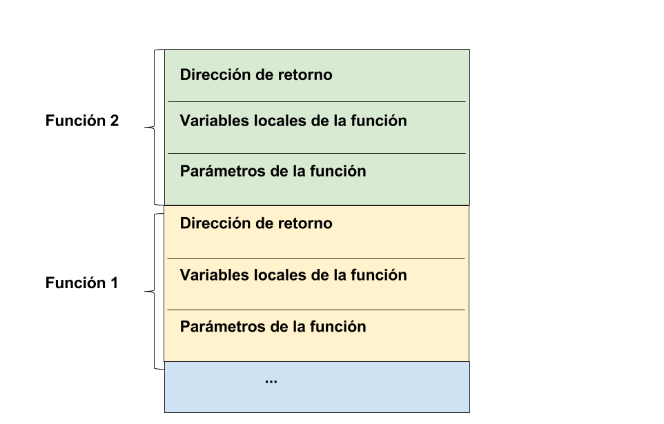

# Tema 9: Recursión

## 1. Qué es la recursividad

Una función es recursiva si en su definición hay una llamada a sí misma. La recursión o recursividad es una forma diferente de realizar las acciones repetitivas, permitiendo que un subprograma se llame a sí mismo para resolver una versión más pequeña del problema original.

Se puede utilizar la recursividad como una alternativa a la iteración. Una solución recursiva es normalmente menos eficiente que una solución iterativa, pero en numerosos casos el uso de la recursión permite a los programadores especificar soluciones naturales, sencillas que serían, en caso contrario, muy difíciles de resolver. Por este motivo, la recursión es una herramienta muy importante y poderosa en la resolución de problemas y en la programación.

Una vez que uno se acostumbra a su uso, se comprueba que la recursión es una forma mucho más natural que la iteración de expresar un gran número de funciones.

El primer lenguaje de programación que permitió el uso de expresiones recursivas fue Lisp. En el momento de su creación existía ya Fortran, que no permitía que una función se llamase a si misma.  

Hay muchas funciones matemáticas que se definen de forma natural de manera recursiva.

Por ejemplo:

- Factorial de un número n:
`factorial(n) = n * factorial(n-1) `	 

- Potencia de dos números:
`x^n = x * x^n-1`

## 2. Cómo diseñar una función recursiva

#### Esquema básico de una función recursiva

- **Caso general o recursivo**: Incluye una o más llamadas recursivas. Estas llamadas recursivas deben resolver versiones "más pequeñas" del problema que tiene que resolver la función.
- **Caso base**: Es el problema más pequeño que podemos encontrar y del cual sabemos su solución inmediata (sin necesidad de hacer una llamada recursiva).

#### Pensando recursivamente

Para diseñar funciones recursivas no funciona el método de prueba y error. Hay que diseñar la solución recursiva desde el principio. Debemos fijarnos en lo que devuelve la función y debemos preguntarnos cómo sería posible descomponer el problema de forma que podamos lanzar la recursión sobre una versión más sencilla del mismo. Supondremos que la llamada recursiva funciona correctamente y devuelve el resultado correcto. Y después debemos transformar este resultado correcto de la versión más pequeña en el resultado de la solución completa.

Debes **confiar** en que la llamada recursiva va a hacer su trabajo y devolver el resultado correcto. Después tendrás que utilizar lo que la llamada recursiva ha devuelto para componer la solución definitiva al problema.

El caso base debe ser el caso más sencillo del problema a resolver. Aquel cuyo resultado conocemos de forma inmediata y no depende de otros resultados.

Por ejemplo, el problema del factorial. Debemos empezar pensando en distintos casos:

~~~c
factorial(5) = 5 * 4 * 3 * 2 * 1
factorial(4) = 4 * 3 * 2 * 1
~~~

Si nos fijamos en estos ejemplos, vemos que el `factorial(4)` forma parte de la solución de `factorial(5)`, de forma que se puede plantear como una llamada a sí misma pero con un problema más pequeño:

~~~c
factorial(5) = 5 * factorial(4)
~~~

Ya tenemos el **caso general** o caso recursivo. Necesitamos un **caso base**, porque si no es así, se llamaría indefinidamente a sí mismo. El caso base es el caso más pequeño que podemos encontrar, que no depende de ninguna llamada recursiva y que conocemos su solución de forma inmediata. En el caso del factorial, se trata de:

~~~c
factorial(1) = 1
~~~

Ahora tenemos que reformularlo de forma general:

~~~c
factorial(n) = n * factorial(n-1)
factorial(1) = 1
~~~

Una vez ya tenemos la solución, sólo falta implementarlo en C:

~~~c
int factorial (int n)
{
  int res;

  if (n == 1) // caso base
    res = 1;
  else
    res = n * factorial(n-1);

  return res;
}

int main() {
  int num;

  printf("Introduce un número: ");
  scanf("%d", &num);
  printf("El factorial de %d es %d\n", num, factorial(num));
}
~~~

Como ves, no hemos empezado a programar directamente. Hemos planteado ejemplos, a continuación los hemos expresado de forma recursiva y por último hemos expresado la solución general. El último paso es traducirlo a C.

#### Sumatorio
Vamos a resolver el sumatorio desde 0 hasta un número n.

Casos de ejemplo:

~~~c
sumatorio(5) = 5 + 4 + 3 + 2 + 1 + 0
sumatorio(4) = 4 + 3 + 2 + 1 + 0
~~~

Ya podemos deducir cuál es el caso general:

~~~c
sumatorio(n) = n + sumatorio(n-1)
~~~

¿Cuál es el caso base?

~~~c
sumatorio(0) = 0
~~~

Ahora lo codificamos en C:

~~~c
int sumatorio (int n)
{
  int res;

  if (n == 0) // caso base
    res = 0;
  else
    res = n + sumatorio(n-1);

  return res;
}
~~~

#### Potencia
Vamos a resolver la potencia de un numéro elevado a otro.

Casos de ejemplo:

~~~c
potencia(2,5) = 2 * 2 * 2 * 2 * 2
potencia (2,4) = 2 * potencia(2,3)
~~~

Caso base:

~~~c
potencia(2,0) = 1
potencia(5,0 = 1
~~~

Formulación recursiva:

~~~c
potencia(n,m) = n * potencia(n, m-1)
potencia(_,0) = 1
~~~

Lo pasamos a C:

~~~c
int potencia (int num, int pow)
{
	int res;

    if (pow){
        res = (num * potencia(num, pow - 1));
    }
    else
    	res = 1;

    return res;
}
~~~

#### Fibonacci

La secuencia de Fibonacci es 0,1,1,2,3,5,8,13,...

Formulación matemática de la secuencia de Fibonacci:

~~~c
Fibonacci(n) = Fibonacci(n-1) + Fibonacci(n-2)  
Fibonacci(0) = 0  
Fibonacci(1) = 1
~~~

Lo pasadmos a C:

~~~c
int fib(int n)
{
   int res;

   if (n == 0)
     res = 0;
   else if (n == 1)
      res = 1;
   else
      res = fib(n-1) + fib(n-2);

   return res;
}

int main() {
   int n;

   printf("Introduce número: ");
   scanf("%d", &n);
   printf("El número %d de fibonacci es %d\n", n, fib(n));

   return 0;
}
~~~

Fibonacci es un ejemplo especial en el que el caso general está compuesto por la suma de dos llamadas recursivas.

#### Conversión número decimal a binario

~~~c

void binario(int n)
{
    if (n!=0)
    {
        binario(n/2);
        printf("%i", n%2);
    }
}

int main() {
   int dec, bin;

   printf("Introduce número decimal: ");
   scanf("%d", &dec);
   binario(dec);

   return 0;
}
~~~

## 3. La pila de llamadas y el proceso de la recursión

### La pila de llamadas

La pila de llamadas o *call stack* es una estructura dinámica de datos LIFO (*last in first out*) que almacena la información sobre las funciones o subrutinas activas de un programa. Esto hace que sea más sencillo mantener el control de los bloques que deben ser liberados, puesto que será aquel que esté en el tope de la pila.

Su objetivo es seguir el curso del punto al cual cada función activa debe **retornar el control** cuando termine su ejecución, es decir, aquellas funciones que se han llamado pero todavía no han completado su ejecución ni retornando al lugar siguiente desde donde han sido llamadas.

Algunos de los datos que suelen almacenar son:

- la dirección de retorno
- variables locales
- valores de los parámetros

Ejemplo: Supongamos que `main`ha llamado a `funcion1`y ésta a `funcion2`:

### El proceso de la recursión

Qué ocurre cuando se invoca a una función:

- Cuando se llama a una función, se crea un **ámbito nuevo** (también llamado marco o *frame*) local a la función, donde se asigna memoria a las variables locales de la función, y al finalizar
su ejecución, se libera la memoria asignada y se
devuelve la ejecución al punto en que se hizo la llamada haciendo uso de lo que se llama **dirección de retorno**.

Cuando la función que se invoca es recursiva:

- En el caso recursivo, cada llamada genera un nuevo ámbito de la función con sus correspondientes variables locales: la función se ejecutará normalmente hasta la llamada a sí misma. Se almacenan en la **pila de llamadas** los parámetros y variables locales, y se van creando más copias hasta llegar al caso base, donde se resuelve directamente el valor, y se va saliendo liberando memoria hasta llegar a la primera llamada (última en cerrarse).

Vistos estos conceptos, ya podemos trazar la ejecución del factorial para el caso de num = 4.

~~~c
int factorial (int n)
{
  int res;

  if (n == 1) // caso base
    res = 1;
  else
    res = n * factorial(n-1);
>
  return res;
}
~~~

La llamada a `factorial(4)` realiza la siguiente secuencia de operaciones (traza):

~~~c
 factorial(4)
  => 4 * factorial(3)
  => 4 * 3 * factorial(2)
  => 4 * 3 * 2 * factorial(1)  
  => 4 * 3 * 2 * 1
  => 4 * 3 * 2
  => 4 * 6
  => 24
~~~

Cada llamada a la recursión deja una función **en espera de ser evaluada** cuando la recursión devuelva un valor (en el caso anterior las llamadas a `factorial`). Estas llamadas en espera, junto con sus argumentos, se almacenan en la **pila de llamadas**.

Cuando la recursión devuelve un valor, los valores se recuperan de la **pila**, se realiza la llamada y se devuelve el valor a la anterior llamada en espera.

Si la recursión está mal hecha y nunca termina se genera un *stack overflow* porque la memoria que se almacena en la pila sobrepasa la memoria reservada.

> Ejercicio: Haz las trazas de las funciones recursivas `potencia`y `sumatorio`.

¿Cuál será el proceso que genera una llamada a Fibonacci? El caso de Fibonacci es distinto, porque en cada función se realizan dos llamadas recursivas, de forma que la pila crece exponencialmente.

## 4. Recursión mutua

Este tipo de recursión se produce cuando una función llama a otra y éste a su vez a la primera.

Por ejemplo, el siguiente programa muestra por pantalla el alfabeto utilizando recursión mutua:

~~~c
void funcionA(char);
void funcionB(char);

int main(){
   funcionA('Z');
   printf("\n");
}

void funcionA(char c) {
   if (c > 'A')
      funcionB(c);
   printf("%c", c);
}
void funcionB(char c) {
   c--;
   funcionA(c);
}
~~~

El programa principal llama a la función recursiva `funcionA`con el argumento 'Z', que a su vez llama a `funcionB` que decrementa el carácter (obtiene el carácter anterior) y llama nuevamente a `funcionA`. Este proceso se repite hasta que c sea el carácter 'A' (caso base). En ese momento, la recursión termina  y se ejecutan los 26 `printf` que se habían quedado en espera en la pila de llamadas y visualizando el alfabeto carácter a carácter de la A a la Z.

## 5. Ventajas y desventajas de la recursión

##### Ventajas

- Soluciones simples, claras.
- Soluciones elegantes.
- Soluciones sencillas a problemas complejos.

##### Desventajas

- Ineficiencia en algunos problemas
- Sobrecarga asociada con las llamadas recursivas: una simple llamada puede generar un gran numero de llamadas

El valor de la recursividad reside en el hecho de que se puede usar para resolver problemas cuya solución iterativa no es fácil de obtener, y sin embargo resueltos de forma recursiva resultan muy concisos y claros.

#### Ejercicios resueltos

1. Dado un array de enteros, escribe un programa que calcule el menor número de un array de enteros utilizando una función recursiva. Formulación recursiva: el número menor de un array es el mínimo entre el elemento actual y el menor del resto de los elementos.

    ~~~c
    int Menor(int[], int, int);
    int Min(int, int);

    int main() {
       int a[] = {4,2,8,45,9};
       int res;

       res = Menor(a, 0, 5);
       printf("%d\n", res);
    }

    int Min(int a, int b) {
       int res;

       if (a < b)
          res = a;
       else
          res = b;

       return res;
    }

    int Menor(int s[], int ini, int fin) {
        int menor, res;

        if(ini == fin) {
            res = s[ini];
        }
        else
        {
            menor = Menor(s, ini+1, fin);
            res = Min(s[ini], menor);
        }
        return res;
    ~~~

2. Escribe una función recursiva que reciba como parámetros un array de enteros y su índice máximo, y devuelva la suma de todos sus elementos.

    ~~~c
    int sumaVector(int array[], int n){
        int res = 0;

        if(n==0){
            res = array[0];
        }else{
            res = array[n] + sumaVector(array,n-1);
        }
        return res;
    }
    ~~~

3. Escribe una función recursiva `mayoresQue(int array[], int elem, int longitud)`que reciba un array, un número y el índice máximo del array, y devuelva la cantidad de elementos del array que son mayores que el número que le pasamos como parámetro.

    ~~~c
    int mayoresQue(int array[], int elem, int n){
          int res = 0;

          if(n >= 0) {
               if (array[n] > elem)
                   res = 1 + mayoresQue(array, elem, n-1);
               else
                   res = mayoresQue(array, elem, n-1);
          }
          return res;
    }
    ~~~

4. Escribe un programa que calcule el número decimal correspondiente a un array de bits mediante una función recursiva.

    ~~~c
    #include <stdio.h>
    #include <math.h>

    int binADecimal(int[], int, int);

    int main() {
       int array[] = {1,1,1,1};
       int array2[] = {1,0};
       printf("1111: %d\n", binADecimal(array, 4, 0));
       printf("10: %d\n", binADecimal(array2, 2, 0));
    }

    int binADecimal(int bits[], int longitud, int indice) {
       int decimal;
       int exponente;

       if (longitud == 0)
          decimal = 0;
       else {
          exponente = pow(2,longitud-1);
          decimal = (bits[indice] * exponente) +
                    binADecimal(bits, longitud-1, indice+1);
       }

       return decimal;
    }
    ~~~

5. Escribe la función recursiva `ordenado` que compruebe si un array está ordenado creciente.

    ~~~c
    bool ordenado(int array[], int n) {
       bool res;

       if (n == 0)
          res = true;
       else {
          res = (array[n] >= array[n-1]) &&
                ordenado(array, n-1);
       }

       return res;
    }
    ~~~

    Lo probamos:

    ~~~c
    int main() {
       int array[] = {1,4,30,3};

       printf("Ordenado: %d\n", ordenado(array,3));
    }
    ~~~

#### Ejercicios propuestos

1. Define una función recursiva que para un número natural n muestre por pantalla la serie creciente de números naturales del 1 al n, es decir, 1 2 3... n.
2. Define una función recursiva que para un número natural n devuelva la suma de los cuadrados de los números del 1 hasta el n. Por ejemplo, para n=4, debe devolver 30 ya que 1^2+ 2^2 + 3^2 + 4^2 = 30.
3. Define una función recursiva que, dado un número natural, muestre por pantalla el número formado por los mismos dígitos en sentido contrario. Por ejemplo: para el número 2089 debe mostrar 9802.
4. Define una función recursiva que devuelva el número de dígitos impares de un número. Ejemplo: rec(321)=2, rec(28)=0.
5. Implementa la función anterior de forma que se reciba un array de dígitos y la función devuelva el número de dígitos impares que contiene el array.
6. Comprobar si un número es par o impar, utilizando recursión mutua.
7. Define una función recursiva que obtenga el valor máximo de un array de enteros. Pista: puedes definir y utilizar la función mayor(int, int)que devuelve el mayor entre dos números enteros. El caso base es cuando el array sólo tiene un elemento. El caso general se puede plantear como el máyor entre el primer elemento y el máximo del resto de elementos.

### Curiosidad: Algoritmos recursivos de vuelta a atrás (*backtracking*)

Se trata de una estrategia recursiva para resolver problemas como los de los laberintos, el sudoku, algunos problemas de ajedrez como el recorrido del caballo o las ocho damas y similares, en los que mediante una búsqueda en profundidad se puede dar con la solución.
El nombre vuelta atrás (*backtracking*) viene del hecho de que en la búsqueda de la solución se va volviendo a un punto anterior para probar alternativas.

Si estáis interesados en el tema, podéis hacer un ejercicio. Se trata de que, dado un mapa con obstáculos y una posición inicial de un robot y una posición objetivo, el robot sea capaz de encontrar el objetivo. Podéis utilizar las estructuras de datos similares a las de la práctica y leer el mapa con los obstáculos desde línea de comandos. El camino lo resolverá el algoritmo recursivo. Podéis encontrar mucha información al respecto en internet, como por ejemplo en el siguiente [enlace](https://www.cs.bu.edu/teaching/alg/maze/).

En este video de [youtube](https://youtu.be/-u4neMXIRA8) podéis ver cómo
funciona el salvapantallas [xscreensaver](https://www.jwz.org/xscreensaver/) en el modo de resolución de
laberintos, se ve muy claro el avance, decisión y retroceso.

----

Programación 1, Grado de Robótica, curso 2019-20  
© Departamento Ciencia de la Computación e Inteligencia Artificial, Universidad de Alicante  
Cristina Pomares Puig
